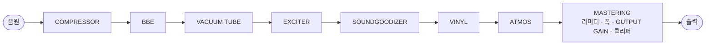
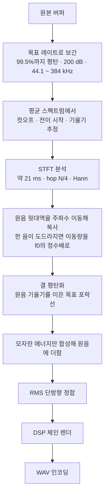

# ANALOG SOUL DSP ENGINE

**브라우저에서 돌아가는 아날로그 음색 처리기이자, 손실 압축 음원의 깎인 고역을 채워 넣는 복원 도구.**

`v3.0` · 단일 HTML 파일 · 설치 없음 · 인터넷 연결 없이 동작 · 음원은 기기 밖으로 나가지 않음

---

## 목차

- [1부 · 쉬운 말로 보기](#part-1)
- [2부 · 원리](#part-2)
- [3부 · 작동 방식](#part-3)
- [4부 · 알고리즘과 수식, 물리, 체계](#part-4)
  - [4.1 표본률 변환과 STFT 커널](#s41) · [4.2 컷오프와 기울기 추정](#s42) · [4.3 주파수 이동 복사와 f0 동기](#s43) · [4.4 포락선 외삽과 결](#s44) · [4.5 레벨 정합](#s45)
  - [4.6 비선형 전달 함수](#s46) · [4.7 앨리어싱 예산](#s47) · [4.8 대역 분할](#s48) · [4.9 다이내믹스](#s49)
  - [4.10 공간의 물리](#s410) · [4.11 스테레오](#s411) · [4.12 레코드 모델](#s412) · [4.13 청감의 물리](#s413)
  - [4.14 체계](#s414) · [4.15 비트 깊이](#s415) · [4.16 이슈와 해결](#s416) · [4.17 최적화](#s417) · [4.18 알려진 한계](#s418) · [4.19 특장점](#s419)
- [저장소 구성](#repo)
- [변경 이력](#changelog)
  - [3.0](#cl-v30) · [2.4](#cl-v24) · [2.3](#cl-v23) · [2.2](#cl-v22)
- [참고 문헌](#refs)
- [사용권](#license)

---

<a id="part-1"></a>

## 1부 · 쉬운 말로 보기

### 이게 뭔가요

음악 파일을 넣으면 소리의 느낌을 바꿔 주는 프로그램입니다. 옛날 녹음 장비를 거친 것처럼 따뜻하게 만들거나, 넓은 공연장에서 듣는 것처럼 퍼지게 만들거나, 들쭉날쭉한 음량을 고르게 다듬을 수 있습니다.

인터넷에서 받은 음악 파일은 용량을 줄이려고 아주 높은 소리를 잘라낸 경우가 많습니다. 이 프로그램은 남아 있는 소리의 규칙을 읽어 잘려 나간 윗부분을 그럴듯하게 채워 넣는 기능도 갖고 있습니다.

설치할 것이 없습니다. 파일 하나를 인터넷 창으로 열면 바로 돌아갑니다. 넣은 음악은 어디로도 보내지지 않고 내 컴퓨터 안에서만 처리됩니다.

### 시작하기

1. `analog-soul-dsp.html`을 인터넷 창으로 엽니다. 크롬을 권합니다.
2. 처음 한 번 나오는 사용 약관을 읽고 동의합니다.
3. 음악 파일을 화면 위쪽 상자에 끌어다 놓습니다.
4. 재생을 누르고, 기능 카드의 스위치를 하나씩 켜 보며 소리가 어떻게 바뀌는지 들어 봅니다.
5. 마음에 들면 아래쪽 EXPORT에서 촘촘함과 세밀함을 고르고, 내보내기 버튼으로 새 파일을 만듭니다.

설명서는 `index.html`에서 시작하면 됩니다. 쉬운 설명부터 깊은 설명까지 다섯 가지가 있습니다.

### 여덟 가지 기능

화면의 카드 하나가 기능 하나입니다. 카드 위의 신호 흐름 지도가 소리가 지나는 순서를 보여 줍니다. 지도의 이름이나 카드를 끌어서 순서를 바꿀 수 있고, 순서가 바뀌면 소리도 달라집니다. 지도에서 노드를 끄는 동안에는 다른 노드가 옆으로 비켜 가 놓일 자리가 비고, 순서가 바뀌면 지도의 노드와 카드들이 새 자리로 미끄러져 갑니다. 맨 앞의 HD 복원과 제작의 끝인 MASTER는 자리가 정해져 있어 점선 테두리로 그려지고, 끌리지 않습니다.

**카드 배치.** 넓은 화면(900 px 이상)에서는 카드가 같은 크기(높이 385 px)로 왼쪽 → 오른쪽, 위 → 아래 순서로 놓여, 자리만 보고도 처리 순서가 읽힙니다. 고해상도 복원 카드는 흐름 지도와 같이 맨 앞에 놓입니다. 켜진 카드는 내용이 넘치면 카드 안에서 스크롤하고(오른쪽 22 px 스크롤바), 꺼진 카드는 손잡이가 눌리지 않는 배경으로 물러나 그 위에서 휠을 굴리면 화면이 굴러갑니다. 켜진 카드 밖에서 화면을 굴리기 시작하면 휠이 0.4초 멈출 때까지는 켜진 카드가 커서 밑을 지나가도 화면이 계속 굴러갑니다. 카드를 끌면 그 자리에 점선 빈칸이 생겨 커서를 따라가고 다른 카드들이 비켜 가며, 놓은 카드는 놓은 자리에서 빈칸으로 미끄러져 들어갑니다. 좁은 화면에서는 카드가 한 줄로 쌓입니다.

**MACRO %와 처음 상태.** 카드 맨 위의 MACRO 손잡이는 그 카드의 주요 손잡이들을 가장 약한 위치(0 %)와 기준 설계값(100 %) 사이에서 함께 옮깁니다. 고해상도 복원의 AUTO %와 같은 방식이고, 값은 슬라이더 눈금에 맞춰 반올림됩니다. 손잡이를 직접 만진 뒤에는 MACRO를 다시 움직일 때까지 그 값이 남고, 화면 설정 파일에는 MACRO와 손잡이 값이 함께 저장됩니다. 처음 열면 COMPRESSOR 50 % · BBE 40 % · EXCITER 80 % · SOUNDGOODIZER 65 % · MASTERING CHAIN 95 %가 켜져 있고, VACUUM TUBE · VINYL RECORD · DOLBY ATMOS는 꺼져 있습니다(MACRO 100 %). COMPRESSOR · EXCITER는 0 %에서 사실상 투명하지만, BBE · SOUNDGOODIZER · MASTERING CHAIN은 카드 구조 자체가 소리를 바꾸므로 소리를 완전히 빼려면 카드를 끕니다.

**재생 단계.** MASTER 뒤는 마스터링이 끝난 소리를 재생 매체로 듣는 단계입니다. 실제 LP는 마스터 음원으로 래커를 깎아 찍어 낸 판을 턴테이블로 재생하므로 지글거림 · 튐 · 표면 잡음 · 휨이 마스터링 뒤에 생기고, Atmos는 마스터가 끝난 뒤 듣는 기기에 맞춰 공간을 그립니다. 그래서 VINYL과 ATMOS만 MASTER 뒤로 옮길 수 있습니다. 두 카드의 제목줄 아래 ‘처리 위치’에서 MASTER 앞 · 뒤를 고르거나, 카드나 흐름 지도의 노드를 MASTER 뒤로 끌어 옮깁니다(흐름 지도에서는 Alt+→로도 넘어갑니다). 재생 단계는 흐름 지도의 청록 ‘재생’ 경계 뒤, 카드판의 ‘재생 단계 · MASTER 뒤’ 구역 아래에 청록 번호표로 표시되고, 다른 카드를 끌어 오면 ‘놓을 수 없음’이 뜹니다. CEILING 보장은 MASTER까지라 재생 단계를 거친 소리는 CEILING을 넘을 수 있습니다. 슬롯과 설정 파일에는 재생 단계 순서도 함께 저장됩니다.

| 카드 | 하는 일 |
|---|---|
| **COMPRESSOR** | 큰 소리는 조금 줄이고 작은 소리는 살려서 전체를 고르게 만듭니다. |
| **BBE** | 말소리와 악기의 첫소리를 또렷하게 세웁니다. |
| **VACUUM TUBE** | 진공관 증폭기 한 단을 실제 회로대로 계산해, 그 장비를 거친 것처럼 따뜻하고 두툼하게 만듭니다. |
| **EXCITER** | 높은 소리에 반짝임을 더합니다. |
| **SOUNDGOODIZER** | 낮은 소리, 가운데 소리, 높은 소리를 나눠 각각 두툼하게 만듭니다. |
| **VINYL** | 레코드판을 실제로 트는 것처럼 만듭니다. 판 위의 먼지, 한 바퀴마다 딸깍하는 긁힌 자국, 살짝 흔들리는 음정, 판 안쪽으로 갈수록 흐려지는 높은 소리까지 따라 합니다. |
| **DOLBY ATMOS** | 녹음실, 클럽, 영화관, 콘서트홀, 경기장 가운데 고른 방에서 소리가 울리는 모습을 계산해 들려줍니다. |
| **MASTERING** | 마지막 정리입니다. 낮은 소리부터 높은 소리까지 네 부분을 따로 다듬고, 소리가 깨질 만큼 커지는 것을 막습니다. |

VINYL의 손잡이는 판, 턴테이블, 바늘 세 묶음입니다. 판에 먼지가 얼마나 앉았는지, 긁혔는지, 휘었는지, 몇 번이나 틀었는지를 정하고, 턴테이블이 얼마나 고르게 도는지와 바늘의 모양을 고릅니다. 각 기기의 설명서에 적힌 숫자를 그대로 넣으면 그 조합의 소리가 납니다. 들을 때 난 딸깍 소리는 저장한 파일에서도 같은 자리에 납니다.

VACUUM TUBE의 DRIVE는 진공관에 들어가는 소리의 세기, BIAS는 진공관이 쉬고 있을 때의 상태입니다. BIAS를 낮추면 한쪽이 먼저 찌그러져 따뜻한 색이 짙어지고, 높이면 깨끗해집니다. DOLBY ATMOS의 SPACE는 방의 크기, DEPTH는 소리가 얼마나 멀리서 나는지, HEIGHT와 OBJECT는 천장과 옆벽에서 되돌아오는 소리의 세기입니다. 가운데(50)가 실제 방의 값입니다.

카드마다 맨 위에 **INPUT GAIN**이 있습니다. 그 기능에 들어가는 소리의 크기입니다. 소리를 찌그러뜨려 맛을 내는 기능은 여기를 올리면 효과가 더 진해집니다.

### 잘려 나간 높은 소리 채우기

**HD**와 **ULTRA · eXtreme HD** 칸이 이 일을 합니다. 저장할 때 촘촘함을 원래 파일보다 높게(44.1 kHz 파일이면 48 · 96 · 192 · 384) 고르면 그 높이에 맞춰 채워집니다. 한 악기나 목소리가 두드러지는 곡에서는 채운 소리의 음정이 원래 소리의 배음 자리에 맞게 놓입니다. 채우는 양은 **SYNTH**로, 높이 올라갈수록 채운 소리를 얼마나 고르게 펼지는 **SMOOTH**로 정합니다.

알아 두실 점이 있습니다. 이 기능은 잘려 나간 원래 소리를 되찾는 것이 아니라, 남은 소리를 보고 그럴듯하게 그려 넣는 것입니다. 차이가 들리는지는 파일과 귀와 장비에 따라 다릅니다. 용량을 많이 줄인 파일일수록 차이가 크고, 처음부터 좋은 파일은 거의 달라지지 않습니다.

**LIVE** 스위치를 켜면 저장하기 전에 결과를 미리 들을 수 있습니다. 켜는 순간 잠시 기다려야 합니다. 어디가 잘렸는지 알려면 곡 전체를 먼저 훑어봐야 하기 때문입니다.

### 그림으로 보기

위쪽 그래프는 왼쪽이 원래 소리, 오른쪽이 바뀐 소리입니다. 같은 순간을 나란히 보여 주므로 무엇이 달라졌는지 바로 보입니다. 그래프를 누르면 시간이 흐르는 그림으로 바뀌고, 색이 밝을수록 그 높이의 소리가 큰 것입니다.

그래프 위의 스위치로 가로 범위를 고정할 수 있습니다. 복원을 켰다 껐다 할 때 그래프가 늘었다 줄었다 하지 않아서 새로 채워진 부분만 눈에 들어옵니다.

### 설정 보관하기

마음에 드는 설정을 붙잡아 둘 수 있습니다. 음악 파일은 담기지 않고 설정만 담깁니다.

| 버튼 | 하는 일 |
|---|---|
| **화면 설정 저장** | 지금 화면의 설정을 파일로 만듭니다. 다른 컴퓨터로 옮길 때 씁니다. |
| **빠른 슬롯 1~4** | 짧게 누르면 불러오고, 길게 누르면 지금 설정을 넣습니다. 빈 슬롯을 누르면 처음 상태로 돌아갑니다. |
| **복사** | 누른 뒤 슬롯 두 개를 차례로 누르면 앞의 것이 뒤로 옮겨집니다. |
| **한 슬롯 비우기** | 누른 뒤 슬롯 하나를 누르면 그것만 지워집니다. |
| **모든 슬롯 비우기** | 한 번 누르면 확인을 묻고, 다시 누르면 전부 지웁니다. |
| **모든 슬롯을 백업** | 네 슬롯을 파일 하나로 묶습니다. |
| **불러오기** | 설정 파일이든 백업 파일이든 알아서 구분해 되돌립니다. |

빠른 슬롯은 지금 쓰는 인터넷 창에만 남습니다. 다른 컴퓨터에서 쓰려면 파일로 저장하세요.

저장하면 위쪽 신호 흐름 지도와 아래 카드들이 처리 순서대로 두 번 깜빡여, 값과 순서가 담겼다는 것을 알려 줍니다. 불러오면 흐름 지도의 노드와 카드들이 저장해 둔 자리로 미끄러져 갑니다.

### 파일로 저장하기

아래쪽 EXPORT에서 두 가지를 고른 뒤 **내보내기** 버튼을 누릅니다.

| 막대 | 고르는 것 | 뜻 |
|---|---|---|
| **SAMPLE RATE** | 44.1 · 48 · 96 · 192 · 384 | 1초를 얼마나 촘촘하게 나눠 적을지입니다. 원래 파일보다 높게 고르면 잘린 높은 소리를 그 높이에 맞춰 채우고, 낮게 고르면 원래 소리를 최대한 지키며 줄입니다. 파일을 올리면 원래 파일과 같은 값에 맞춰지고, 그 눈금 아래에 (원본)이 붙습니다. 원래 파일이 44.1 계열(44.1 · 88.2 · 176.4 · 352.8)이면 위쪽 세 눈금이 88.2 · 176.4 · 352.8로 바뀝니다. |
| **BIT DEPTH** | 16 · 24 · 32 | 한 번 적을 때 얼마나 세밀하게 적을지입니다. 원래 파일이 16비트면 24나 32를 고를 때 계단 사이를 이어 채웁니다. |

버튼 아래에 어떤 순서로 처리되는지가 나옵니다. 숫자가 클수록 파일이 커집니다. 1분짜리 곡이 44.1과 16이면 약 10 MB, 96과 24면 약 33 MB, 192와 32면 약 88 MB, 384와 32면 약 176 MB입니다.

### 알아 두면 좋은 것

- **켜기만 하면 좋아진 것 같다면** 소리가 커졌기 때문일 수 있습니다. 사람의 귀는 커진 소리를 무조건 더 좋다고 느낍니다. 켠 것과 끈 것의 크기를 맞춘 뒤에 비교해 보세요.
- **MASTERING은 소리를 저절로 키우지 않습니다.** 조용한 부분은 그대로 두고 큰 부분만 누릅니다. 더 크게 만들려면 MASTERING의 INPUT GAIN을 올려 리미터를 미세요.
- **192나 384로 저장할 수 없다는 안내가 뜨면** 인터넷 창이 그만큼 촘촘한 저장을 지원하지 않는 것입니다. 96을 고르세요.
- **설정을 바꾼 뒤 다른 설명서로 가려 하면** 확인 창이 뜹니다. 설정은 저절로 저장되지 않기 때문입니다.
- **화면 색은 맨 위 막대 오른쪽에서 고릅니다.** '자동'은 컴퓨터의 다크·라이트 설정을 따르고, '야간'과 '주간'은 늘 어둡게, 늘 밝게 둡니다. 고른 것은 이 인터넷 창에 기억되어 프로그램과 설명서 모두에 적용됩니다.
- **저장한 음악 파일에는 소리만 담깁니다.** 어떤 설정으로 만들었는지는 남지 않으니, 나중에 다시 쓰려면 설정도 함께 저장해 두세요.

---

<a id="part-2"></a>

## 2부 · 원리

이 부분은 각 기능이 기대는 물리적·지각적 현상을 설명합니다. 계산 방식은 3부, 수식은 4부에서 다룹니다.

### 2.1 소리를 보는 두 개의 눈 — 시간과 주파수

소리는 공기 압력의 시간 변화입니다. 녹음 파일은 이 변화를 일정한 간격으로 측정한 숫자열이고, 그 간격의 역수가 **표본화 주파수**입니다. 44.1 kHz는 1초에 44,100번 측정했다는 뜻입니다. 표본화 주파수의 절반인 **나이퀴스트 주파수**가 그 파일이 담을 수 있는 가장 높은 소리입니다.

같은 소리를 주파수 성분으로 분해해 볼 수도 있습니다. 어떤 높이의 소리가 얼마나 섞여 있는지를 보는 **스펙트럼**입니다. 사람의 귀는 주파수를 로그 척도로 지각합니다. 100 Hz에서 200 Hz로 가는 것과 1 kHz에서 2 kHz로 가는 것이 똑같이 한 옥타브로 들립니다. 이 프로그램의 그래프가 가로축을 로그로 그리는 이유입니다.

크기는 **데시벨(dB)** 로 셉니다. 진폭이 두 배가 되면 약 +6 dB이고, 10 dB 차이는 대략 두 배 크게 들립니다.

### 2.2 다이내믹스 — 압축

압축기는 소리가 **스레숄드**를 넘으면 넘은 만큼을 **레시오**로 나눠 줄입니다. 4:1이면 스레숄드를 8 dB 넘은 소리가 2 dB만 넘도록 줄어듭니다. **어택**은 넘은 뒤 얼마나 빨리 줄이기 시작하는지, **릴리즈**는 내려간 뒤 얼마나 빨리 원래대로 돌아오는지입니다. **니(knee)** 는 스레숄드 근처에서 압축을 급하게 걸지 부드럽게 걸지를 정합니다.

압축은 음량의 들쭉날쭉함을 줄입니다. 가장 큰 순간과 평균의 차이인 **크레스트 팩터**가 작아지므로, 같은 최대 크기 안에서 평균 음량을 올릴 수 있습니다.

압축으로 줄어든 만큼 전체를 다시 키우는 것을 **메이크업**이라고 합니다. 이 프로그램의 압축기는 문턱 아래의 조용한 소리를 건드리지 않고, 메이크업은 MAKEUP으로 정한 만큼만 겁니다.

### 2.3 위상과 명료도

스피커는 모든 높이의 소리를 동시에 내보내지 못합니다. 특히 낮은 소리는 높은 소리보다 늦게 나오는 경향이 있습니다. 주파수에 따라 도착 시간이 다른 이 현상을 **군지연**이라고 합니다. BBE 계열 처리는 오히려 저역을 조금 더 늦춰 높은 성분의 어택이 먼저 오게 합니다. 제조사는 이를 스피커의 위상 보정이라고 설명하지만, 스피커가 이미 늦춘 저역을 더 늦추는 방향이므로 되돌린다기보다 첫소리의 윤곽을 도드라지게 하는 처리입니다.

위상만 바꾸고 크기는 그대로 두는 필터를 **전역통과(올패스) 필터**라고 합니다. 이 필터를 그대로 통과시키면 크기는 두고 낮은 소리만 늦출 수 있습니다. 반대로 이 필터를 거친 신호를 원래 신호와 섞으면 위상이 반대가 되는 주파수에서 소리가 서로 지워지므로, 시간만 바꾸려면 섞지 않아야 합니다.

사람의 말소리에서 자음이 몰려 있는 2~5 kHz 대역은 **명료도**를 좌우합니다. 이 대역을 조금 올리면 말이 앞으로 나오는 느낌이 듭니다.

### 2.4 비선형과 배음

소리를 찌그러뜨리면 원래 없던 **배음**이 생깁니다. 100 Hz 소리를 찌그러뜨리면 200, 300, 400 Hz 성분이 새로 나타납니다. 어떤 배음이 얼마나 생기는지는 찌그러뜨리는 방식이 결정합니다.

양쪽을 똑같이 누르는 **대칭** 방식은 홀수 배음(3배, 5배…)만 만듭니다. 한쪽을 더 세게 누르는 **비대칭** 방식은 짝수 배음(2배, 4배…)도 만듭니다. 2배음은 한 옥타브 위라 원래 소리와 잘 섞여 두툼하게 들리고, 3배음은 옥타브 위의 5도라 조금 더 거친 색을 냅니다. 진공관 음색이 따뜻하다고 불리는 까닭은 비대칭 특성이 만드는 짝수 배음에 있습니다.

디지털로 소리를 찌그러뜨릴 때는 주의할 점이 있습니다. 새로 생긴 배음이 나이퀴스트 주파수를 넘으면 사라지지 않고 아래로 **접혀** 들어와, 원래 소리와 아무 관계없는 높이에 나타납니다. 이것을 **앨리어싱**이라고 합니다.

### 2.5 대역을 나눠 다루기

낮은 소리와 높은 소리는 성격이 달라 같은 처리를 하면 한쪽이 망가집니다. 그래서 **크로스오버**로 대역을 나눠 따로 처리한 뒤 다시 합칩니다. 이때 나눈 조각을 그대로 다시 합쳤을 때 원래와 같은 크기가 되어야 합니다. 이런 성질을 가진 분할을 **상보적** 분할이라고 합니다. 상보적이지 않으면 나뉜 경계에서 소리가 부풀거나 꺼집니다.

### 2.6 공간 — 반사와 잔향

방 안에서 듣는 소리는 세 부분으로 나뉩니다. 음원에서 곧장 오는 **직접음**, 벽과 천장에 한두 번 부딪혀 오는 **초기 반사**, 수없이 부딪혀 뒤섞인 **후기 잔향**입니다. 초기 반사는 방의 크기와 모양을, 후기 잔향은 방의 울림을 알려 줍니다.

잔향이 60 dB 줄어드는 데 걸리는 시간을 **RT60**이라고 합니다. 작은 녹음실은 0.3~0.5초, 콘서트홀은 2초 안팎입니다.

벽이 소리를 많이 먹을수록, 방이 작을수록 잔향은 짧습니다. 공기도 높은 소리를 먹기 때문에 큰 방일수록 높은 소리의 잔향이 짧습니다. 음원에서 멀어지면 직접음은 약해지지만 잔향은 방 전체에 고르게 남아, 어느 거리부터는 잔향이 직접음보다 커집니다. 이 거리를 **임계 거리**라고 합니다.

옆벽에서 오는 초기 반사는 두 귀에 서로 다른 소리를 보내 음원을 넓게 들리게 합니다. 위에서 오는 소리는 귓바퀴 때문에 8 kHz 부근이 강조되어 들어오고, 귀는 이 강조를 소리가 위에서 온다는 단서로 씁니다.

### 2.7 스테레오 이미지

왼쪽과 오른쪽 신호는 **가운데(M)** 와 **옆(S)** 으로 바꿔 볼 수 있습니다. 가운데는 양쪽에 똑같이 있는 성분, 옆은 양쪽의 차이입니다. 옆 성분을 키우면 소리가 넓어지고 줄이면 좁아집니다.

주의할 점은 **모노 호환성**입니다. 스마트폰 스피커처럼 한 개로 듣는 환경에서는 왼쪽과 오른쪽이 더해지는데, 이때 옆 성분은 서로 상쇄되어 완전히 사라집니다. 옆으로 너무 밀어낸 악기는 모노에서 들리지 않을 수 있습니다.

### 2.8 레코드판의 결함

레코드의 소리는 만드는 과정과 읽는 과정의 물리에서 옵니다.

**커팅.** 홈은 소리의 속도를 새긴 것입니다. 그대로 새기면 저음은 홈을 너무 크게 흔들고 고음은 너무 작아 잡음에 묻히므로, 저음을 줄이고 고음을 키운 **RIAA 기록 곡선**으로 새기고 재생할 때 반대 곡선으로 되돌립니다. 이때 홈 안에서 생긴 잡음과 먼지 소리는 재생 곡선만 거치므로 고음이 깎이고 저음이 부풀어, 레코드 특유의 둥근 "톡"과 두툼한 표면 잡음이 됩니다. 스테레오 홈은 좌우 벽을 따로 새기는데, 저음의 좌우 차이는 홈을 위아래로 크게 흔들어 바늘이 튀므로 커팅할 때 저음을 가운데로 모읍니다.

**홈의 속도.** 판은 일정한 회전수로 돌기 때문에, 바늘 아래를 지나가는 홈의 속도는 반경에 비례합니다. 12인치 LP의 바깥 홈은 초당 약 0.51 m, 안쪽 홈은 0.21 m입니다. 같은 높이의 소리라도 안쪽에서는 홈의 물결이 더 촘촘해져, 둥근 바늘 끝이 굴곡을 따라가지 못하는 **트레이싱 왜곡**과 물결을 뭉개 읽는 **주사 손실**이 커집니다. 앨범의 마지막 곡이 가장 불리하고, 45 rpm이 음질에 유리한 이유입니다.

**회전.** 판의 구멍이 중심에서 조금만 어긋나도 바늘이 도는 반경이 한 바퀴마다 변해 음정이 천천히 흔들립니다(**와우**). 같은 어긋남이라도 반경이 작을수록 비율이 커져 안쪽에서 더 흔들립니다. 벨트의 미끄러짐은 느린 표류를, 모터는 빠른 떨림(**플러터**)을 만듭니다. 한 바퀴마다 되풀이되는 것은 또 있습니다. 반경 방향의 긁힘은 매 회전 같은 자리에서 딸깍하고, 여러 홈에 걸친 굵은 먼지는 몇 바퀴 동안 되풀이되며, 휜 판은 회전 주기로 오르내립니다. 바로 다음 홈이 누른 자국은 한 바퀴 뒤에 희미한 **에코**로 남습니다.

**카트리지.** 바늘은 좌우 벽을 완벽히 분리하지 못해 소리가 서로 새는데(**누화**), 고음으로 갈수록 더 많이 샙니다.

### 2.9 손실 압축과 사라진 고역

mp3와 AAC는 사람이 알아채기 어려운 성분을 버려서 용량을 줄입니다. 큰 소리 바로 옆의 작은 소리는 가려져 들리지 않는데, 이 **차폐** 현상을 이용합니다. 비트레이트가 낮으면 버릴 것이 더 많아져서, 아예 일정 높이 위를 통째로 잘라냅니다. 스펙트럼에서 보면 가파른 **절벽**이 생깁니다.

자연의 소리는 높아질수록 완만하게 약해집니다. 부호화가 만든 절벽은 그보다 훨씬 가파릅니다.

MPEG-4의 **SBR** 기술은 인코딩할 때 고역의 대략적인 모양을 따로 기록해 두었다가, 재생할 때 저역을 복사해 그 모양대로 다듬어 고역을 되살립니다. 이 프로그램은 그런 기록 없이 남아 있는 저역만 보고 고역을 만들어 냅니다. 이런 방식을 **블라인드 대역 확장**이라고 합니다.

### 2.10 크기의 착각

사람은 조금이라도 큰 소리를 더 좋다고 느낍니다. 1 dB 차이만 나도 판단이 기웁니다. 처리의 효과를 공정하게 비교하려면 반드시 크기를 먼저 맞춰야 합니다.

크기를 맞추는 기준도 중요합니다. 귀는 주파수마다 민감도가 달라, 같은 에너지라도 2~5 kHz가 더 크게 들립니다. 방송 표준인 **ITU-R BS.1770**은 이 특성을 반영한 **K-가중**으로 크기를 잽니다.

### 2.11 들을 수 있는 한계

사람이 들을 수 있는 가장 높은 소리는 나이가 들수록 내려갑니다. 10대에는 20 kHz 가까이 듣지만 50대에는 12~14 kHz 부근까지 내려오는 경우가 많습니다. 재생 장비도 한계가 있어, 48 kHz로 동작하는 장치는 24 kHz 위를 내보내지 못합니다.

---

<a id="part-3"></a>

## 3부 · 작동 방식

### 3.1 두 개의 엔진

프로그램 안에는 같은 처리를 하는 엔진이 둘 있습니다.

| | 실시간 엔진 | 렌더링 엔진 |
|---|---|---|
| 용도 | 재생하며 듣기 | 파일로 내보내기 |
| 기반 | `AudioContext` | `OfflineAudioContext` |
| 노드 | 한 번 만들어 재사용, 연결만 바꿈 | 내보낼 때마다 새로 만듦 |
| 값 변경 | 재생 중 즉시 반영 | 만들 때 고정 |
| 고역 복원 | 미리 복원해 둔 버퍼를 재생 | 체인에 넣기 전에 복원 |

두 엔진은 **화면의 카드 순서를 똑같이 읽습니다.** 그래서 들은 소리와 저장한 파일이 같은 순서로 처리됩니다. 재생 중에 순서를 바꾸면 음원 노드는 그대로 둔 채 처리 체인만 교체하므로 재생 위치가 유지되고 끊기지 않습니다. 신호 흐름 지도에서 순서를 바꿔도 지도가 카드를 같은 방식으로 옮기므로, 두 엔진이 읽는 순서는 언제나 하나입니다. 이때 카드는 프리셋을 불러올 때와 같은 스프링(§3.10)으로 새 자리를 찾아갑니다. 재생 중 체인 교체는 한 번에 0.1 s 남짓 걸리므로 다음 프레임이 그려진 뒤로 미뤄, 카드가 기다리지 않고 출발하게 합니다. 교체 전에 또 바꾸면 마지막 것만 교체합니다.



MASTERING은 제작의 마지막 단입니다. 그 뒤에는 재생 단계에 둔 VINYL · ATMOS만 올 수 있습니다. OUTPUT GAIN은 MASTERING 안에서 천장 클리퍼 바로 앞에 걸리며, MASTERING을 끄면 체인의 맨 끝에서 걸립니다.

### 3.2 기본 순서의 근거

| 단계 | 성격 | 이 자리에 있는 이유 |
|---|---|---|
| COMPRESSOR | 다이내믹스 | 음량을 먼저 고르게 해야 뒤따르는 찌그러뜨림의 깊이가 구간마다 달라지지 않습니다. |
| BBE | 위상 보정 | 배음이 더해지기 전, 원래 위상 관계가 살아 있을 때 보정해야 의미가 있습니다. |
| VACUUM TUBE | 비선형 | 기본 배음 구조를 만듭니다. |
| EXCITER | 고역 비선형 | 진공관이 만든 배음까지 재료로 삼아 고역을 확장합니다. |
| SOUNDGOODIZER | 대역별 비선형 | 앞 단계의 결과를 대역별로 균형 잡습니다. |
| VINYL | 열화·잡음 | 음색을 다 만든 뒤에 덮어야 잡음이 뒤의 비선형 단계에서 부풀지 않습니다. |
| ATMOS | 공간 | 잔향을 먼저 걸면 뒤의 압축이 잔향 꼬리에 반응해 숨 쉬듯 출렁입니다. |
| MASTERING | 최종 제어 | 뒤에 다른 처리가 있으면 천장 설정이 무의미해집니다. |

### 3.3 입력 게인

각 카드에 들어가기 직전에 −24 ~ +24 dB 게인이 하나씩 끼어듭니다. 카드가 꺼져 있으면 게인도 체인에서 빠지므로, 스위치를 껐는데 음량만 달라지는 일이 없습니다.

| 카드 | 입력 게인을 올리면 |
|---|---|
| VACUUM TUBE · EXCITER · SOUNDGOODIZER | 곡선 위의 동작점이 옮겨 가 포화가 깊어집니다. 드라이브를 올리는 것과 사실상 같습니다. |
| COMPRESSOR | 입력 +3 dB는 스레숄드 −3 dB와 같은 효과입니다. |
| BBE · VINYL · ATMOS | 대부분 선형 처리라 음량만 달라집니다. |
| MASTERING | 대역 압축기의 스레숄드가 고정이라 입력이 곧 압축 깊이를 정합니다. |

### 3.4 카드별 구조

아래 도식에서 세로 분기는 병렬 경로, `(+)`는 합산입니다. `D`는 드라이브, `fs`는 표본화 주파수입니다.

**COMPRESSOR**

```
입력 ─▶ DynamicsCompressor ─▶ 자동 메이크업 상쇄 ─▶ 메이크업 게인 ─▶ 출력
```

| 파라미터 | 범위 | 기본 |
|---|---|---|
| THRESHOLD | −60 ~ 0 dB | −18 dB |
| RATIO | 1:1 ~ 20:1 | 4:1 |
| ATTACK | 0.1 ~ 200 ms | 10 ms |
| RELEASE | 10 ~ 3000 ms | 250 ms |
| KNEE | 0 ~ 40 dB | 10 dB |
| MAKEUP | 0 ~ +24 dB | +4 dB |

게인 리덕션 표시는 리덕션 dB에 4를 곱한 백분율이라, 막대가 가득 차면 약 25 dB 리덕션입니다.

압축 소자는 규격상 문턱 아래의 신호까지 키우는 자동 메이크업을 겁니다(기본값에서 +6.03 dB). 같은 식으로 계산한 역수를 곧바로 곱해 없애므로 조용한 신호의 이득은 MAKEUP 값 그대로입니다. 니는 스레숄드에서 위쪽으로만 펼쳐집니다. 식은 [4.9](#s49)에 있습니다.

**BBE**

```
입력 ─▶ 올패스 220 Hz ─▶ 올패스 1850 Hz ─▶ 로우셸프 80 Hz ─▶ 하이셸프 3 kHz ─▶ 하이셸프 10 kHz ─▶ 출력
```

| 요소 | 값 |
|---|---|
| 올패스 1 | 220 Hz, Q 0.59 |
| 올패스 2 | 1850 Hz, Q 1.47 |
| LO CONTOUR | 로우셸프 80 Hz, 0 ~ +10 dB |
| PROCESS | 하이셸프 3 kHz, 0 ~ +8 dB |
| HI DEF | 하이셸프 10 kHz, 0 ~ +6 dB |

두 올패스를 **직렬로** 거쳐 저역을 약 2.5 ms, 중역을 약 0.5 ms 고역보다 늦춥니다. 크기는 바꾸지 않으므로 세 노브가 0이면 전 대역 0.0 dB이고 군지연만 50 Hz 2.58 ms, 500 Hz 0.61 ms, 5 kHz 0.03 ms로 달라집니다. 올패스를 원음에 더하면 위상이 반대인 주파수에서 골이 생기므로(g = 0.6에서 −12 dB) 더하지 않습니다.

**VACUUM TUBE**

```
입력 ─┬─▶ 밀러 LPF(f_M) ─▶ 12AX7 곡선 4× ─▶ DC 차단 10 Hz ─▶ ×MIX ─────▶ (+) ─▶ OUT ─▶ 출력
      └─▶ 지연 정렬 (같은 4× 지연) ─────────────────────────────▶ ×(1−MIX) ─┘
```

12AX7 삼극관 한 개의 공통 캐소드 증폭단(B+ 250 V, 판 부하 100 kΩ, 소스 저항 68 kΩ)을 방정식으로 풉니다. DRIVE는 0 dBFS가 그리드에 거는 신호 전압, BIAS는 그리드 바이어스입니다. 출력을 소신호 이득으로 나누므로 DRIVE를 올려도 작은 신호의 크기는 그대로이고 포화만 깊어집니다. 밀러 입력 용량이 만드는 저역 통과는 그리드 앞, 곧 곡선 앞에 둡니다. 원음 경로에 같은 오버샘플링 지연을 넣어 MIX를 어디에 두어도 두 경로가 표본 단위로 맞습니다. 수식은 [4.6](#s46)에 있습니다.

| 파라미터 | 범위 | 기본 | 물리량 |
|---|---|---|---|
| DRIVE | 0 ~ 100 | 30 | 그리드 신호 전압 0.1 · 100^DRIVE V (0.1 ~ 10 V, 기본 0.40 V) |
| BIAS | 0 ~ 100 | 50 | 그리드 바이어스 −3 + 2.5 · BIAS V (−3 ~ −0.5 V, 기본 −1.75 V) |
| OUTPUT | −12 ~ +6 dB | 0 dB | 출력 이득 |
| MIX | 0 ~ 100 | 50 | 포화 경로의 비율 |

**EXCITER**

```
입력 ─┬─▶ 지연 정렬 ─────────────────────────────────────────────────────────▶ (+) ─▶ 출력
      └─▶ HPF(FREQ) ─▶ LPF(max(1.4·FREQ, fs/3)) ─▶ 포화 4× ─▶ HPF(FREQ) ─▶ ×0.5·MIX ─┘
```

FREQ는 2 ~ 12 kHz(기본 6 kHz)입니다. 포화 곡선은 $`f(Du)/D`$ 꼴이라 작은 신호의 선형 성분은 DRIVE와 무관하고 배음만 커집니다. DRIVE는 0 ~ 24 dB 구동이며, 양과 음의 포화 한계를 +1과 −0.7로 달리해 짝수 배음도 만듭니다. 포화 앞의 저역 통과는 사이드체인에만 걸려 앨리어싱을 줄입니다.

**SOUNDGOODIZER**

```
입력 ─┬─▶ AP(lo) ─▶ AP(hi) ─▶ 지연 정렬 ─────────────────────────────────────────▶ (+) ─▶ ÷(1+0.3·AMT) ─▶ 피킹 2.5 kHz ─▶ 압축 ─▶ M/S 폭 ─▶ 출력
      ├─▶ LR-LP(lo) ─▶ AP(hi) ────────────────────────▶ 포화 ─▶ ×0.7·LOW ─┐                        │
      ├─▶ LR-HP(lo) ─▶ LR-LP(hi) ─────────────────────▶ 포화 ─▶ ×0.5·MID ─┼─▶ DC 차단 12 Hz ─▶ ×0.6·AMT ─┘
      └─▶ LR-HP(lo) ─▶ LR-HP(hi) ─▶ LPF(max(1.4·hi, fs/3)) ─▶ 포화 ─▶ ×0.4·HI ──┘
```

| 모드 | 성격 | 분할점 lo / hi | 드라이브 (저 / 중 / 고) |
|---|---|---|---|
| A | Warm & Punchy | 250 Hz / 4 kHz | 0.40 / 0.34 / 0.28 |
| B | Bright & Airy | 180 Hz / 6 kHz | 0.55 / 0.47 / 0.39 |
| C | Full & Rich | 300 Hz / 3.5 kHz | 0.50 / 0.43 / 0.35 |
| D | Crispy & Detailed | 200 Hz / 8 kHz | 0.60 / 0.51 / 0.42 |

세 대역은 트리로 나눠 합이 $`AP(lo)\cdot AP(hi)`$가 됩니다. 원음 경로에 같은 올패스를 걸어, 분할점에서 원음과 대역 합이 반대 위상으로 만나 서로 지우지 않게 합니다. 출력 압축기는 스레숄드 `−10 − 8·AMOUNT dB`, 레시오 2:1, 어택 3 ms, 릴리즈 200 ms, 니 6 dB이고 자동 메이크업은 상쇄합니다. STEREO는 M/S 폭을 0(모노) ~ 2배로 조절하며 기본 55에서 약 1.1배입니다. 네 모드 모두 낮은 레벨 응답이 ±1.3 dB 이내이고, 봉우리는 2.5 kHz 강조입니다.

**VINYL**

```
입력 ─▶ 엘립티컬 EQ (S 150 Hz HP) ─┬──────────────────────────────────────────▶ (+) 홈
                                    ├─▶ 후행 에코 (1회전 뒤) ─────────────────────▶ ┤
                                    └─▶ RIAA 기록 ─▶ V·dV/dt ─▶ RIAA 재생 ─▶ HP 1k ─▶ ┤
   표면 잡음 · 크래클 · 팝 · 스크래치 · 럼블 ─▶ RIAA 재생 + IEC 20 Hz ──────────────▶ ┘
(+) 홈 ─▶ 주사 손실 LP (반경 따라) ─▶ 카트리지 공진 ─▶ 와우·플러터 지연 ─▶ 주파수 의존 누화 ─▶ 출력
```

| 구분 | 파라미터 | 범위 · 기본 | 모형에서의 작용 |
|---|---|---|---|
| 레코드 | SPEED | 33⅓ / 45 rpm | 선속도, 회전 주기, 면 길이 |
| | TRACK POS | 0 ~ 100 % · 30 | 곡이 놓인 반경 구간 |
| | SURFACE S/N | 40 ~ 75 dB · 60 | 표면 잡음 RMS = −S/N dBFS |
| | CRACKLE | 0 ~ 40 /s · 8 | 고운 먼지 딸깍의 밀도 |
| | POPS | 0 ~ 120 /min · 10 | 굵은 먼지 딸깍의 밀도, 회전마다 1 ~ 4회 반복 |
| | SCRATCH | −60 ~ −10 dBFS · 없음 | 회전마다 같은 자리의 긁힘 |
| | WARP | 0 ~ 3 mm · 0.5 | 수직 속도 2π·f_rot·h |
| | ECCENTRICITY | 0 ~ 0.5 mm · 0.10 | 편심 와우 e/r |
| | PLAYS | 0 ~ 1000 회 · 100 | 마모 w = 1 − e^(−n/300) |
| 턴테이블 | WOW & FLUTTER | 0.01 ~ 0.30 % · 0.08 | 벨트 표류와 모터 떨림의 RMS |
| | RUMBLE | −80 ~ −40 dB · −65 | 럼블 RMS |
| | ARM RESONANCE | 6 ~ 16 Hz · 10 | 톤암 공진 피킹 |
| 카트리지 | STYLUS | 원뿔 · 타원 · 마이크로라인 | 반경 15.2 · 7.6 · 2.8 µm |
| | SEPARATION | 15 ~ 35 dB · 25 | 1 kHz 누설, 고역에서 약 +8 dB |
| | AZIMUTH | 0 ~ 3° · 0.5 | tan θ만큼 평탄한 누설 추가 |
| | LOAD CAP | 100 ~ 470 pF · 200 | MM 코일 RLC 공진 |

모든 손잡이는 실제 턴테이블·카트리지·레코드 사양서에 적히는 물리량입니다. 레벨 기준은 0 dBFS = 1 kHz에서 홈 속도 10 cm/s입니다.

두 엔진이 같은 함수 `buildVinylChain`으로 이 블록을 만들고, 값도 같은 함수로 읽습니다. 반경에 따라 변하는 값(주사 손실 차단점, 트레이싱 계수, 편심 와우 깊이)은 곡의 남은 구간 전체에 자동화 곡선으로 한 번에 예약합니다. 재료는 고정된 씨앗의 난수로 만들고 곡의 시간 위치에 맞춰 시작하므로, 재생과 내보내기에서 같은 자리에 같은 딸깍 소리가 납니다. 수식은 [4.12](#s412)에 있습니다.

**DOLBY ATMOS**

```
입력 ─┬──────────────────────────────────────────────────────────────▶ (+) ─▶ 출력    직접음(원음 그대로)
      ├─▶ 초기 반사 IR (영상원, 두 음원 × 두 귀) ─▶ ×MIX ───────────────┤
      └─▶ 확산 잔향 IR (주파수별 감쇠, 두 음원 × 두 귀) ─▶ ×MIX·2·REV·r·e^(−0.02r/T) ─┘
```

이름과 달리 객체 기반 다채널 규격과는 무관한 **2채널 방 음향 모형**입니다. 직육면체 방의 영상원 반사와 Eyring 잔향 시간으로 임펄스 응답을 계산해 컨볼루션합니다. 응답은 설정이 같으면 언제나 같습니다. 식과 검증은 [4.10](#s410)에 있습니다.

| 씬 | 치수 (SPACE 60) | 흡음률 | 잔향 시간 125 / 1k / 8k Hz | 임계 거리 |
|---|---|---|---|---|
| STUDIO | 7.6 × 5.4 × 3.2 m | 0.37 | 0.28 / 0.28 / 0.23 s | 1.24 m |
| CLUB | 21.6 × 16.2 × 5.4 m | 0.29 | 0.80 / 0.79 / 0.52 s | 2.77 m |
| CINEMA | 27.0 × 19.4 × 9.7 m | 0.40 | 0.82 / 0.81 / 0.53 s | 4.49 m |
| CONCERT | 43.2 × 27.0 × 19.4 m | 0.29 | 2.10 / 2.02 / 0.87 s | 6.00 m |
| STADIUM | 162 × 119 × 43 m | 0.40 | 4.14 / 3.84 / 1.10 s | 26.4 m |

| 노브 | 물리량 |
|---|---|
| SPACE | 방의 모든 치수 0.6 ~ 1.4배. 잔향 시간과 반사 지연이 함께 변합니다. |
| DEPTH | 음원과 청취자 거리 `r = 1 + DEPTH·(0.7·길이 − 1)` m |
| HEIGHT | 천장·바닥 반사 0 ~ 2배, 머리 위 반사의 8 kHz 강조 0 ~ +8 dB |
| OBJECT | 옆벽 반사 0 ~ 2배 — 음원의 폭 |
| REVERB | 확산 잔향 0 ~ 2배 |
| MIX | 반사와 잔향 전체의 양. 직접음은 항상 원음 그대로 |

HEIGHT·OBJECT·REVERB의 50은 방의 물리적 값입니다. 씬 표는 처음 열었을 때의 SPACE 60 기준이며, 씬 버튼을 누르면 SPACE·HEIGHT·DEPTH·REVERB·OBJECT도 씬마다 정해진 값으로 바뀌어, 1 kHz 잔향 시간이 STUDIO(SPACE 25) 0.21 s · CLUB(SPACE 55) 0.76 s · CINEMA(SPACE 75) 0.90 s · CONCERT(SPACE 85) 2.37 s · STADIUM(SPACE 95) 4.73 s가 됩니다.

**MASTERING**

```
입력 ─┬─▶ LR-LP(120) ─▶ AP(500) ─▶ AP(5k) ──────▶ 압축 1 ─┐
      ├─▶ LR-HP(120) ─▶ LR-LP(500) ─▶ AP(5k) ───▶ 압축 2 ─┤
      ├─▶ LR-HP(120) ─▶ LR-HP(500) ─▶ LR-LP(5k) ▶ 압축 3 ─┼─▶ (+) ─▶ 리미터 ─▶ M/S 폭 ─▶ OUTPUT GAIN ─▶ 세이프티 클리퍼 4× ─▶ 천장 묶음 ─▶ 출력
      └─▶ LR-HP(120) ─▶ LR-HP(500) ─▶ LR-HP(5k) ▶ 압축 4 ─┘
```

| 대역 | 범위 | 스레숄드 | 레시오 | 어택 | 릴리즈 | 니 |
|---|---|---|---|---|---|---|
| 1 | ~120 Hz | −24 dB | min(LOW, 4) | 30 ms | 80 ms | 10 |
| 2 | 120~500 Hz | −22 dB | LOW | 15 ms | 120 ms | 8 |
| 3 | 500 Hz~5 kHz | −20 dB | MID | 5 ms | 180 ms | 6 |
| 4 | 5 kHz~ | −22 dB | min(HIGH, 3) | 2 ms | 150 ms | 5 |

리미터는 스레숄드 = CEILING(−6 ~ 0 dB, 기본 −0.3), 레시오 20:1, 어택 1 ms, 릴리즈 50 ms, 하드 니입니다. 모든 압축기의 자동 메이크업을 상쇄하므로 압축이 걸리지 않는 조용한 신호는 전 대역 0.0 dB로 지나갑니다. 그 뒤에 M/S 폭(0 ~ 200, 기본 110)과 OUTPUT GAIN(−12 ~ +12 dB), 소프트 클리퍼, 원래 표본률에서 천장으로 한 번 더 묶는 단계가 있어 출력 표본은 천장을 넘지 않습니다.

### 3.5 고역 복원 파이프라인



1. **보간.** 원본을 목표 레이트로 올립니다. 브라우저 변환기에 맡기지 않고 직접 계산하므로 원래 대역이 나이퀴스트의 99.5%까지 평탄하게 남고, 새로 생긴 윗부분은 비어 있습니다([4.1](#s41)).
2. **추정.** 파일 전체에서 고르게 모은 평균 스펙트럼으로 절벽의 위치(컷오프), 절벽이 시작되는 곳(전이 시작), 그 아래 한 옥타브 남짓의 기울기를 찾습니다. 원본이 이미 목표 대역을 채우고 있으면 여기서 멈춥니다.
3. **분석.** 약 21 ms 프레임을 4분의 1씩 밀며 주파수 성분으로 나눕니다.
4. **이동 복사.** 전이 시작 아래의 원음 대역을 통째로 위로 옮겨 빈 곳을 덮습니다. 옮긴 조각끼리는 가장자리를 겹쳐 잇습니다. 한 음이 도드라지는 틀에서는 옮기는 양을 그 음의 기본 주파수($`f_0`$)의 정수배로 맞춰, 옮긴 배음이 원래 배음 격자 위에 빠짐없이 놓이게 합니다([4.3](#s43)).
5. **포락선.** 옮긴 소리의 결을 위로 갈수록 고르게 펴고, 원음의 기울기를 그대로 이어 그린 곡선 하나에 크기를 맞춥니다. 조각의 경계가 레벨에 드러나지 않습니다.
6. **보충.** 곡선보다 모자란 만큼만 합성해 원음에 더합니다. 원음은 한 표본도 바뀌지 않습니다.
7. **정합.** 에너지가 원본보다 1% 넘게 커졌으면 그만큼 되돌립니다.
8. **렌더.** 복원한 버퍼를 켜진 카드들에 화면 순서대로 통과시킵니다. LIVE와 같은 순서이며, MASTERING의 천장이 복원 뒤까지 지켜집니다.

### 3.6 LIVE 미리듣기

컷오프 추정이 파일 전체를 봐야 하므로 프레임 단위로 흘려보내는 실시간 처리가 원리적으로 불가능합니다. 대신 스위치를 켜는 순간 곡 전체를 복원해 저장해 두고 그 결과를 재생합니다.

- 결과는 **모드 · SYNTH · SMOOTH · 파일** 조합으로 보관되어, 같은 조합으로 다시 켜면 즉시 전환됩니다.
- 슬라이더는 손을 뗄 때 반응하므로 드래그하는 동안 계속 다시 계산하지 않습니다.
- 켜는 동안 오디오 엔진 자체가 96 kHz 또는 192 kHz로 다시 만들어집니다. 장치가 그 속도를 받아 주지 않으면 가능한 값으로 내려가고 화면에 표시됩니다. 이때는 복원 결과도 그 속도로 직접 내려 두어, 재생 중의 변환이 고역을 접어 들이지 않게 합니다.
- 처리 순서는 내보내기와 같습니다. 둘 다 **복원 → 체인**입니다. 복원은 체인 앞에서 한 번만 하므로, 카드의 노브를 돌려도 복원을 다시 계산하지 않습니다.
- 내보내기는 LIVE 스위치와 무관하게 언제나 원본에서 새로 시작합니다. 복원이 두 번 걸리지 않습니다.

### 3.7 분석기

원음 신호는 모든 카드에 들어가기 직전에서 갈라 따로 측정하고, 적용본은 출력 직전에서 측정합니다. 두 그래프가 같은 dB 범위와 색 눈금을 쓰므로 같은 색은 같은 음압입니다.

| 항목 | 값 |
|---|---|
| 변환 길이 | 2048 (1024 빈) |
| 시간 평활 | 0.8 |
| 표시 범위 | −100 ~ −30 dB, 10 dB 눈금 |
| 막대 | 로그 간격 128개, 구간 내 최댓값 |
| 스펙트로그램 | 프레임당 2 px, 약 8.7초 이력 |
| 가로축 고정 | 순응 · 48 · 96 · 192 kHz (표시 상한은 그 절반) |

고정 범위가 실제 데이터보다 넓으면 경계에 점선을 긋고 오른쪽을 어둡게 덮습니다. 경계 값을 늘려 채우면 없는 신호가 있는 것처럼 보이기 때문입니다.

### 3.8 내보내기

표본화 주파수(44.1 · 48 · 96 · 192 · 384 kHz — 44.1 계열 원본이면 44.1 · 48 · 88.2 · 176.4 · 352.8 kHz)와 비트 깊이를 따로 고릅니다. 파일을 올리면 표본화 주파수와 비트 깊이가 원본과 같은 눈금에 맞춰지고 그 눈금 숫자 아래에 (원본)이 붙습니다. 원본이 눈금보다 낮으면 44.1 kHz · 16비트, 높으면 맨 위 눈금 · 32비트, 눈금 사이면 바로 위 눈금을 표시 없이 고릅니다. 32비트 float WAV · AIFF처럼 정수 격자가 없는 원본은 파일 머리에서 비트 깊이를 읽습니다.

| 원본 대비 | 처리 |
|---|---|
| 같음 | 변환 없음 |
| 높음 | 업스케일링 — 최고 규격 보간(업샘플링) → 고역 복원 (나가는 표본률이 96 kHz 이하면 HD, 176.4 · 192 kHz면 ULTRA HD, 352.8 · 384 kHz면 eXtreme HD 설정) |
| 낮음 | 다운샘플링 — 효율 규격 변환, 복원 없음 |

| 비트 깊이 | 인코딩 | 처리 |
|---|---|---|
| 16 | 정수 PCM | TPDF 디더 |
| 24 | 정수 PCM | 비트 깊이 향상 → TPDF 디더 |
| 32 | 부동소수점 | 비트 깊이 향상 |

전체 순서는 **향상 → 변환 → 복원 → 체인 → 인코딩**입니다. 변환은 올릴 때와 내릴 때 규격이 다르고([4.1](#s41)), 복원은 SYNTH가 0이면 건너뜁니다. 비트 깊이 향상은 원본이 16비트 이하 정수 파일이고 그보다 깊게 쓸 때만, 원본 표본화 주파수에서 먼저 합니다([4.15](#s415)). 파일 이름에는 거친 경로가 붙습니다. 복원을 거치면 `_HD48k24bit` · `_UHD192k32bit` · `_XHD384k32bit`처럼 HD · UHD · XHD가, 아니면 `_dsp44.1k16bit`처럼 dsp가 붙습니다.

시작 전에 두 가지를 점검합니다. 브라우저가 그 표본화 주파수로 렌더링할 수 있는지, 예상 용량이 약 1.8 GB를 넘지 않는지입니다. 넘으면 시작하지 않고 안내합니다.

일반 브라우저에서는 `.wav` 파일로 바로 저장됩니다. 파일 저장이 제한되고 허용 형식에 wav가 없는 임베드 환경에서는 무압축 zip으로 감싸 전달합니다. 압축하지 않으므로 풀면 원본 그대로입니다.

### 3.9 원본 샘플레이트 판독

브라우저의 디코더는 항상 재생 장치의 레이트로 변환해 버립니다. 원본 레이트를 지키려면 디코딩하기 전에 그 값을 알아야 하므로, 파일 머리를 직접 읽습니다.

| 형식 | 읽는 위치 |
|---|---|
| WAV | `fmt ` 청크를 찾아 표본화 주파수 필드 |
| FLAC | `STREAMINFO` 블록의 20비트 필드 |
| OGG Vorbis | 식별 헤더 패킷의 32비트 필드 |
| MP3 | ID3v2 태그를 건너뛴 뒤 첫 프레임 헤더의 버전·인덱스 조합 |
| MP4 · M4A · AAC | `moov → trak → mdia → minf → stbl → stsd`를 따라가 AudioSampleEntry의 16.16 고정소수 필드 |

MP4는 `mdhd`의 타임스케일에도 같은 값이 적혀 있는 경우가 많지만, SBR 계열 AAC에서는 출력 레이트의 절반으로 적히기도 합니다. 그래서 `stsd`를 먼저 보고, 실패했을 때만 `mdhd`를 씁니다. 판독에 실패하거나 8 ~ 192 kHz를 벗어나면 장치 기본값으로 디코딩합니다.

### 3.10 프리셋

화면 설정 전체를 JSON 하나로 직렬화합니다. 음원은 담지 않습니다.

- **담기는 것.** 슬라이더 50개, 토글 10개, 카드 순서, SOUNDGOODIZER 모드, ATMOS 씬.
- **적용 순서.** ATMOS 씬 → SOUNDGOODIZER 모드 → 슬라이더 → 토글 → 카드 순서 → LIVE 스위치. 씬과 모드 버튼은 누르는 순간 하위 슬라이더를 자기 기본값으로 덮어쓰므로 반드시 먼저 적용해야 합니다. LIVE는 켜지는 순간 곡 전체를 다시 복원하므로 다른 값이 다 자리 잡은 뒤 한 번만 겁니다.
- **빈 슬롯.** 페이지가 뜬 직후의 상태를 기본값으로 보관해 두고 그것을 적용합니다. 슬라이더와 체크박스는 HTML에 적힌 `defaultValue`·`defaultChecked`를 기준으로 삼습니다.
- **불러오기 판별.** 파일의 `format` 필드가 `asde-preset`이면 지금 값에 적용하고, `asde-slots`이면 슬롯을 되돌립니다.
- **슬롯 편집 모드.** 복사, 한 슬롯 비우기는 동시에 켜지지 않습니다. 모드 중에는 슬롯의 기본 동작이 멈추고, 같은 버튼이나 `Esc`로 취소합니다.
- **저장 표시.** 저장에 성공하면 `asde:preset-saved` 이벤트를 보냅니다. 인터페이스 층이 받아 흐름 지도 노드와 카드 안쪽을 처리 순서(HD 복원 → 체인 → MASTERING)대로 38 ms 간격, 640 ms 동안 두 번 깜빡입니다. 색은 각 처리기의 캡 색입니다.
- **불러오기 이동.** 적용 직전과 직후에 `asde:preset-apply-start`와 `asde:preset-apply-end`를 동기로 보냅니다. 인터페이스 층은 직전에 카드 자리를 카드판 기준으로 재고, 직후에 흐름 지도를 곧바로 다시 그리고, 카드와 흐름 지도 노드를 FLIP으로 옮깁니다. 궤적은 질량 1인 감쇠 진동의 닫힌 해(응답 0.38 s, 감쇠비 0.86, 넘침 약 0.5 %)를 120 Hz로 새긴 변형 키프레임이라 합성기에서 움직이며, 흔들림의 포락선이 0.25 px 안에 드는 때 끝납니다. 800 px를 옮길 때 90 %까지 약 0.2 s, 99 %까지 약 0.3 s, 멈추기까지 약 0.6 s입니다. 움직이는 도중에 다시 불러오면 지금 위치와 속도를 초기 조건으로 이어받습니다. 운영체제의 동작 줄이기 설정이 켜져 있으면 옮기지 않고, 저장 표시도 한 번만 옅게 합니다.
- **흐름 지도 움직임.** 흐름 지도는 다시 그릴 때마다 노드를 새로 만듭니다. 그래서 그리기 직전과 직후에 칸(전선 + 노드)의 자리를 재어 노드의 `data-mod`로 짝을 짓고, 자리가 바뀐 칸을 카드와 같은 스프링 키프레임으로 옮깁니다. 움직이는 중에 다시 그리면 지금 속도를 이어받습니다. 노드를 끄는 동안(한 줄일 때)에는 새 순서로 칸을 늘어놓은 자리와 지금 자리의 차이만큼 다른 칸을 옆으로 밀어(0.3 s 전환) 놓일 자리를 비웁니다. 칸의 폭은 순서와 상관없어(남는 폭은 전선이 똑같이 나눔) 이 자리가 놓은 뒤의 자리와 같습니다(실측 차이 0.2 px 안). 놓일 자리 판정은 밀기 전의 배치 자리로 하므로 움직임에 흔들리지 않습니다. 여러 줄이면 줄바꿈이 달라질 수 있어 밀지 않고 표시선만 씁니다. 놓은 노드는 놓은 자리(포인터)에서 출발합니다.
- **체인 재구성.** 재생 중 체인 재구성(`hotswapDSP`)은 한 번에 0.1 s 남짓 걸립니다. 적용하는 동안의 요청은 모아 두었다가 다음 프레임이 그려진 뒤 한 번만 실행하고, 그사이 또 불러오면 마지막 것만 실행합니다. 카드 순서는 결과가 지금과 같으면 건드리지 않습니다.

---

<a id="part-4"></a>

## 4부 · 알고리즘과 수식, 물리, 체계

표기: $`x[n]`$ 원신호, $`f_s`$ 표본화 주파수, $`N`$ 프레임 길이, $`R`$ 홉, $`\Delta f = f_s/N`$ 빈 간격, $`X_m[k]`$ 프레임 $`m`$의 스펙트럼. 대문자 파라미터는 $`[0,1]`$로 정규화된 값입니다.

<a id="s41"></a>

### 4.1 표본률 변환과 STFT 커널

**표본률 변환.** 출력과 입력 표본률의 비를 기약분수 $`L/M`$으로 두면(44.1 → 96 kHz는 320/147), 출력 표본 $`n`$은 입력 위치 $`u = nM/L`$에 놓입니다. 가중은 Kaiser 창을 씌운 sinc입니다.

$$
h(d) = 2f_c\,\mathrm{sinc}(2f_c d)\,\frac{I_0\!\left(\beta\sqrt{1-(d/D)^2}\right)}{I_0(\beta)},\qquad |d| < D
$$

$`d = u - i`$는 입력 표본 단위의 거리, $`f_c`$는 통과·저지 경계의 한가운데를 입력 표본률로 나눈 값, $`D`$는 반길이입니다. 저지 감쇠 $`A`$와 전이대 폭 $`\Delta`$(입력 표본당 주기)를 정하면 Kaiser의 설계식이 나머지를 정합니다.

$$
\beta = 0.1102\,(A - 8.7),\qquad 2D \approx \frac{A - 7.95}{14.36\,\Delta}
$$

변환은 방향에 따라 두 갈래입니다. 올림은 원본을 그대로 옮기는 보간이라 비용을 따지지 않고 가장 높은 규격을 쓰고, 내림은 원본을 최대한 지키면서 효율을 앞세웁니다.

| 항목 | 올림 (보간) | 내림 |
|---|---|---|
| 통과대역 | 입력 나이퀴스트의 99.5%까지 평탄 (44.1 kHz면 21.94 kHz) | 출력 나이퀴스트의 98%까지 평탄 (44.1 kHz면 21.61 kHz) |
| 저지대역 | 입력 나이퀴스트부터 200 dB ($`\beta = 21.08`$) | 출력 나이퀴스트부터 180 dB ($`\beta = 18.88`$) |
| 날카로운 거름 | 입력의 두 배 표본률에서 한 번 (44.1 kHz 원본이면 10,701탭) | 출력의 두 배 ~ 네 배 표본률에서 한 번 |
| 앞뒤 단 | 짧은 다상 단으로 목표에 맞춤 | 입력이 목표의 4배 이상이면 짧은 반감 단을 먼저, 끝에 짧은 다상 단 |
| 위상 | 선형 위상, $`L`$개 위상을 모두 정확히 계산 | 같음 |

날카로운 거름은 겹쳐 저장(overlap-save) FFT 합성곱으로 겁니다. 블록을 필터 길이의 4배 이상으로 잡아 비용이 탭 수와 거의 무관하고, 계산은 전부 배정밀도입니다. 홀수 길이 대칭 필터의 지연 $`(L_h - 1)/2`$를 빼 출력이 입력과 같은 시각에 놓입니다. 짧은 다상 단은 거울상이 멀리 있어 수십 탭이면 되는데, 차단을 단의 입력 나이퀴스트에, 저지 시작을 단의 입력 표본률에서 내용 상한을 뺀 곳에 둡니다. 첫 거울상이 반드시 저지대역 안에 들어야, 위상마다 직류 이득을 1로 맞추는 정규화가 통과대역 이득을 틀지 않기 때문입니다. 가중표는 배정밀도로 둡니다. float32로 두었을 때는 계수 반올림이 −166 dBc 안팎의 음처럼 뭉친 성분을 남겼습니다.

**SoX와의 비교.** 같은 입력을 libsoxr(SoX의 리샘플러)로 변환해 나란히 쟀습니다. 응답은 1 kHz 대비, 거울상 · 에일리어싱은 대역 밖으로 가야 할 성분의 최대치, 잔차는 997 Hz 사인을 뺀 나머지의 최대 성분입니다. 진폭은 알려진 주파수에 맞춘 최소제곱 사인으로 구해 측정 창의 손실이 섞이지 않게 했습니다.

| 올림 | 이 프로그램 | SoX VHQ (28비트 · 95%) | SoX 최고 (33비트 · 99.5%) |
|---|---|---|---|
| 44.1 → 96, 21.5 kHz 응답 | 0.0000 dB | −6.10 dB | −0.0056 dB |
| 44.1 → 96, 21.9 kHz 응답 | 0.0000 dB | −71.4 dB | −0.0075 dB |
| 44.1 → 96, 거울상 최대 | −166.8 dBc | −168.7 dBc | −166.6 dBc |
| 44.1 → 384, 거울상 최대 | −170.8 dBc | −172.0 dBc | −168.8 dBc |
| 44.1 → 96, 997 Hz 잔차 최대 | −180.5 dBc | −180.7 dBc | −180.4 dBc |

| 내림 | 이 프로그램 | SoX VHQ (28비트 · 95%) | SoX (28비트 · 98%) |
|---|---|---|---|
| 96 → 44.1, 21.6 kHz 응답 | 0.0000 dB | −13.5 dB | −0.0042 dB |
| 96 → 44.1, 에일리어싱 최대 | −164.8 dBc | −164.8 dBc | −164.8 dBc |
| 48 → 44.1, 에일리어싱 최대 | −159.4 dBc | −159.4 dBc | −159.4 dBc |
| 384 → 44.1, 에일리어싱 최대 | −168.7 dBc | −170.6 dBc | −170.6 dBc |
| 192 → 48, 에일리어싱 최대 | −158.1 dBc | −158.1 dBc | −158.1 dBc |
| 96 → 44.1, 997 Hz 잔차 최대 | −179.7 dBc | −180.0 dBc | −179.6 dBc |

통과대역은 두 갈래 모두 SoX보다 넓고 평탄하며, 거울상 · 에일리어싱 · 잔차는 float32 저장의 반올림 바닥(−150 dBc 안팎)보다 한참 아래에서 SoX와 2 dB 안쪽으로 같습니다. 단 사이 버퍼는 배정밀도라 반올림은 마지막에 한 번뿐이고, 짧은 다상 단은 입력을 블록마다 여백과 함께 옮겨 담아 입력 전체를 복사하지 않습니다. 그래서 float32 중간 버퍼를 쓸 때와 메모리 · 속도가 같습니다(±7%). 모든 변환에서 시간 정렬 오차는 0표본입니다. 10초 모노를 처리하는 데 올림은 0.29 ~ 0.45 s, 내림은 0.27 ~ 0.48 s 걸립니다(Node). 실제 Chromium에서 96 kHz 24비트 파일을 44.1 kHz로 내리면 1 kHz는 0.00 dB, 30 kHz 사인이 접힐 자리(14.1 kHz)는 −171.2 dBc입니다.

브라우저의 재생 노드에 변환을 맡기지 않는 이유는 그 품질을 명세가 정하지 않기 때문입니다. 선형 보간으로 구현된 환경에서는 응답이 $`\mathrm{sinc}^2(f/f_{s,\mathrm{in}})`$이 되어 44.1 kHz 원본의 5 · 10 · 16 kHz가 −0.37 · −1.49 · −3.94 dB 깎이고, 원래 나이퀴스트 위에는 윗옥타브 대비 −12 ~ −25 dB의 거울상이 남습니다.

**STFT 커널.**

| 항목 | 값 | 96 kHz | 192 kHz |
|---|---|---|---|
| 프레임 길이 N | 약 21 ms | 2048 | 4096 |
| 홉 R | N/4 | 512 (5.3 ms) | 1024 (5.3 ms) |
| 빈 간격 Δf | fs/N | 46.9 Hz | 46.9 Hz |
| 창 | Hann | 주엽 폭 4Δf | 최고 부엽 −31.5 dB |

프레임 길이를 표본 수가 아니라 시간으로 정해, 두 표본률에서 시간·주파수 분해능이 같습니다. 해석과 합성 양쪽에 같은 창을 곱하므로 실효 창은 $`w^2`$입니다. 완전 재구성에는 $`w^2`$의 중첩 합이 상수여야 합니다(COLA).

**보조정리 — Hann² 의 COLA.** $`w[n] = \tfrac12 - \tfrac12\cos(2\pi n/N)`$, $`R = N/4`$일 때 내부 구간에서

$$
w^2[n] = \frac38 - \frac12\cos\frac{2\pi n}{N} + \frac18\cos\frac{4\pi n}{N}
$$

이고, $`R = N/4`$로 밀린 네 항은 첫째 코사인에서 90° 간격, 둘째 코사인에서 180° 간격으로 균등 분포하므로 각각 합이 0이 됩니다. 따라서

$$
\sum_m w^2[n - mR] = 4 \cdot \frac38 = \frac32 .
$$

프레임을 $`m = -3`$, 곧 $`-3R`$부터 시작하므로 파일의 모든 표본이 네 프레임에 덮이고, 상수 $`3/2`$로 나누는 것이 처음과 끝에서도 정확합니다. 이렇게 되돌리는 것은 합성한 고역 $`h`$뿐이고 원음은 변환을 거치지 않습니다.

$$
h[n] = \frac{2}{3}\sum_m w[n - mR]\;\mathcal{F}^{-1}\{Y_m\}[n - mR],\qquad y = x + h
$$

실수 FFT는 $`N/2`$점 복소 FFT에 짝수·홀수 표본을 실수부·허수부로 넣고 후처리로 풀어 연산을 절반으로 줄입니다. 직접 계산한 DFT와의 차는 $`10^{-11}`$ 이하입니다.

컷오프 탐지만은 분해능 23.4 Hz(96 kHz 4096점, 192 kHz 8192점)로 따로 변환합니다. 여기서 Hann 창을 고른 이유는 부엽 특성입니다. 최고 부엽 −31.5 dB, 감쇠 −18 dB/oct는 다음 절의 −30 dB 판정이 누설에 묻히지 않게 해 줍니다. 직사각창(−13 dB, −6 dB/oct)이었다면 절벽 아래가 누설로 채워졌을 것입니다.

**44.1 계열 눈금.** 44.1 kHz의 정수배 원본이면 위 세 눈금이 88.2 · 176.4 · 352.8 kHz로 바뀝니다. 음질 때문이 아니라, 88.2 · 176.4 · 352.8 kHz 원본이 제 눈금을 찾아 기본으로 변환 없이 나가게 하려는 것입니다. 같은 44.1 kHz 입력을 두 계열로 올려 비교하면 차이는 파일 형식의 반올림 바닥보다 한참 아래입니다.

| 44.1 → | 21.9 kHz 응답 | 거울상 최대 | 997 Hz 잔차 최대 / 전체 | 60초 처리 |
|---|---|---|---|---|
| 88.2 / 96 | 0.0000 / 0.0000 dB | −171.1 / −166.8 dBc | −181.0 / −151.9 · −180.5 / −150.7 dBc | 539 / 793 ms |
| 176.4 / 192 | 0.0000 / 0.0000 dB | −169.7 / −168.9 dBc | −181.8 / −151.3 · −181.3 / −150.7 dBc | 1,017 / 1,028 ms |
| 352.8 / 384 | 0.0000 / 0.0000 dB | −171.2 / −170.8 dBc | −181.7 / −151.0 · −181.5 / −150.7 dBc | 1,361 / 1,530 ms |

88.2 kHz는 정확히 두 배라 마지막 다상 단이 빠져 32% 빠릅니다. HD · ULTRA · eXtreme HD · eXtreme HD는 나가는 표본률로 가르므로(96 kHz 이하 · 176.4 · 192 kHz · 352.8 · 384 kHz), 352.8 kHz 원본을 176.4 kHz로 내리는 것은 대역과 무관하게 복원 없는 다운샘플링입니다.

<a id="s42"></a>

### 4.2 컷오프와 기울기 추정

**평균 스펙트럼.** 파일 전체에 고르게 퍼진 64개 지점을 채널마다 골라 진폭과 파워를 평균합니다(Bartlett 평균).

$$
\bar A[k] = \frac{1}{M}\sum_{m=1}^{M} \left| X_m[k] \right|,\qquad
\bar P[k] = \frac{1}{M}\sum_{m=1}^{M} \left| X_m[k] \right|^2
$$

**평활과 dB.** 9탭 이동 평균 뒤 $`D[k] = 20\log_{10}\max(\bar A_9[k],\ 10^{-12})`$. 로그 평균이 아니라 산술 평균의 로그이므로 에너지가 큰 프레임에 가중되어, 조용한 구간에 속는 일을 줄입니다.

**기준 레벨.** $`D_{\mathrm{ref}}`$ = 1 ~ 4 kHz 구간 평균. 부호화기가 가장 먼저 보존하는 대역이라 어떤 장르에서도 기준점으로 살아남습니다.

**탐색.** 상한은 원본 나이퀴스트와 목표 나이퀴스트 중 낮은 쪽의 0.995배입니다. 그 위는 원본에 처음부터 없던 자리입니다. 상한에서 아래로 6빈씩 내려오며 12빈 평균이 $`D_{\mathrm{ref}} - 30\,\mathrm{dB}`$를 처음 넘는 곳을 컷오프 $`c`$로 봅니다. 컷오프 위 12빈이 15 dB 이상 떨어지지 않으면 절벽이 아니라고 보고, 인접 12빈 평균 차가 20 dB를 넘는 지점을 다시 찾습니다. 결과는 $`N/2`$의 0.05배 이상, 상한 이하로 제한합니다. 컷오프가 목표 나이퀴스트의 0.95배 이상이면 채울 대역이 없다고 보고 복원하지 않습니다. 원본이 이미 고해상도일 때 진짜 고역을 합성으로 덮지 않기 위해서입니다.

| 임계 | 진폭비 | 의미 |
|---|---|---|
| −30 dB | 1/31.6 | 실질 신호의 유무 |
| −15 dB | 1/5.6 | 절벽 검증 |
| −20 dB | 1/10 | 재탐색 급락 기준 |
| −1.5 dB | 1/1.19 | 전이 시작 (적합선 기준) |

**기울기.** $`[0.5c,\ 0.85c]`$를 1/12옥타브 대역으로 나눠 대역마다 빈당 평균 파워를 dB로 구하고, $`x = \log_2(f/c)`$에 대해 직선을 적합합니다.

$$
L(x) = L_c + \alpha x,\qquad \alpha \in [-24,\ 0]\ \mathrm{dB/oct}
$$

대역으로 묶는 것은 로그 주파수축에서 고르게 가중하기 위해서입니다. 빈 하나하나로 적합하면 빈이 많은 윗부분이 기울기를 좌우합니다. 오르막 기울기는 0으로 묶습니다. 원음의 고역이 올라간다고 해서 초음파까지 계속 올라갈 근거는 없습니다.

**전이 시작.** 컷오프에서 아래로 내려오며 평균 파워(±1% 폭)가 적합선의 −1.5 dB 안에 처음 들어오는 곳을 전이 시작 $`f_{lo}`$로 둡니다($`[0.8c,\ c]`$로 제한). 부호화기의 저역 통과 전이대, 그리고 프레임마다 있다 없다 하는 윗대역(MP3의 sfb21)이 평균을 끌어내리는 구간이 여기서 시작합니다. 이 아래는 원음을 그대로 믿고, 이 위부터 모자란 에너지를 채웁니다.

<a id="s43"></a>

### 4.3 주파수 이동 복사와 f0 동기

**원천과 패치.** 원천은 전이 시작 아래 한 옥타브 남짓 $`[c/2,\ f_{lo}]`$(빈 $`k_A`$ ~ $`k_B`$, 폭 $`W`$)입니다. 패치 $`p`$는 원천 전체를 $`s_p`$빈 위로 옮깁니다.

$$
s_1 = k_{lo} - v - k_A,\qquad s_{p+1} = s_p + W - v,\qquad v = \max\!\big(8,\ \mathrm{round}(W/4)\big)
$$

첫 패치는 전이 시작보다 $`v`$빈 아래에서 시작하고, 이웃 패치는 $`v`$빈씩 겹칩니다. 겹친 구간은 전력 상보 가중 $`\cos(\pi t/2)`$, $`\sin(\pi t/2)`$로 잇습니다. 두 패치는 서로 다른 원천 빈에서 와서 거의 상관이 없으므로, 합해지는 것은 진폭이 아니라 전력입니다.

$$
P_m[k] = \sum_p w_p(k)\; X_m[k - s_p]\; i^{\,s_p m}
$$

컷오프 16 kHz라면 원천 8.0 ~ 15.9 kHz를 5.9 kHz씩 옮긴 패치가 96 kHz에서 6개, 192 kHz에서 14개이고, 이웃 패치는 약 2 kHz씩 겹칩니다.

**명제 1 — 이동과 위상 회전.** 프레임 $`m`$은 $`x[mR + n]`$을 봅니다. 양의 주파수 빈을 $`s`$칸 올리고 음의 주파수를 켤레로 채우는 것은, 창을 씌운 프레임의 해석 신호에 $`e^{\,i2\pi sn/N}`$을 곱하고 실수부를 취하는 것과 같습니다. 이어 붙인 프레임이 전체 시간축에서 하나의 변조 $`e^{\,i2\pi s(mR+n)/N}`$가 되려면 프레임마다 $`e^{\,i2\pi smR/N}`$을 더 곱해야 하고, $`R = N/4`$이면

$$
e^{\,i2\pi smR/N} = e^{\,i\pi sm/2} = i^{\,sm}
$$

입니다. 결과는 원천 대역을 $`s\Delta f`$만큼 옮긴 **단측파대(SSB) 변조**와 같습니다. 곱하는 값이 $`1, i, -1, -i`$뿐이라 반올림 오차도 없습니다(f0 동기 중에는 아래의 누적 회전).

한 파티셜의 주엽을 이루는 빈들이 함께 옮겨지므로 주엽의 모양, 곧 파티셜이 빈 사이 어디에 있는지가 그대로 보존됩니다. 이전 방식처럼 빈 번호를 $`k`$배 하면 이웃 빈이 $`k`$칸씩 떨어져 반송파가 빈 중심에 묶이고, 파티셜의 실제 주파수와의 차가 프레임 사이 위상 오차로 홉마다 최대 $`k\pi/4`$씩 쌓입니다. $`k \ge 4`$에서 이것이 홉 주기의 진폭 변조가 되었습니다(+16 ~ +23 dB → 이동 복사 −1.8 ~ +2.0 dB, 정답 신호 자체가 +1 ~ +7.5 dB).

**명제 2 — 밀도 보존.** 이동은 빈 간격을 바꾸지 않으므로 확장 대역의 성분 밀도가 원천과 같습니다. 빈 번호를 $`k`$배 하면 목표 구간에서 $`k`$칸마다 한 빈만 채워져, 옥타브를 오를 때마다 밀도가 절반이 되고 층마다 결이 달라집니다. 스펙트럼 평탄도로 보면 이전 방식의 35 kHz −6.7 dB, 70 kHz −18.1 dB가 이동 복사에서 −0.8 dB입니다(정답 −0.1 dB).

**비조화도와 f0 동기 이동.** 옮긴 파티셜 $`f + s\Delta f`$는 이동량이 기본음의 정수배가 아니면 배음 격자에서 벗어납니다. 16 kHz의 청각 필터 대역폭(ERB 약 1.75 kHz)에는 파티셜 여럿이 함께 들어오므로 이 대역에서 음높이를 전하는 것은 개별 위치보다 시간 포락선의 주기이고, 단측파대 변조는 그 주기를 지킵니다. 그래도 위치까지 맞출 수 있다면 더 낫습니다. 한 음 220 Hz를 16 kHz에서 자른 시험에서, 이동만으로는 확장 대역 에너지의 0%가 배음 격자(±10 Hz) 위에 놓였습니다. 그래서 한 음이 도드라지는 틀에서는 패치의 이동량을 그 음의 $`f_0`$의 정수배로 맞춥니다.

$$
\Delta_p = \mathrm{round}\!\left(\frac{s_p\,\Delta f}{f_0}\right) f_0,\qquad k f_0 + \Delta_p = (k + n_p)\,f_0
$$

옮긴 배음이 격자 위에 놓이고 간격이 $`f_0`$ 그대로라, 촘촘함과 포락선의 주기가 함께 보존됩니다. 이동은 여전히 패치 전체에 같은 양이므로 명제 1의 성질(틀 안의 시각, 틀 사이 위상 이음)도 그대로입니다. $`\Delta_p`$가 소수 빈이 되므로 회전은 패치마다 $`\theta_p(m) = \theta_p(m-1) + \tfrac{\pi}{2}\,\Delta_p/\Delta f`$로 누적합니다. 맞춤이 없는 동안은 증분이 정수라 $`i^{\,s_p m}`$과 같습니다. 이웃 패치의 겹침이 절반 아래로 줄지 않도록 $`f_0 \le v\Delta f/2`$일 때만 맞춥니다.

$`f_0`$는 틀마다 원천 대역의 음 봉우리에서 구합니다. 음 봉우리는 양옆 골보다 6 dB 이상 도드라지고(이미 음 봉우리였으면 3 dB까지 유지), 순간 주파수가 앞 틀과 0.5빈 안으로 3틀 이상 이어진 봉우리입니다. 순간 주파수는 앞 틀과의 위상 차이에서 홉의 기대 진행 $`\pi k/2`$를 빼 고친 값입니다. 한 음이 도드라지면 이웃 음 봉우리는 이웃 배음이므로, 간격의 중앙값을 후보로 두고 최소제곱 $`f_0 = \sum F_i k_i / \sum k_i^2`$로 다듬습니다. 봉우리가 6개 이상이고 그중 70% 이상이 정수배(±0.1) 위에 있을 때만 받아들이고, 놓쳐도 8틀(약 43 ms) 동안은 앞의 값을 붙듭니다. 과도음이 판정을 흔들어도 자리가 오가지 않게 하려는 것입니다. 여러 음이 섞여 한 $`f_0`$로 설명되지 않는 틀은 원래 이동량을 씁니다.

| 44.1 kHz(16 kHz 차단) → 96 kHz, HF SYNTH 60 · SMOOTH 40 | 이동만 | f0 동기 |
|---|---|---|
| 한 음 220 Hz — 배음 격자 위(±10 Hz) | 0% | 100% |
| 한 음 — 채워진 배음 번호 16.5 ~ 24 kHz · 24 ~ 40 kHz | 0/35 · 0/72 | 34/35 · 72/72 |
| 두 음 220 · 277.18 Hz — 격자 위 ±10 Hz · ±20 Hz | 26.1% · 45.3% | 32.2% · 49.8% |
| 채움 에너지 차 (배음 · 잡음 · 섞음) | 기준 | −0.1 · 0.0 · 0.0 dB (3.0.24에서 f0 동기를 끈 판 대비: 한 음 −0.27 dB, 여러 음 + 잡음 −0.02 dB) |
| 1/3옥타브 이웃 차 흔들림 · 최대 꺾임 | 0.14 · 0.27 dB | 0.14 · 0.28 dB |
| 딸깍이 만든 복원분의 앞 번짐 (5 ~ 40 ms) | −31.8 dB | −31.2 dB |

처리 시간은 약 40% 늘어납니다(4초 모노 0.42 → 0.58 s).

**버린 대안 — 정수배 전치.** 배음을 맞추는 다른 길은 봉우리마다 주파수를 $`T`$배 하는 것입니다(Laroche–Dolson 1999, MPEG USAC eSBR의 고조파 전치). 한 음의 격자 적중은 100%였지만 새 배음이 $`T`$번째마다만 채워져(보완판에서 16.5 ~ 24 kHz 17/35, 24 ~ 40 kHz 30/72) 간격과 포락선 주기가 $`T`$배가 되고, 봉우리마다 다른 양을 옮기느라 틀 안의 시각이 깨져 과도음이 번졌습니다. 과도음 틀에서 음 봉우리를 예측으로 잇는 보완을 더해도 딸깍만의 앞 번짐이 −28.7 dB로 같은 때의 f0 동기(−31.2 dB)보다 나빴고, 성긴 결은 그대로였습니다. 명제 2의 밀도 보존을 되돌리는 셈이라 채택하지 않았습니다.

**시간 정렬.** 원천 대역의 시간 구조를 그대로 옮기므로 트랜지언트가 제자리에 옵니다. 클릭 앞 12 ~ 1 ms로 번진 고역 에너지는 이전 방식의 −14.9 dB(192 kHz −12.3 dB)에서 −37.8 dB가 됐습니다.

**실제 코덱 음원의 이음매.** 매끈한 시험 신호는 기울기를 이어 그리기 쉬워 이음매 결함이 드러나지 않습니다. 그래서 30초 음악(킥 · 스네어 · 하이햇 · 베이스 · 코드 · 멜로디)을 실제 코덱으로 압축한 파일을 실제 Chromium에서 96 kHz로 업스케일하고, 이음매 양옆에 맞춘 추세선 대비 이음매 구간(전이 시작 ~ 차단점의 1.15배)의 딥과 피크를 1/24옥타브 대역으로 쟀습니다(기본 설정, AAC는 이 Chromium이 읽지 못해 같은 파일을 WAV로 풀어 올림).

| 실제 코덱 음원 → 96 kHz (전이 구간) | 곡 평균 딥 / 피크, 3.0.18 → 지금 | 1초 블록 딥 중앙 · 최악 5%, 3.0.18 → 지금 | 틀마다 계단 상위 5%, 3.0.20 → 지금 |
|---|---|---|---|
| MP3 128 kbps (16.45 ~ 16.73 kHz) | −1.2 / +0.0 → +0.0 / +0.3 dB | −1.0 · −2.0 → −0.2 · −0.8 dB | +9.9 → +4.8 dB |
| AAC 96 kbps (15.77 ~ 16.73 kHz) | −2.8 / +0.1 → −0.1 / +0.4 dB | −1.3 · −2.0 → −0.2 · −0.9 dB | +5.5 → +5.5 dB |
| MP3 64 kbps (10.52 ~ 11.25 kHz) | −2.7 / −0.1 → −0.8 / +1.3 dB | −2.3 · −4.3 → −1.0 · −2.4 dB | +42.6 → +8.8 dB |

이전 판은 두 곳에서 덜 채웠습니다. 모자람에 전이 구간 전체에 걸친 올림 코사인 무게 $`r`$을 곱해 가운데가 $`(1-r)\langle|X|^2\rangle + rT^2`$로 목표에 못 미쳤고, 원음의 힘을 넓은 창(±330 Hz 안팎)으로 평균하면서 창이 차단점과 전이 윗부분의 급경사를 가로질러 원음이 부풀려 잡혔습니다. 64 kbps에 남은 값은 원음을 옮겨 붙인 채움의 굴곡(이음매 밖에서도 ±1.6 dB)과, 원음이 아직 제 레벨인 전이 아래쪽에서 틀마다 모자람만 채우는 데서 오는 작은 치우침입니다.

**틀마다의 계단.** 곡 평균이 평평해도 틀마다는 계단이 생길 수 있습니다. 틀마다 이음매 양옆에 직선 추세를 맞추고, 차단점 바로 위(복원 쪽)와 전이 시작 바로 아래(원음 쪽)가 추세에서 벗어난 양의 차이를 쟀습니다(43 ms 틀). MP3는 틀의 약 6%(128 kbps) ~ 3분의 1(64 kbps)에서 차단점 아래 최상단을 통째로 비웁니다. 이전 판은 채우기 시작점을 곡 전체의 전이 시작점에 고정해 이 구멍을 원음으로 여겨 두었고, 그 틀마다 빈 최상단 위에 찬 복원 대역이 얹혀 스펙트로그램에 가로 경계가 생겼습니다. 이제 코덱이 틀마다 차단점 아래를 통째로 비운 구멍이 있으면 그 틀은 구멍부터 채웁니다(목표보다 30 dB 이상 낮은 빈이 4빈 넘게 이어질 때, 차단점의 75%까지). 구멍이 있는 틀은 전이 구간도 비어 있으므로 무게 없이 다 채웁니다. 남은 것은 아래로 꺾이는 틀(하위 5%에서 −2 ~ −8 dB)입니다. 복원 레벨은 차단점 아래 한 옥타브의 기울기를 이어 정하므로, 과도음처럼 원음 최상단이 그보다 센 틀에서는 복원 쪽이 한 계단 낮게 붙습니다.

**조각의 반복 무늬.** 원천이 모두 같으면 원천 안의 무늬가 조각 간격(약 6 kHz)마다 되풀이되므로, 일부 조각은 원천 창을 주파수 방향으로 뒤집고(거울), 넷째 조각부터는 원천 창을 조금씩(원천 폭의 ⅙ 안) 아래로 밉니다. 뒤집은 조각은 목표 빈 $`k`$에 원천 빈 $`c-k`$의 켤레를 놓고 틀마다 $`c`$만큼 돌립니다. 과도음은 켤레와 회전이 상쇄되어 같은 시각에 놓이고, $`c`$를 f0의 정수배로 맞추면 뒤집힌 배음도 격자 위에 놓입니다. 어느 조각을 뒤집을지는 $`\sqrt2-1`$, 밀 양은 황금비 수열로 정해 두 수열이 함께 되풀이되지 않게 했고, 첫 조각은 그대로 두어 이음매를 바꾸지 않습니다. 실제 Chromium에서 MP3 128k를 업스케일해, 곡 평균 스펙트럼에서 넓은 추세를 뺀 잔결의 주파수 방향 자기상관을 쟀습니다.

| 결과 | 조각 간격의 되풀이 (잔결 자기상관 최대, 2 ~ 40 kHz 간격), 3.0.21 → 지금 |
|---|---|
| 44.1 → 176.4 / 352.8 kHz | 0.46 / 0.55 → 0.10 / 0.12 |
| 48 → 192 / 384 kHz | 0.51 / 0.64 → 0.08 / 0.13 |

밀기만으로는 0.3 안팎에서 멈췄습니다. 무늬가 모양 그대로 자리만 옮겨, 스무 장 가까운 조각 중 몇 쌍은 다시 비슷한 자리에 놓이기 때문입니다. 밀기 폭을 원천 폭의 ⅓ · ½ · ⅔로 넓히면 원천이 아래로 내려가 딸깍 번짐 · 연속성이 나빠졌고, 거울만으로는 0.26 · 0.29(거울 상태가 둘뿐이라 절반쯤의 쌍이 같은 무늬)였습니다. 둘째 조각부터 ⅙ 밀기(3.0.22)는 반복 무늬를 목표 안에 넣었지만 두 음 배음 적중 ±20 Hz가 49.8 → 47.2%, 딸깍만의 앞 번짐이 −31.2 → −31.0 dB로 조금 나빠졌습니다. 밀기 폭을 ⅑ · 1/12로 줄이면 조각이 놓이는 조합이 통째로 바뀌어 오히려 더 나빠졌고(±20 Hz 40.7 · 39.1%, 번짐 −29.8 · −30.3 dB), 밀기를 이음매에서 먼 넷째 조각부터 하자 모두 3.0.21보다 나아졌습니다.

| 지킬 조건 (합성 신호, 16 kHz 차단 → 96 kHz) | 3.0.21 | 둘째부터 밀기 (3.0.22) | 넷째부터 밀기 (지금) |
|---|---|---|---|
| 한 음 배음 적중 ±10 / ±20 Hz | 100 / 100% | 100 / 100% | 100 / 100% |
| 두 음 배음 적중 ±10 / ±20 Hz | 32.2 / 49.8% | 37.0 / 47.2% | 32.5 / 53.2% |
| 1/3옥타브 연속성 흔들림 / 최대 꺾임 | 0.14 / 0.28 dB | 0.13 / 0.26 dB | 0.12 / 0.24 dB |
| 딸깍만의 앞 번짐 | −31.2 dB | −31.0 dB | −32.0 dB |

이음매는 3.0.21과 ±0.1 dB 안에서 오르내립니다(MP3 64 kbps 틀별 계단 중앙 · 상위 5% +0.1 dB, 곡 평균 피크 +0.01 dB로 조금 크고, 딥 · 1초 블록 중앙은 조금 작음). 첫 조각과 전이 구간은 3.0.21과 같고, 차이는 측정 추세선이 걸치는 차단점의 1.5 ~ 1.8배 대역의 윗조각에서 옵니다. 딸깍 번짐은 배경 음의 복원분을 뺀, 딸깍이 만든 복원분만의 앞(5 ~ 40 ms) / 뒤(0 ~ 20 ms) 비입니다.

**정답 시험.** 정답 없는 지표만으로는 채운 고역이 원래 소리와 얼마나 가까운지 알 수 없습니다. 그래서 무손실 원본(FLAC 96 kHz · 24비트, 48 kHz 제작)의 40초를 정답으로 삼아, 44.1 kHz로 내린 뒤(SoX) MP3 128k(차단 16.2 kHz) · MP3 96k(15.2 kHz) · AAC 128k(17.3 kHz)로 압축하고, 앱의 보간과 복원만 거쳐 96 kHz로 올린 결과를 원본과 비교했습니다(DSP 체인 없음). 합성 고역은 파형이 같을 수 없으므로 크기 스펙트럼으로 봅니다. LSD는 43 ms 틀마다 차단점 ~ 22 kHz에서 결과와 정답의 dB 차이의 제곱평균제곱근이고, 청감 근사 오차는 이음매 주변을 청각 필터 폭(ERB) 대역으로 나눠 10 ms 틀마다 음량(에너지^0.23)을 정답과 비교한 값입니다(곡 평균 음색 오차 + 포락선 오차).

| 3.0.23 → 3.0.24 | MP3 128k | MP3 96k | AAC 128k |
|---|---|---|---|
| LSD (차단 ~ 22 kHz) | 16.5 → 11.0 dB | 15.9 → 11.6 dB | 14.9 → 11.0 dB |
| 20 ~ 22 kHz 레벨 치우침 | +13.4 → +1.7 dB | +14.5 → −0.1 dB | +10.2 → +3.1 dB |
| 전이 구간 레벨 치우침 | +2.6 → −0.3 dB | +2.5 → +0.1 dB | +1.6 → −0.8 dB |
| 차단 위 1 kHz 레벨 치우침 | +2.8 → −0.1 dB | +3.0 → +0.7 dB | +2.3 → −0.1 dB |
| 이음매 계단 오차 (정답의 계단 대비, 치우침) | +3.4 → +2.3 dB | +1.2 → +2.0 dB | +5.7 → +4.5 dB |
| 청감 근사 오차 | 78.2 → 33.8% | 63.4 → 27.6% | 84.4 → 38.2% |

이전 목표선(거의 곧은 연장선에 곡률 3 dB/oct²)은 고역이 언제 커지고 작아지는지는 잘 맞혔지만(16 ~ 20 kHz 시간 상관 0.84 ~ 0.88, 지금도 같음), 이 녹음이 16 kHz 위에서 옥타브당 −20 dB에서 −45 dB로 가팔라지는 것을 따라가지 못해 20 ~ 24 kHz를 10 ~ 20 dB 과하게 채웠습니다. 새 곡선은 그 모양(떨어졌다가 평평해짐)을 따르고, 시작 기울기가 0이라 이음매에 절벽이 없습니다. 뒤집힌 사이클로이드를 그대로 쓰면 차단점에서 수직으로 떨어져 16.5 ~ 24 kHz 오차가 3.7 dB였고, 코사인 S자는 1.0 dB였습니다.

전이 구간은 더하기만으로는 평평해지지 않습니다. 원음 에너지(정답 대비 0.87 · 0.89)와 필요한 채움(빈마다 정답 − 원음, 0.37 · 0.38)의 합이 이미 1을 넘기 때문입니다(MP3 128k · 96k). MP3가 이 대역을 양자화하며 에너지를 흩어 놓아 어떤 빈은 정답보다 높고 어떤 빈은 비어 있으므로, 모자란 빈만 정확히 채워도 곡 평균이 +0.9 ~ 1.0 dB 높습니다. 원음 평균 폭 넓히기 · 시간 평활 · 부드러운 모자람은 0.1 ~ 0.3 dB밖에 줄이지 못했고, 교차(원음을 롤오프 필터로 내리고 합성을 페이드로 올림)는 곡 평균을 정답의 ±0.8 dB로 맞추는 대신 코덱이 살려 둔 순간 세기를 합성으로 바꿔 틀별 이음매 계단 오차를 0.5 ~ 1.6 dB 키웠습니다. 청감 근사 오차는 더하기만 · 부분 교차 · 교차가 1%p 안으로 같아(부분 교차가 근소하게 가장 낮음), 원음을 절반까지만 내리는 부분 교차를 택했습니다. 청감 근사 오차가 가장 큰 곳은 이음매가 아니라 차단점 위 1 ~ 2 청각 필터 대역(17 ~ 22 kHz, 46 ~ 71%)으로, 합성 고역의 10 ms 단위 포락선이 정답과 어긋나는 몫입니다.

실제 음원을 넓혀 코덱 셋을 더 시험했습니다.

| 더 넓힌 코덱 (3.0.23 → 3.0.24) | 차단 · 전이 시작 | LSD | 전이 · 차단 위 1 kHz · 20 ~ 22 kHz 치우침 (3.0.24) | 청감 근사 오차 |
|---|---|---|---|---|
| MP3 VBR (LAME -V 6) | 15.9 · 13.4 kHz | 15.8 → 11.9 dB | +0.5 · +0.6 · +1.9 dB | 81.6 → 35.4% |
| Ogg Vorbis (-q 2) | 16.6 · 15.7 kHz | 16.7 → 12.2 dB | +0.7 · +1.5 · +4.1 dB | 80.4 → 43.3% |
| Opus 32 kbps | 20.0 kHz (전이 없음) | 15.0 → 13.7 dB | — · +6.8 · +7.5 dB | 80.8 → 70.7% |

Opus는 차단점이 20 kHz로 높아 개선이 작습니다. 이 녹음은 16 kHz부터 이미 가파르게 떨어지는데, S자 곡선은 차단점에서부터 떨어지고 전이 구간도 없어 국소 기울기 보정이 걸리지 않습니다. 음악의 자연 감쇠가 코덱 차단점이 아니라 절대 주파수에 매여 있기 때문입니다. LIVE 미리듣기의 복원 버퍼는 내보내기와 같은 표본률 변환과 복원을 거쳐 표본 단위로 같습니다(실제 Chromium, HD 88.2 kHz · ULTRA HD 176.4 kHz에서 최대 차이 0). 다른 점은 내보내기만 거치는 비트 깊이 향상(½ LSB 이하)과 DSP 체인, 그리고 기기가 목표 표본률을 거부할 때의 재생용 변환입니다.

지킬 조건은 한 음 f0 동기 100%, 두 음 배음 적중 ±10 / ±20 Hz 32.5 / 53.2 → 51.6 / 60.0%, 딸깍만의 앞 번짐 −32.0 → −34.1 dB(부분 교차 전 −34.7 dB), 조각의 반복 무늬 0.08 ~ 0.13입니다. 이음매 양옆에 곧은 추세선을 긋는 정답 없는 지표와 17 ~ 40 kHz를 1/3옥타브 세 대역으로 보는 연속성 지표는 목표선이 휜 지금은 설계된 휨을 결함으로 읽어, 판단은 정답 대비 지표로 했습니다.

**AUTO 규칙과 조작변인 교차검증.** 곡마다 고역의 성격이 달라, 무손실 원본 네 곡(ref5와 디지털 음원 세 곡: 밝은 힙합, 어두운 발라드 OST, 폭이 넓은 발라드)을 정답으로 조작변인의 조합 전체를 쟀습니다. 곡마다 40초를 MP3 128k로 압축해 복원하고, 정답 대비 점수 J = 대역 레벨 치우침의 RMS(dB) + LSD(dB) + 3 × 17 ~ 20 kHz 솟음 · 잦아듦의 상대 오차로 평가했습니다. 청감 근사 지표는 레벨을 낮출수록 좋아지는 치우침이 있어 판정에서 뺐습니다. 격자는 SMOOTH 9 × ATTACK 3 × SUSTAIN 3을 실제로 복원하고, SYNTH 21 × KNEE 7은 목표선 수식으로 레벨 변화를 적용해 곡마다 1만 1,907가지를 계산했습니다.

곡별 최적값은 뚜렷했지만(곡마다 J 0.7 ~ 5.0 개선), 저역 단서로 곡별 값을 맞히는 식은 한 곡씩 빼고 맞혀 보면 기본값보다 나빠져(평균 3.1 대 2.1 dB) 쓰지 않았습니다. 대신 두 곡 이상에서 모두 좋아지는 규칙만 받아들였습니다. 저역 기울기가 −14.8 dB/oct 이하인 어두운 곡은 ATTACK −3 dB, 최상단의 국소 기울기가 −21.9 dB/oct보다 완만한 곡은 KNEE를 차단점 + 0.5 kHz로 둡니다. SYNTH는 원리에 맞는 단서로 갈리는 규칙이 없었습니다(좌우 폭으로 갈리는 규칙은 우연으로 보고 버림).

SMOOTH는 네 곡 모두 강하게 걸수록 좋아졌지만(정답의 고역이 더 고른 결), 대가로 딸깍의 앞 번짐(−34.1 → −29.7 dB)과 두 음 배음 적중(51.6 → 49.0%)이 나빠졌습니다. 원인을 가려 보니 치는 순간의 틀에서 크기를 고르게 펴면 순간 소리의 에너지가 틀 전체로 퍼지고, 음이 뚜렷한 틀(원음 대역의 스펙트럼 평탄도가 낮은 틀)에서는 배음 봉우리가 깎였습니다. 그래서 결 고르기를 틀마다 나눠 치는 순간에는 걸지 않고, 음이 뚜렷한 틀에는 따로 정한 강도를 씁니다. 세 변인(이어지는 틀의 SMOOTH, 치는 순간, 음이 뚜렷한 틀)을 곡을 바꿔 가며 검증해, 네 곡이 모두 좋아지면서 합성 시험을 과거 판들의 범위 안에 두는 조합을 AUTO 100%로 정했습니다.

| AUTO | 네 곡의 J 변화 (0% 대비) | 합계 | 두 음 적중 ±10 / ±20 Hz | 딸깍만의 앞 번짐 |
|---|---|---|---|---|
| 0% (3.0.25) | 0 · 0 · 0 · 0 | 0 | 51.6 / 60.0% | −34.1 dB |
| 50% | −0.04 · −0.39 · −1.13 · −1.78 | −3.35 | 50.5 / 58.6% | −34.5 dB |
| **75% (기본)** | −0.09 · −0.72 · −1.24 · −2.54 | −4.58 | 50.1 / 58.1% | −33.9 dB |
| 100% | −0.13 · −1.02 · −0.95 · −2.92 | −5.02 | 49.8 / 57.6% | −33.4 dB |

어느 비율에서도 네 곡이 모두 좋아지고, 75%에서 딸깍은 3.0.25와 같은 수준입니다. 한 음 f0 동기(±10 / ±20 Hz 100%)와 채운 배음 번호는 그대로입니다.

<a id="s44"></a>

### 4.4 포락선 외삽과 결

**목표 포락선.** 프레임마다 원천 대역 $`[0.5c,\ \min(0.85c,\ f_{lo})]`$에서 기울기 $`\alpha_m`$을 다시 적합하되, 전역값 쪽으로 당기고 시간으로 다듬습니다.

$$
\alpha' = \mathrm{clip}\!\big(\alpha + 0.5\,\mathrm{clip}(\alpha_m - \alpha,\ \pm 6),\ [-24,\ 0]\big),\qquad
\bar\alpha_m = a\,\bar\alpha_{m-1} + (1-a)\,\alpha',\quad a = e^{-R/(0.05 f_s)}
$$

프레임의 레벨은 기울기를 $`\bar\alpha_m`$으로 고정한 최소제곱 절편 $`L_m = \bar y - \bar\alpha_m \bar x`$입니다($`\bar x`$, $`\bar y`$는 적합 대역들의 위치와 레벨 평균). 목표는 이 직선에서 출발해, 전이 구간에서는 원음의 실제 꺾임을 따르고 차단점 위에서는 코사인 S자로 떨어진 뒤 나란히 가는 곡선입니다.

$$
T_m^2(f) = g^2 \cdot 10^{\left(L_m + \bar\alpha_m x + e(x) - D\,S(x)\right)/10},\qquad x = \log_2\frac{f}{c},\qquad S(x) = \tfrac12\Big(1-\cos\big(\pi \min(1,\,\max(0,x)/W)\big)\Big)
$$

$$
e(x) = \begin{cases} 0 & x < x_\ell \\ o + \Delta\alpha\,\big(\min(x,0) - x_\ell\big) & x \ge x_\ell \end{cases},\qquad x_\ell = \log_2\frac{\ell}{c},\qquad D = 30\ \mathrm{dB},\ W = 1\ \mathrm{oct}
$$

$`S`$는 사이클로이드의 높이를 굴린 각도에 대해 그린 모양입니다. 시작 기울기가 0이라 차단점에서 원음 기울기를 그대로 잇고, 가운데서 가장 가파르다가 바닥에서 평평해집니다. $`D`$와 $`W`$는 무손실 원본을 정답으로 맞춘 잠정값입니다(4.3 정답 시험). $`e(x)`$는 전이 구간 보정입니다. 전이 시작 $`\ell`$ 바로 아래(0.8ℓ ~ ℓ)의 곡 평균 국소 기울기가 연장선보다 가파르면 그 차이 $`\Delta\alpha`$(옥타브당 −48 dB까지)로 내려가고, 전이 시작점에서 원음이 연장선보다 낮은 양 $`o`$(0 ~ −3 dB)만큼 내려서 출발합니다. 기울기를 프레임마다 절반만 따라가게 한 것은, 밝은 순간에는 확장도 밝아지되 짧은 프레임의 적합 오차가 포락선을 흔들지 않게 하기 위해서입니다.

| 차단점 위 | 0.25옥타브 | 0.5옥타브 | 1옥타브 이상 |
|---|---|---|---|
| S자 감쇠 $`D\,S(x)`$ | −4.4 dB | −15.0 dB | −30 dB |

SYNTH는 이 곡선의 모양과 양을 정합니다. 50 아래는 곡선 모양 그대로 전체를 낮추고($`g = 0.5 + \mathrm{SYNTH}`$), 50 위는 곡선을 옥타브당 −3 dB의 거의 평탄한 선 쪽으로 dB 기준 선형으로 옮겨 100에서 거의 평탄합니다.

| SYNTH | 0 | 1 | 25 | 50 (기본) | 75 | 100 |
|---|---|---|---|---|---|---|
| 목표 | 보간만 | 곡선 −5.8 dB | 곡선 −2.5 dB | 곡선 그대로 | 곡선과 거의 평탄의 가운데 | 거의 평탄 (옥타브당 −3 dB) |

**손잡이와 AUTO.** HD와 ULTRA · eXtreme HD 모듈에는 다음 손잡이가 있습니다(KNEE 2는 ULTRA · eXtreme HD만).

| 손잡이 | 범위 · 기본값 | 하는 일 |
|---|---|---|
| AUTO | 0 ~ 100% · 75% | 파일을 열 때 원음 분석으로 정한 규칙을 이 비율만큼 SMOOTH · ATTACK · KNEE에 걸고, 음이 뚜렷한 틀의 결 고르기 강도를 0.1에서 0.25로 옮깁니다. 0%는 3.0.25의 기본 동작입니다 |
| HF · UHF SYNTH | 0 ~ 100 · 50 | 위 표의 목표선 모양과 양 |
| SMOOTH | 0 ~ 100 · AUTO가 정함 (75%에서 40) | 위로 갈수록 결을 고르게 펴는 정도 |
| KNEE | AUTO · 12 ~ 24 kHz | 첫 번째 S자가 꺾이기 시작하는 곳. AUTO는 차단점이고, 차단점 아래로는 내리지 않습니다(복원이 원음보다 낮게 시작해 이음매에 턱이 생기므로) |
| KNEE 2 | AUTO · 24 ~ 64 kHz | 음악이 끝나는 곳. AUTO는 목표선이 차단점보다 42 dB 낮아지는 곳(24 ~ 48 kHz로 제한)이며, 밝은 원음일수록 높습니다. 거기서 2옥타브에 걸쳐 30 dB를 완만하게 더 줄입니다 |
| ATTACK · SUSTAIN | −6 ~ +6 dB · 0 | 복원 고역에서 치는 순간과 치고 난 뒤 잦아드는 울림만 조절합니다. 바탕보다 6 dB 넘게 높을 때만 작동하고, 늘린 꼬리는 ATTACK을 적용한 타격 높이를 넘지 않습니다 |
| WIDTH | 0 ~ 150% · AUTO | 복원 고역의 좌우 폭(아래 참고) |

어느 출력이든 채움은 제 나이퀴스트에서 끝납니다. 실제 파일이 변환기 필터로 나이퀴스트의 70% 안팎부터 떨어져 끝에서 바닥에 닿듯이, 합성분도 나이퀴스트의 70%부터 진폭을 코사인으로 줄여 나이퀴스트에서 0이 되게 합니다(원음은 그대로). 스테레오는 좌우 대신 가운데(M) · 옆(S)을 복원합니다. 좌우를 따로 합성하면 두 합성분이 서로 닮지 않아 복원 고역이 정답보다 10 dB 남짓 넓게 퍼졌습니다. 옆 합성분은 원음 옆 성분의 고역을 이어 만들어지므로 폭이 원음을 순간순간 따르고, MP3 · AAC의 조인트 스테레오가 고역의 옆 성분을 줄여 둔 몫은 +6 dB로 보정합니다(WIDTH는 그 배율, 100%가 AUTO).

**프리셋.** 두 복원 모듈의 PRESET 단추를 누르면 탭으로 나뉜 판이 열립니다(기준 · 밝기 · 질감 · 공간 · 음악 종류, ULTRA · eXtreme HD 모듈에는 초고역이 더해짐). 탭마다 하나씩 골라 섞을 수 있습니다. 기준 탭은 AUTO %를 정하고(자연 75% · 정확 100% · 원음 결 보존 0%), 나머지 탭은 AUTO가 곡에 맞춰 놓은 값에서 얼마나 옮길지를 정합니다(예: 밝게 = SYNTH +15 · KNEE +1 kHz, 힙합 · 전자음 = SYNTH +10 · KNEE +1 kHz · ATTACK +2 · SUSTAIN −1 dB). 그래서 파일을 열면 AUTO가 곡에 맞춘 값 위에 고른 프리셋이 다시 얹히고, 슬라이더를 직접 옮기면 요약이 '사용자 조정'으로 바뀝니다. 정답으로 검증한 것은 기준 탭뿐이고, 나머지는 손잡이가 소리를 바꾸는 방향에 맞춘 취향 프리셋입니다.

**결 평탄화 (SMOOTH).** 옮긴 스펙트럼의 미세 구조 $`F = |P|/\sqrt{\langle |P|^2\rangle}`$에 지수를 걸어 위로 갈수록 봉우리를 눕힙니다. $`\langle\cdot\rangle`$은 중심 주파수의 ±4.5% 폭 이동 평균입니다.

$$
G = F^{\gamma},\qquad \gamma(x) = \frac{1}{1 + 12\,\mathrm{SMOOTH}\cdot\max(0,\,x)},\qquad \hat G = \frac{G}{\sqrt{\langle G^2\rangle}}
$$

$`\hat G`$의 국소 평균 파워는 정확히 1이므로 레벨은 $`T`$만이 정합니다. 컷오프에서 $`\gamma = 1`$이라 결이 원음과 이어지고, 위로 갈수록 음의 봉우리가 잡음처럼 고르게 퍼집니다. 위상은 그대로 두므로 시간 구조는 바뀌지 않습니다. 실제 악기의 고역이 올라갈수록 배음보다 잡음 성분이 우세해지는 것과 같은 방향입니다.

| SMOOTH | $`x = 0.5`$ | 1 | 1.58 | 2.58 |
|---|---|---|---|---|
| 0 | 1 | 1 | 1 | 1 |
| 35 (ULTRA · eXtreme HD 기본) | 0.66 | 0.49 | 0.38 | 0.27 |
| 40 (HD 기본) | 0.63 | 0.45 | 0.35 | 0.24 |
| 100 | 0.40 | 0.25 | 0.17 | 0.11 |

**모자란 만큼만 더하기.** 원음이 이미 가진 에너지를 먼저 셉니다. 이때 원음의 힘은 차단점을 넘지 않게 평균하고, 코덱이 몇 빈 만에 수십 dB 깎아 내리는 전이 구간 안에서는 ±2빈으로 좁혀 셉니다. 무게는 전이 구간 앞쪽 4분의 1에서 0에서 1로 오르고, 그 위는 모자란 만큼을 다 채웁니다. 코덱이 틀마다 차단점 아래를 통째로 비운 구멍이 있으면, 그 틀은 구멍부터 채웁니다(목표보다 30 dB 이상 낮은 빈이 4빈 넘게 이어질 때, 차단점의 75%까지). 전이 시작 아래의 원음은 그대로입니다. 전이 구간은 부분 교차입니다. 원음을 코사인으로 절반(−6 dB)까지 내리고(롤오프 필터) 합성은 1 − w²만큼 목표에 맞춰 올립니다(페이드). 더하기만 하면 코덱이 흩어 놓은 넘치는 원음 에너지 위에 모자란 빈만 채워져 곡 평균이 정답보다 1 dB 남짓 높았습니다.

$$
D_m^2(k) = r(k)\,\max\!\big(0,\ T_m^2(k) - \langle S_m\rangle(k)\big),\qquad
Y_m(k) = D_m(k)\,\hat G(k)\,\frac{P_m(k)}{|P_m(k)|}
$$

$`S_m = |X_m|^2`$은 원음의 파워, $`r(k)`$는 전이 시작에서 0, 컷오프에서 1로 오르는 올림 코사인이고 그 위는 1입니다. 전이 시작 아래는 원음이 한 표본도 바뀌지 않고, 전이대와 윗대역이 비는 프레임에서는 빈 만큼만 채워집니다. 원음과 합성이 같은 자리에서 겹쳐 두꺼워지는 일이 없습니다.

**측정.** 정답을 아는 192 kHz 합성 음악(현·금관·베이스·하이햇·방 잡음)을 44.1 kHz로 내리고 16 kHz에서 잘라 복원했습니다.

| 96 kHz, 16 kHz 컷오프 | 정답 | 이전 방식 | 현재 |
|---|---|---|---|
| 인접 1/12옥타브 대역 차의 표준편차 | 0.26 dB | 1.05 dB | 0.25 dB |
| 최대 도약 | 0.6 dB | 4.2 dB | 0.5 dB |
| 원음 구간 12 ~ 14.4 kHz 변화 | — | −4.9 dB | 0.00 dB |
| 35 kHz 스펙트럼 평탄도 | −0.1 dB | −6.7 dB | −0.8 dB |
| 확장 대역의 정답 대비 평균 오차 | — | 11.8 dB | 0.7 dB |

컷오프 11 · 19.5 kHz, 192 kHz, 윗대역이 프레임마다 깜빡이는 원본까지 여덟 조건에서 표준편차는 0.22 ~ 0.29 dB(정답 0.14 ~ 0.27 dB, 이전 0.68 ~ 1.61 dB), 최대 도약은 0.5 ~ 1.0 dB(이전 2.2 ~ 7.0 dB)입니다. 깜빡이는 원본에서 윗대역이 빈 프레임의 16 ~ 16.6 kHz가 정답보다 10 dB 넘게 비어 있는 비율은 이전 96.5 %, 현재 9.4 %입니다.

<a id="s45"></a>

### 4.5 레벨 정합

$$
\mathrm{RMS}_{\mathrm{out}} > 1.01\,\mathrm{RMS}_{\mathrm{in}}
\ \Rightarrow\
y \leftarrow y\cdot\frac{\mathrm{RMS}_{\mathrm{in}}}{\mathrm{RMS}_{\mathrm{out}}}
$$

커진 경우만 되돌리는 단방향 보정이라, 처리본이 체계적으로 커지는 A/B 편향을 막습니다. 복원은 체인 앞에서 하므로 봉우리는 체인 끝 MASTERING의 천장이 관리하고, 복원 단계에서 표본을 따로 자르지 않습니다.

다만 이 측도는 **가중하지 않은 RMS**입니다. BS.1770의 K-가중은 약 2 kHz 이상을 +4 dB 가까이 강조하는데, 대역 확장은 정확히 그 구간에 에너지를 더합니다. 추가된 고역 에너지의 비율을 $`\rho`$, 그 대역의 K-가중 이득을 $`G`$(선형)라 하면 무가중 정합 뒤 남는 라우드니스 차이는 대략

$$
\Delta L \approx 10\log_{10}\!\big(1 + (G - 1)\rho\big)\ \mathrm{LU}
$$

입니다. 정합한 뒤에도 처리본이 조금 더 크게 들릴 수 있다는 뜻이므로, 엄밀한 청취 비교는 게이트 라우드니스로 ±0.1 LU 이내로 맞춘 뒤 순서를 무작위로 바꾼 ABX로 하는 것이 맞습니다.

<a id="s46"></a>

### 4.6 비선형 전달 함수

**진공관 — 12AX7 삼극관.** 곡선을 손으로 고르지 않고 삼극관의 판 전류 식(Koren)과 회로를 풉니다.

$$
E_1 = \frac{V_p}{k_p}\ln\!\left(1 + \exp\!\left(k_p\left(\frac{1}{\mu} + \frac{V_g}{\sqrt{k_{vb} + V_p^2}}\right)\right)\right),\qquad
I_p = \frac{2\,E_1^{\,x}}{k_{g1}}\quad(E_1 > 0)
$$

12AX7은 $`\mu = 100`$, $`x = 1.4`$, $`k_{g1} = 1060`$, $`k_p = 600`$, $`k_{vb} = 300`$입니다. 판 전압은 부하선 $`V_p = B^{+} - I_p(V_g, V_p)\,R_p`$ ($`B^{+} = 250`$ V, $`R_p = 100`$ kΩ)을 이분법으로 풀어 얻습니다. 그리드가 양이 되면 그리드 전류 $`K_g V_g^{1.5}`$ ($`K_g = 0.5`$ mA/V^1.5)가 소스 저항 $`R_s = 68`$ kΩ에서 전압을 떨어뜨려 $`V_s = V_g + R_s K_g V_g^{1.5}`$가 됩니다. 공간 전하 법칙의 3/2 제곱과 그리드 전류 때문에 곡선은 본래 비대칭입니다.

노브는 $`V_b = -3 + 2.5\,\mathrm{BIAS}`$ V, $`V_d = 0.1\cdot 100^{\mathrm{DRIVE}}`$ V이고, 출력은 동작점 기준 변화를 소신호 이득 $`A`$로 나눈 값입니다.

$$
y(x) = \frac{V_q - V_p\big(V_b + V_d\,x\big)}{A\,V_d},\qquad A = -\frac{dV_p}{dV_g}\bigg|_{V_b}
$$

반전을 되돌리고 입력 0에서 0을 지나며, 작은 신호의 이득이 1입니다. 그리드 앞의 밀러 입력 용량은

$$
f_M = \frac{1}{2\pi R_s\big(C_{gk} + (1 + A)\,C_{gp}\big)},\qquad C_{gk} = 1.6\ \mathrm{pF},\ C_{gp} = 1.7\ \mathrm{pF}
$$

의 저역 통과가 되어 곡선 앞에 놓입니다. 차단점이 나이퀴스트를 넘을 수 있어, 극 하나짜리 필터의 극을 골라 직류와 $`\min(f_M, 0.35 f_s)`$에서 아날로그 크기를 정확히 맞춥니다.

| BIAS | 그리드 | 판 전압 | 판 전류 | 이득 A | 밀러 차단 |
|---|---|---|---|---|---|
| 0 | −3.00 V | 243.4 V | 0.066 mA | 15.8 | 77.5 kHz |
| 50 | −1.75 V | 200.3 V | 0.497 mA | 51.0 | 26.0 kHz |
| 100 | −0.50 V | 123.9 V | 1.261 mA | 68.3 | 19.6 kHz |

**실측 (1 kHz −6 dBFS, MIX 100, 기본파 대비).** 렌더링 결과가 식으로 직접 계산한 값과 0.1 dB 안에서 같습니다.

| DRIVE / BIAS | 2배음 | 3배음 | 기본파 이득 |
|---|---|---|---|
| 30 / 50 (기본) | −33.7 dB | −67.5 dB | 0.0 dB |
| 50 / 50 | −25.6 dB | −51.4 dB | −0.1 dB |
| 100 / 50 | −18.8 dB | −11.8 dB | −7.6 dB |
| 50 / 0 | −13.6 dB | −38.1 dB | +0.3 dB |
| 50 / 100 | −38.0 dB | −54.5 dB | −0.1 dB |

작은 신호에서는 2배음이 3배음보다 34 dB 크고, 크게 밀면 양쪽이 잘려 3배음이 앞섭니다. 차가운 바이어스는 전류가 끊기는 쪽에 가까워 2배음이 강하고, 뜨거운 바이어스는 곡선의 곧은 구간을 써서 깨끗합니다.

**EXCITER 곡선.** $`D = 10^{1.2\,\mathrm{DRIVE}}`$ (0 ~ 24 dB),

$$
y = \frac{f(D\,u)}{D},\qquad
f(u) = \begin{cases} \tanh u, & u \ge 0\\[2pt] 0.7\tanh(u/0.7), & u < 0 \end{cases}
$$

양쪽 모두 원점 기울기가 1이라 작은 신호의 선형 성분은 DRIVE와 무관하고 배음만 커집니다. 7 kHz −12 dBFS, FREQ 6 kHz에서 DRIVE 0 / 50 / 100의 2배음은 −68.9 / −50.1 / −54.8 dBFS, 3배음은 −65.7 / −45.4 / −41.3 dBFS입니다. 아주 깊게 밀면 파형이 비대칭 사각파에 가까워지는데, 이는 대칭 사각파에 직류를 더한 것이라 짝수 배음이 다시 줄어듭니다.

**SOUNDGOODIZER 곡선.** $`\kappa = 1 + 2.5\,\mathrm{SAT}`$, $`d = 1 + 1.5\,\mathrm{DRIVE}`$, $`b = 0.08\,\mathrm{SAT}`$, $`u = (x + b)d`$,

$$
f(x) = \mathrm{clamp}\!\left[\left(1 - 0.3\,\mathrm{SAT}\right)\frac{u}{1 + \kappa|u|}
  + 0.3\,\mathrm{SAT}\left(u - \frac{u^3}{3\kappa}\right),\ -1,\ 1\right],\qquad
y(x) = f(x) - f(0)
$$

**대칭과 배음.** $`f(-x) = -f(x)`$인 기함수는 홀수 배음만 냅니다. 위 두 항은 모두 기함수라서 섞기만 해서는 짝수 배음이 생기지 않습니다. 짝수 배음을 만드는 것은 **동작점 이동**입니다.

$$
f(x + b) = f(b) + f'(b)\,x + \tfrac12 f''(b)\,x^2 + \cdots
$$

$`x^2`$ 항이 2배음과 직류를 만들고 그 계수는 $`f''(b)`$에 비례합니다. 기함수는 $`f''(0) = 0`$이므로 **바이어스가 0이면 2배음도 0**입니다. 음의 반주기에만 이득을 곱하는 방식은 원점의 곡률을 바꾸지 않아 작은 신호에서 짝수 배음을 거의 만들지 못합니다.

| SOUNDGOODIZER, DRIVE 0.4, 진폭 0.7 | 2배음 | 3배음 | 4배음 |
|---|---|---|---|
| SAT 0.2 | −37.8 dB | −17.2 dB | −44.4 dB |
| SAT 0.6 | −28.8 dB | −17.8 dB | −35.2 dB |
| SAT 1.0 | −26.7 dB | −20.4 dB | −33.5 dB |

**곡선 표본화.** 명세는 입력 $`x`$를 곡선 색인 $`v = \tfrac{N-1}{2}(x + 1)`$에 대응시키므로, 표본 $`i`$는 입력 $`2i/(N-1) - 1`$에 놓여야 합니다. $`2i/N - 1`$로 만들면 격자가 반 칸 어긋나 곡선이 원점을 지나지 않고, 대칭 곡선에서도 직류와 짝수 배음이 조금 생깁니다. 곡선은 4097점입니다. 0 dBFS를 넘을 수 있는 TUBE와 EXCITER는 입력을 1/8로 줄여 넣고 곡선을 ±8(+18 dBFS) 범위에서 만듭니다.

**오버샘플링 지연.** 오버샘플링의 업·다운샘플 필터는 지연을 만들며 그 양은 구현마다 다릅니다. Chromium 방식의 필터를 재현하면 4배에서 192표본(48 kHz 기준 4 ms)입니다. 포화 경로를 원음과 병렬로 더하면 이 지연이 빗살 필터가 됩니다.

$$
H(f) = 1 + g\,e^{-j2\pi f\tau},\qquad f_{\mathrm{notch}} = \frac{2k+1}{2\tau}
$$

원음 경로에 **같은 오버샘플링의 항등 곡선**을 넣으면 두 경로가 같은 필터를 지나 구현과 무관하게 지연이 같아집니다. TUBE를 MIX 50으로 두고 임펄스를 넣으면 봉우리가 192표본 한 곳에만 섭니다.

**직류.** 비대칭 곡선은 짝수 배음과 함께 직류를 만듭니다. 직류는 헤드룸을 한쪽으로만 잠식하고 리미터의 동작점을 밀어 비대칭 클리핑을 부릅니다. 입력 0에서의 몫(정적 직류)은 곡선이 원점을 지나게 정의해 없애고, 신호에 따라 변하는 몫은 포화 뒤 고역 통과가 막습니다. TUBE는 10 Hz(결합 콘덴서), EXCITER는 FREQ, SOUNDGOODIZER는 세 대역을 합친 버스의 12 Hz입니다. 고역 통과가 포화 **앞**에만 있으면 포화가 만든 직류를 막지 못합니다. 무음 입력의 출력은 세 모듈 모두 정확히 0입니다.

**상호변조와 지각.** 고조파 왜곡률은 비선형의 지각적 불쾌도와 상관이 낮습니다. 같은 왜곡률이라도 곡선의 고차 미분 특성에 따라 선호가 크게 갈리며, 곡률이 급하게 변하는 곡선이 만드는 고차 상호변조가 가장 기피됩니다(Geddes & Lee). 삼극관 곡선은 차단과 그리드 전류 영역을 빼면 매끄럽고, EXCITER의 $`\tanh`$는 무한히 미분 가능해 이 기준에서 유리합니다.

<a id="s47"></a>

### 4.7 앨리어싱 예산

4배 오버샘플링은 내부 레이트 $`4f_s`$, 내부 나이퀴스트 $`2f_s`$에서 곡선을 적용한 뒤 다운샘플합니다. 내부 나이퀴스트를 넘은 성분 $`f`$는 $`4f_s - f`$로 접히므로, 다운샘플 뒤에도 남는 조건은

$$
4f_s - f < \frac{f_s}{2}\ \Longleftrightarrow\ f > 3.5\,f_s .
$$

입력을 $`f_c`$ 이하로 제한하면 가청 앨리어싱이 시작되는 배음 차수는

$$
n^{*} = \frac{3.5\,f_s}{f_c}.
$$

입력 상한이 나이퀴스트에 비례해 함께 오르므로 이 값은 **표본화 주파수와 무관**합니다. 제한이 없으면 $`f_c = f_s/2`$에서 $`n^{*} = 7`$, 포화 앞에 $`f_s/3`$ 저역 통과를 두면 $`n^{*} = 10.5`$입니다. 레이트를 올리는 것만으로는 개선되지 않고 입력 대역을 나이퀴스트의 분수로 묶어야 합니다.

EXCITER와 SOUNDGOODIZER 고역 밴드는 포화 경로에만 $`\max(1.4\,f_{\mathrm{lo}},\ f_s/3)`$ 저역 통과를 둡니다. 원음 경로는 건드리지 않으며, 16 kHz 위 성분의 배음은 어차피 모두 가청 대역 밖입니다. TUBE는 MIX 100에서 신호 전체가 곡선을 지나므로 대역 제한을 두지 않습니다. 실제 증폭단에 없는 16 kHz 차단이 되기 때문입니다.

**실측.** 배음이나 그 접힌 위치와 겹치지 않는 주파수의 사인을 넣고, 가청 대역 안에서 배음이 아닌 성분의 전력을 기본파 대비로 쟀습니다(48 kHz).

| 설정 | 5 kHz, −6 dBFS | 12 kHz, −6 dBFS | 16 kHz, −12 dBFS |
|---|---|---|---|
| TUBE DRIVE 60, MIX 100 | −126 dB | −125 dB | −120 dB |
| TUBE DRIVE 100, MIX 100 | −53 dB | −43 dB | −49 dB |
| EXCITER DRIVE 100, MIX 100 | −101 dB | −55 dB | −63 dB |
| SOUNDGOODIZER D, AMOUNT·SAT 100 | −82 dB | −53 dB | −59 dB |

가장 나쁜 값은 고역에 큰 사인을 넣고 드라이브를 끝까지 올린 경우입니다. 실제 음악에서 12 ~ 16 kHz 성분은 중역보다 30 ~ 40 dB 낮으므로 같은 설정에서 접혀 들어오는 산물은 대략 −70 ~ −90 dBFS이고, TUBE DRIVE 60 이하에서는 측정 한계에 가깝습니다.

체인 전체를 목표 레이트의 배수에서 렌더한 뒤 내리면 $`n^{*}`$가 배수만큼 밀립니다. 그러나 채택하지 않았습니다.

| 내부 렌더 | 시작 차수 (대역 제한 경로) | 렌더 시간 | 피크 메모리 (5분 스테레오 48 kHz) |
|---|---|---|---|
| 1배 (현재) | 10.5 | 기준 | 220 MB |
| 2배 | 21 | 2배 | 439 MB |
| 4배 | 42 | 4배 | 879 MB |

- 렌더 시간과 메모리가 배수만큼 늘고, 표본화 주파수가 높은 출력일수록 여유가 없습니다. Chromium의 오프라인 렌더 상한이 768 kHz라 384 kHz 출력은 두 배가 한계입니다.
- 리샘플이 한 번에서 두 번으로 늘어 통과대역 리플과 트랜지언트 전후 링잉이 새로 생깁니다.
- 내보내기에만 적용되므로 듣는 소리와 저장되는 파일이 같은 축에서 다시 벌어집니다.

<a id="s48"></a>

### 4.8 대역 분할 — Linkwitz–Riley 4차

버터워스 2차($`Q = 1/\sqrt2`$)를 두 번 종속해 만듭니다. $`s = j\omega/\omega_c`$, $`D(s) = s^2 + \sqrt2\,s + 1`$이면

$$
H_{LP} = \frac{1}{D^2},\qquad H_{HP} = \frac{s^4}{D^2}.
$$

두 경로의 합은

$$
H_{LP} + H_{HP} = \frac{1 + s^4}{D^2}
= \frac{(s^2 + \sqrt2 s + 1)(s^2 - \sqrt2 s + 1)}{(s^2 + \sqrt2 s + 1)^2}
= \frac{s^2 - \sqrt2\,s + 1}{s^2 + \sqrt2\,s + 1}
$$

로 정확히 **2차 전역통과**입니다. 크기는 모든 주파수에서 1이고 위상만 0°에서 −360°로 돕니다. 수치로 확인한 값은 $`f/f_c`$ = 0.25, 0.5, 1, 2, 4에서 크기 1.000000, 위상 −41.3°, −86.6°, −180.0°, +86.6°, +41.3°입니다.

군지연은 $`u = (\omega/\omega_c)^2`$로 놓으면

$$
\tau(\omega) = \frac{2\sqrt2}{\omega_c}\cdot\frac{1 + u}{1 + u^2},
$$

$`u = \sqrt2 - 1`$에서 최대 $`\tau_{\max} \approx 0.543/f_c`$입니다. MASTERING의 120 Hz 분할점에서 약 4.5 ms로, 저역 군지연의 변별 역치보다 작습니다.

**명세의 Q 단위.** 위 유도는 선형 $`Q = 1/\sqrt{2}`$를 전제합니다. Web Audio 명세는 `lowpass`·`highpass`의 Q를 **dB로 해석**합니다.

$$
\alpha = \frac{\sin\omega_0}{2\cdot 10^{Q/20}}
$$

그래서 버터워스에는 $`Q = 20\log_{10}(1/\sqrt{2}) = -3.0103`$을 넣어야 합니다. 0.707을 그대로 넣으면 선형 1.085가 되어 섹션마다 +1.74 dB 봉우리가 생기고, LR4 합은 분할점에서 +7.4 dB로 부풉니다. `peaking`·`allpass`·`bandpass`는 선형 Q를 쓰므로 이 두 종류만 예외입니다.

**교차점이 셋 이상일 때.** 교차점 $`a < b < c`$를 인접 대역끼리만 나누면 합이 전역통과가 아니어서, 120 / 500 / 5000 Hz에서 약 411 Hz에 −1.22 dB 골이 생깁니다. 저역 쪽 대역에 위쪽 교차점의 전역통과를, 고역 쪽 대역에 아래쪽 고역 통과를 더한 트리 구조로 짜면

$$
LP_a AP_b AP_c + HP_a LP_b AP_c + HP_a HP_b LP_c + HP_a HP_b HP_c = AP_a AP_b AP_c
$$

로 크기가 정확히 1입니다. 여기서 $`AP_x = LP_x + HP_x`$입니다. 명세 계수로 계산한 합의 편차는 44.1 · 48 · 192 kHz 모두 ±0.0000 dB입니다.

**병렬 합의 위상.** 대역 합은 크기가 1이어도 위상이 돌아 있어, 분할점에서 −180°입니다. SOUNDGOODIZER처럼 처리한 대역을 원음에 병렬로 더하면 분할점에서 원음과 대역 합이 반대 위상으로 만나 지워집니다(250 Hz −2.3 dB). 그래서 원음 경로에 같은 $`AP(lo)\cdot AP(hi)`$를 겁니다. 포화가 들어간 대역은 선형이 아니므로 합의 평탄성은 낮은 레벨에서만 성립하며, 네 모드 모두 그 응답이 ±1.3 dB 이내입니다. 이전의 LPF + BPF + HPF 병렬 구성은 선형 항의 합이 모드 A 기준 0.906 ~ 1.568로 흔들려 2 kHz 부근이 약 +4 dB 부풀어 있었습니다.

<a id="s49"></a>

### 4.9 다이내믹스

**dB와 선형.** $`g = 10^{\,\mathrm{dB}/20}`$. −6 dB → 0.501, +6 dB → 1.995.

**정적 곡선.** Web Audio 압축기의 무릎은 스레숄드 $`T`$에서 **위쪽으로만** $`K`$ dB 펼쳐집니다. 하드웨어의 대칭 무릎 $`[T - K/2,\ T + K/2]`$와 달라, 같은 숫자라도 압축이 시작되는 지점이 $`K/2`$만큼 높습니다. 무릎 구간은 지수 곡선 $`y = T_{\mathrm{lin}} + (1 - e^{-k(x - T_{\mathrm{lin}})})/k`$이고, $`k`$는 무릎 끝의 기울기가 $`1/R`$이 되도록 정합니다.

**자동 메이크업.** 명세는 곡선을 1.0에 적용한 값의 역수를 0.6제곱해 출력에 항상 곱합니다.

$$
\mathrm{makeup} = \left(\frac{1}{c(1)}\right)^{0.6}
$$

문턱 아래의 조용한 신호도 이만큼 커지고, 그 양이 문턱·무릎·비율에 따라 달라집니다. 이 프로그램은 같은 식으로 계산한 역수를 압축기 바로 뒤에 곱해 없애므로, 모든 압축기가 문턱 아래에서 이득 1이고 메이크업은 MAKEUP으로만 줍니다.

| 압축기 (기본값) | 문턱 · 무릎 · 비율 | 상쇄한 자동 메이크업 |
|---|---|---|
| COMPRESSOR | −18 · 10 · 4 | 6.03 dB |
| MASTERING 대역 1 / 2 / 3 / 4 | −24·10·2 / −22·8·2 / −20·6·3 / −22·5·2 | 5.68 / 5.43 / 6.93 / 5.90 dB |
| SOUNDGOODIZER 버스 (AMOUNT 50 / 100) | −14·6·2 / −18·6·2 | 3.35 / 4.55 dB |
| MASTERING 리미터 (천장 −0.3) | −0.3 · 0 · 20 | 0.17 dB |

상쇄하지 않으면 MASTERING은 조용한 신호를 대역마다 +5.4 ~ +7.1 dB 다르게 키워 중역이 1.7 dB 도드라집니다. 상쇄는 명세의 공식에 기대므로, 이 공식과 다르게 구현한 환경에서는 그 차이만큼 어긋납니다.

**어택 시정수의 하한.** 게인 $`g(t)`$가 시정수 $`\tau`$로 변하면 $`y = g\,x`$의 스펙트럼이 $`\pm 1/(2\pi\tau)`$만큼 번집니다. 이 측파대가 대역의 가장 낮은 주파수 $`f_{\mathrm{lo}}`$보다 안쪽으로 들어오면 파형 자체가 변형됩니다.

$$
\frac{1}{2\pi\tau} < f_{\mathrm{lo}}\ \Longleftrightarrow\ \tau > \frac{1}{2\pi f_{\mathrm{lo}}}
$$

| 대역 | f_lo | τ 하한 | 설정 | 여유 |
|---|---|---|---|---|
| 1 | ~20 Hz | 8.0 ms | 30 ms | 3.8배 |
| 2 | 120 Hz | 1.33 ms | 15 ms | 11배 |
| 3 | 500 Hz | 0.32 ms | 5 ms | 16배 |
| 4 | 5 kHz | 0.03 ms | 2 ms | 63배 |

대역 1의 여유가 가장 작은 것은 저역에서 이 제약이 실제로 구속적이기 때문입니다. 30 ms보다 짧게 하면 킥 드럼 기본파의 파형이 변형되기 시작합니다. 대역 1과 4에 레시오 상한(4:1, 3:1)을 둔 것은 저역의 펀치 소실과 고역의 펌핑을 막기 위해서입니다.

**세이프티 클리퍼.** `DynamicsCompressor`는 사이드체인 입력이 없고, 레시오가 20:1이라 천장을 넘는 양의 1/20이 남습니다. 그래서 최종단에 천장 기준으로 정규화한 정적 곡선을 둡니다. $`c = 10^{\,\mathrm{CEIL}/20}`$, $`t = 0.85`$,

$$
|y| =
\begin{cases}
|x|, & |x| \le t\\[2pt]
t + (1-t)\tanh\!\left(\dfrac{|x| - t}{1 - t}\right), & |x| > t
\end{cases}
$$

곡선에는 $`x/c`$를 넣고 결과에 다시 $`c`$를 곱합니다. 곡선은 1에 점근하고, 천장의 85% 아래는 완전 선형이라 보통의 신호에는 착색이 없습니다. 클리핑이 만드는 배음을 줄이려고 4배 오버샘플링으로 적용합니다.

그런데 곡선이 1을 넘지 않는다고 출력이 천장 아래인 것은 아닙니다. 원래 표본률로 내리는 저역 통과 필터가 잘린 파형의 모서리를 복원하면서 천장을 넘는 봉우리가 다시 생깁니다(Gibbs 현상, 대역 제한한 사각파에서 약 9 %). 그래서 원래 표본률에서 $`\pm c`$로 한 번 더 묶습니다.

| 최악 조건 (천장 −0.3 dBFS) | 묶음 없이 | 묶음 뒤 |
|---|---|---|
| 100 Hz 사각파 0 dBFS, OUTPUT +12 dB | +0.32 dBFS | −0.30 dBFS |
| 임펄스열 +12 dBFS, OUTPUT +12 dB | +2.97 dBFS | −0.30 dBFS |
| 40 Hz 사인 −6 dBFS, INPUT +24 dB | −0.62 dBFS | −0.62 dBFS |

보장하는 것은 **표본** 최댓값입니다. 재생 장치의 재구성 필터가 표본 사이에서 만드는 봉우리(true peak)는 따로 계산하지 않습니다. M/S 폭 조절과 OUTPUT GAIN **뒤**, 체인의 가장 끝에 두는 이유는 폭을 넓히면 옆 성분이 더해지고 출력 게인을 올리면 신호 전체가 커져서 피크가 다시 오르기 때문입니다.

| OUTPUT GAIN | 클리퍼 뒤에 둘 때 출력 피크 | 클리퍼 앞에 둘 때 출력 피크 |
|---|---|---|
| −6 dB | −6.62 dBFS | −6.30 dBFS |
| 0 dB | −0.62 dBFS | −0.62 dBFS |
| +3 dB | +2.38 dBFS (천장 초과) | −0.62 dBFS |
| +12 dB | +11.38 dBFS (천장 초과) | −0.62 dBFS |

천장 −0.3 dB, 리미터 출력이 천장까지 눌린 경우입니다. 천장에 딱 닿은 신호가 −0.62 dBFS로 나오는 것은 곡선이 1에 점근할 뿐 닿지는 않기 때문입니다.

<a id="s410"></a>

### 4.10 공간의 물리

ATMOS는 직육면체 방에서 음원이 울리는 과정을 계산합니다. 직접음은 원음 그대로 두고, 초기 반사와 확산 잔향을 따로 만들어 더합니다.

**영상원 반사.** 벽에 비친 음원의 거울상을 반복해 놓으면 반사 경로가 직선이 됩니다(Allen & Berkley). $`x`$축 영상은

$$
x_n = nL + \begin{cases} x_s, & n\ \text{짝수}\\ L - x_s, & n\ \text{홀수}\end{cases}
$$

이고 $`y`$, $`z`$도 같습니다. 반사 횟수는 $`|n_x| + |n_y| + |n_z|`$이며, 한 반사의 진폭은

$$
a = \frac{1}{\sqrt2}\,\beta^{\,\mathrm{order}}\,\frac{r_0}{d}\,e^{-m(d - r_0)/2}\,\sqrt{1 - w(t)},\qquad \beta = \sqrt{1 - \alpha},\quad t = \frac{d - r_0}{c}
$$

입니다. $`r_0`$는 직접음 거리, $`m`$은 공기 흡음 계수, $`1/\sqrt2`$는 스테레오 입력을 두 음원으로 나눈 몫입니다. 차수가 아니라 **도착 시각**으로 잘라, 혼합 시간의 1.5배 안에 오는 반사는 차수와 무관하게 모두 넣습니다. 옆벽 반사에는 OBJECT, 천장·바닥 반사에는 HEIGHT를 0 ~ 2배로 곱하고, 머리 위에서 오는 반사에는 8 kHz 부근을 HEIGHT에 따라 최대 +8 dB 올립니다(Blauert의 방향 결정 대역).

**잔향 시간.** 반사 한 번에 에너지가 $`1 - \alpha`$로 준다는 가정은 Eyring 식과 같습니다. 흡음률이 0.2를 넘으면 Sabine 식은 잔향 시간을 과대평가하므로(α 0.4에서 약 28 %) Eyring 식에 공기 흡음을 더해 씁니다.

$$
T(f) = \frac{0.161\,V}{-S\ln(1 - \alpha) + 4\,m(f)\,V}
$$

$`m(f)`$는 20 °C, 상대습도 50 %의 공기 흡음(ISO 9613-1)을 옥타브 대역 값 사이에서 로그 보간한 것입니다. 공기 흡음은 주파수의 제곱에 가깝게 커지므로 큰 방일수록 고역 잔향이 짧습니다.

**거리와 잔향의 크기.** 임계 거리 $`r_c = \sqrt{0.161\,V/(16\pi T)}`$에서 직접음과 잔향의 에너지가 같습니다. 청취 거리 $`r`$에서 반사 에너지와 직접음의 비는 Barron의 수정 이론을 따릅니다.

$$
\frac{E_{\mathrm{refl}}}{E_{\mathrm{direct}}} = \left(\frac{r}{r_c}\right)^2 e^{-0.04\,r/T}
$$

반사 에너지 밀도는 직접음 도착부터 $`\varepsilon(t) = E\,k\,e^{-kt}`$, $`k = 13.82/T`$로 줄고, 후기 잔향은 그 가운데 교차 페이드 가중 $`w(t)`$만큼을 맡습니다. $`w`$는 혼합 시간 $`t_{\mathrm{mix}} = \min(\sqrt{V}\ \mathrm{ms},\ 150\ \mathrm{ms})`$(Polack)의 0.5 ~ 1.5배 구간에서 0에서 1로 오르는 올림 코사인이며, 초기 반사는 에너지 $`1 - w`$, 후기 잔향은 $`w`$를 맡아 합이 1입니다.

**확산 잔향의 합성.** 주파수 영역에서 빈마다 감쇠를 입힙니다(프레임 1024, 홉 256, Hann 합성 창).

$$
X(f, t) \propto e^{-\delta(f)\,t}\,N,\qquad \delta(f) = \frac{6.91}{T(f)}
$$

옥타브 대역 필터로 잡음을 거르는 방식과 달리 필터의 치마가 겹치지 않아, 잔향이 긴 이웃 대역이 새어 들지 않습니다. 두 귀의 신호는 확산장의 결맞음 $`\gamma(f) = \sin(kd)/(kd)`$ ($`d = 0.18`$ m, Cook 등)을 갖도록

$$
L = a N_1 + b N_2,\qquad R = a N_1 - b N_2,\qquad a^2 = \frac{1+\gamma}{2},\ b^2 = \frac{1-\gamma}{2}
$$

로 만듭니다. 난수는 씨앗을 설정에서 정하는 결정적 생성기라 같은 설정은 언제나 같은 응답을 냅니다.

**검증.** STFT 대역 에너지의 Schroeder 역적분으로 잰 잔향 시간은 옥타브 대역 적분 기댓값과 대부분 5 % 안이고, 저역은 빈이 적어 최대 10 % 흔들립니다. 두 귀 결맞음은 125 / 500 / 1000 Hz에서 0.96 / 0.54 / 0.04(이론 0.97 / 0.60 / 0.00)입니다. 반사+잔향 에너지는 Barron 수정 이론보다 0.4 ~ 0.9 dB 작은데, 기하학적인 초기 반사가 통계 이론의 매끈한 밀도와 다르기 때문입니다.

| 씬 · DEPTH | r | 렌더링 | Barron 수정 이론 |
|---|---|---|---|
| STUDIO 20 | 1.9 m | 1.7 dB | 2.4 dB |
| CINEMA 70 | 13.5 m | 6.1 dB | 6.7 dB |
| CONCERT 50 | 15.6 m | 6.2 dB | 7.0 dB |
| STADIUM 30 | 34.7 m | −0.1 dB | 0.8 dB |

**옆벽 반사와 음원 폭.** 초기 80 ms의 양이 상관도 IACC<sub>E</sub>가 낮을수록 음원이 넓게 들립니다(Hidaka 등). 옆벽 반사는 두 귀에 서로 다른 시각과 세기로 도착해 IACC를 낮춥니다(Barron & Marshall). OBJECT 0 / 50 / 100에서 IACC<sub>E</sub>는 0.40 / 0.27 / 0.20입니다.

<a id="s411"></a>

### 4.11 스테레오

**M/S 폭.**

$$
M = \frac{L + R}{2},\quad S = \frac{L - R}{2},\qquad
L' = M + wS,\quad R' = M - wS
$$

$`w = 1`$이면 $`L' = L`$, $`R' = R`$로 항등입니다. 구현은 `ChannelMergerNode`의 같은 입력에 들어온 여러 연결이 합산된다는 규정에 기댑니다. 모노로 합치면

$$
L' + R' = 2M
$$

로 $`S`$가 완전히 사라지므로, $`w > 1`$로 옆에 실은 정보는 모노에서 모두 사라집니다. 또한 $`w > 1`$은 옆 성분을 키울 뿐 **탈상관**시키지 않습니다. 두 귀 사이 상관(IACC)을 낮춰 겉보기 음원 폭(ASW)을 넓히는 데는 주파수 의존 위상 회전이나 짧은 무작위 지연이 더 효과적입니다.

**채널 누화.** 카트리지의 분리도는 고역에서 나빠지고, 바늘이 좌우로 기울면(방위각 오차 $`\theta`$) 더 나빠집니다. 1 kHz 분리도 SEP에서 $`L_1 = 10^{-\mathrm{SEP}/20}`$, 5 kHz 1차 고역 통과를 $`H_1(f)`$라 하면

$$
\ell(f) = L_1\big(0.579 + 2.149\,H_1(f)\big) + \tan\theta,\qquad n = \frac{1}{1 + 0.579L_1 + \tan\theta}
$$

$$
L' = n\big(L + \ell * R\big),\qquad R' = n\big(R + \ell * L\big)
$$

두 계수는 누설이 1 kHz에서 정확히 $`L_1`$이 되고 10 kHz에서 약 8 dB 나빠지도록 정한 값입니다.

| 분리도 · 방위각 | 1 kHz | 10 kHz | 20 kHz |
|---|---|---|---|
| 35 dB · 0° | −35.2 dB | −27.0 dB | −26.4 dB |
| 25 dB · 0.5° | −24.2 dB | −16.7 dB | −16.2 dB |
| 15 dB · 3° | −14.1 dB | −7.2 dB | −6.7 dB |

<a id="s412"></a>

### 4.12 레코드 모델

**RIAA 곡선.** 재생 곡선은

$$
H_P(s) = \frac{1 + sT_2}{(1 + sT_1)(1 + sT_3)},\qquad
T_1 = 3180\,\mu\mathrm{s},\ T_2 = 318\,\mu\mathrm{s},\ T_3 = 75\,\mu\mathrm{s}
$$

이고, 잡음 경로에는 IEC 개정안의 저역 차단 $`sT_4/(1 + sT_4)`$, $`T_4 = 7950\,\mu\mathrm{s}`$(20.02 Hz)를 더합니다. 기록 곡선 $`H_R = 1/H_P`$는 고역에서 끝없이 올라가 실현할 수 없으므로 노이만 극 $`T_5 = 3.18\,\mu\mathrm{s}`$(50 kHz)를 붙입니다.

$`H_P`$는 분모 차수가 하나 커서 쌍선형 변환이 $`z = -1`$에 영점을 놓고, 48 kHz에서 20 kHz가 표준값 −19.6 dB보다 9 dB 더 깎입니다. 분자에 보정 인수 $`(1 + sT_z)`$를 넣어 차수를 맞추고, 20 Hz ~ min(20 kHz, 0.45 $`f_s`$)에서 최대 오차가 가장 작아지는 $`T_z`$를 로그 축 황금분할로 찾습니다.

| 표본화 주파수 | 44.1 kHz | 48 kHz | 96 kHz | 192 kHz |
|---|---|---|---|---|
| 가청 대역 최대 오차 | 0.274 dB | 0.175 dB | 0.006 dB | 0.002 dB |

**홈 기하.** 12인치 LP의 바깥 홈 $`R_o = 146`$ mm, 안쪽 $`R_i = 60`$ mm, 한 면 최대 길이 $`S`$(33⅓ rpm 22분, 45 rpm 15분)입니다. 홈 간격이 일정하면 반경은 시간에 선형으로 줄어듭니다. 곡 길이 $`T`$, TRACK POS $`p`$에서

$$
s(t) = p\left(1 - \frac{T}{S}\right) + \frac{t}{S},\qquad
r(t) = R_o - (R_o - R_i)\,s(t),\qquad
v(t) = 2\pi\,r(t)\,\frac{\mathrm{rpm}}{60}
$$

입니다($`T \ge S`$면 곡이 면 전체에 걸칩니다). 4분 곡을 면 맨 앞에 두면 146 → 130 mm, 맨 끝에 두면 76 → 60 mm를 지납니다. 반경에 따라 변하는 세 값은 남은 구간에 96점 곡선으로 예약합니다.

**주사 손실.** 녹음 파장 $`\lambda = v/f`$가 바늘 접촉폭에 가까워지면 고역이 줄어듭니다.

$$
f_c = \frac{v(t)}{\lambda_e},\qquad \lambda_e = 10.7\,\mu\mathrm{m}\cdot\frac{r_s}{7.6\,\mu\mathrm{m}}\,(1 + 1.5\,w)
$$

임계 감쇠 2차 저역 통과로 근사합니다. 바이쿼드의 쌍선형 주파수 왜곡 때문에 같은 $`f_c`$라도 표본화 주파수마다 감쇠가 달라지므로(안쪽 홈 10 kHz가 48 kHz에서 −0.43 dB, 192 kHz에서 −1.94 dB), 기준 주파수 $`f_r = \min(10\,\mathrm{kHz},\ 0.4f_s)`$에서 아날로그와 같아지도록 사전 왜곡합니다.

$$
f_{c,d} = \frac{f_s}{\pi}\arctan\!\left(\tan\frac{\pi f_r}{f_s}\cdot\frac{f_c}{f_r}\right)
$$

| 10 kHz 손실, 타원형 | w 0 | w 0.4 | w 1 |
|---|---|---|---|
| 바깥 홈 | −0.37 dB | | |
| 안쪽 홈 | −2.01 dB | −4.44 dB | −8.40 dB |

적용 뒤 10 kHz 손실은 네 레이트에서 소수 둘째 자리까지 같습니다.

**트레이싱 왜곡.** 홈 변위 $`a\sin(2\pi x/\lambda)`$의 최대 곡률은 $`a(2\pi/\lambda)^2`$이고, 속도 진폭 $`V = a\omega`$와 $`\lambda = v/f`$를 대입하면 $`V\omega/v^2`$입니다. 반지름 $`r_s`$의 바늘 끝이 이 곡률을 따라가지 못해 생기는 2차 배음은

$$
D_2 \propto \frac{r_s\,V\,\omega}{v^2}.
$$

사인파에서

$$
V\,\frac{dV}{dt} = A\sin\omega t \cdot A\omega\cos\omega t = \frac{A^2\omega}{2}\sin 2\omega t
$$

이므로 홈 속도와 그 미분의 곱이 같은 의존성을 정확히 만듭니다. 곱은 기록 곡선을 거친 홈 속도에 걸고, 재생 곡선으로 되돌린 뒤 1 kHz 고역 통과로 저역 포락선 산물을 걷어냅니다. 계수는 $`K(t) = 0.006\,(r_s/7.6\,\mu\mathrm{m})\,(v_{\mathrm{ref}}/v(t))^2\,(1 + 2w)`$, $`v_{\mathrm{ref}} = 0.51`$ m/s입니다. $`r_s`$는 바늘 끝 반경(원뿔형 15.2, 타원형 7.6, 마이크로라인 2.8 µm), $`w`$는 마모도입니다.

| 2차 배음, 타원형, w 0.4 | 바깥 홈 | 안쪽 홈 |
|---|---|---|
| 1 kHz −10 dBFS | 0.12 % | 0.69 % |
| 4 kHz −10 dBFS | 0.76 % | 4.49 % |
| 8 kHz −20 dBFS | 0.96 % | 5.63 % |

샘플 단위 시뮬레이션 값입니다. 45 rpm에서는 같은 조건이 3.1 %로 줄어듭니다.

**마모.** 재생 횟수 $`n`$에서 마모도는

$$
w = 1 - e^{-n/300}
$$

입니다. 100회 0.28, 300회 0.63, 1000회 0.96입니다. 시정수 300회는 바늘 상태와 침압에 따라 달라지는 모형 가정입니다.

**속도 흔들림.** 편심 $`e`$(ECCENTRICITY)가 만드는 속도 변동은 반경에 반비례하고 회전수와 무관합니다.

$$
\frac{\Delta f}{f}(t) = \frac{e}{r(t)},\qquad A(t) = \frac{e/r(t)}{2\pi f_{\mathrm{rot}}}
$$

$`e = 0.21`$ mm면 바깥 홈 ±0.14 %, 안쪽 홈 ±0.35 %입니다. 벨트의 표류(0.05 ~ 0.8 Hz)와 모터의 떨림(4 ~ 12 Hz)은 1 : 2 비율로 섞어 피치 편차 RMS가 WOW & FLUTTER 값이 되도록 만들고, $`\tau(t) = -\int p\,dt`$로 적분해 지연 변화로 바꿉니다. 실측 RMS는 목표 0.1 %에 대해 0.0997 %이고, 0.30 %에서 최대 지연 편차는 2.5 ms입니다. 지연선 중심은 12 ms입니다.

**카트리지.** MM 카트리지는 코일 인덕턴스와 부하 용량이 공진합니다. 코일 0.5 H · 600 Ω, 부하 47 kΩ에서

$$
H(s) = \frac{1}{LC\,s^2 + (L/R_L + R_c C)\,s + 1 + R_c/R_L}
$$

| 부하 용량 | 공진 | 10 kHz | 15 kHz | 20 kHz |
|---|---|---|---|---|
| 100 pF | 22.5 kHz | −0.4 dB | −1.2 dB | −2.6 dB |
| 200 pF | 15.9 kHz | +0.9 dB | −0.1 dB | −3.2 dB |
| 300 pF | 13.0 kHz | +2.0 dB | −0.5 dB | −5.6 dB |
| 470 pF | 10.4 kHz | +3.3 dB | −3.4 dB | −9.6 dB |

바이쿼드 저역 통과로 옮기면 48 kHz에서 봉우리가 2 dB 높고 20 kHz가 9 dB 넘게 더 깎입니다. 극은 정합 z 변환 $`z = e^{sT}`$로 옮겨 공진을 보존하고, 분자 세 계수는 100 Hz ~ 20 kHz의 dB 오차 제곱합이 최소가 되도록 넬더–미드로 맞춥니다. 최대 오차는 44.1 kHz 0.21 dB, 48 kHz 0.13 dB, 192 kHz 0.00 dB입니다.

**홈 안의 소리.** 모두 홈 영역에서 생성해 RIAA 재생 곡선(IEC 포함)을 거칩니다. 목표 레벨은 재료를 만든 뒤 재생 곡선을 실제로 통과시켜 측정해 맞춥니다.

| 재료 | 생성 | 재생 곡선 뒤 목표 |
|---|---|---|
| 표면 잡음 | 좌우 상관 0.2의 백색 잡음 | RMS = −S/N + 12w dBFS |
| 크래클 | 초당 40의 고정 흐름에서 순위로 골라 담음, 파레토 α 1.6, 폭 20 ~ 60 µs | 중앙값 −40 dBFS |
| 팝 | 곡 전체의 사건 목록을 개별 예약, α 1.3, 폭 150 ~ 600 µs, 회전마다 1 ~ 4회 | 중앙값 −28 dBFS |
| 스크래치 | 회전마다 같은 각도, 0.3 ms 간격 겹 펄스 | SCRATCH 값 |
| 럼블 | 3 ~ 28 Hz, 수직(L−R) 우세, 톤암 공진 +8 dB | RMS = RUMBLE 값 (공진 제외) |
| 휨 | 회전 주파수 정현파, 수직(L−R) | 2π·f_rot·h / 10 cm/s, 1 mm에서 −40 dBFS |
| 후행 에코 | 1회전 뒤의 원음 | −54 + 14w dB |

백색 잡음이 재생 곡선을 지나면 500 Hz ~ 2 kHz가 평탄하고 그 위와 50 ~ 500 Hz가 −6 dB/oct로 기우는, 레코드 특유의 표면 잡음 스펙트럼이 됩니다. 짧은 충격은 75 µs 극을 지나며 적분되어 둥근 "톡"으로 바뀝니다.

**결정성.** 크래클은 초당 40의 고정된 사건 흐름에서 각 사건에 순위를 매겨 두고 설정 밀도의 몫만 담으므로, 밀도를 올려도 이미 난 딸깍은 그대로이고 새것만 더해집니다. 팝은 드물어서 짧은 루프에 담으면 같은 딸깍이 되풀이되는 게 들리므로 곡 전체 길이의 사건 목록으로 만들어 각각 예약합니다. 재료는 씨앗을 고정한 난수로 만들고, 딸깍 소리의 시각·크기·폭은 초 단위로 정해 각 표본화 주파수에 그립니다. 회전과 얽힌 재료의 루프 길이는 회전 주기의 정수배입니다. 재생을 시작할 때 각 소스를 곡 시간 $`t_0`$에 대해 $`t_0 \bmod L`$ 오프셋으로 시작하므로, 일시정지·탐색·체인 교체 뒤에도 같은 자리에서 같은 소리가 납니다.

<a id="s413"></a>

### 4.13 청감의 물리

**가청 상한.**

| 연령대 | 대략의 상한 |
|---|---|
| 10대 후반 | 17 ~ 20 kHz |
| 30대 | 15 ~ 17 kHz |
| 50대 | 12 ~ 14 kHz |

**실효 이득 구간.** 대역 확장이 채우는 것 가운데 들을 수 있는 부분은

$$
[\ f_{\mathrm{cut}},\ \ f_{\mathrm{hearing}}\ ]
$$

뿐입니다. 128 kbps mp3(LAME 기본 설정에서 약 17 kHz 차단)를 20대가 들으면 1 ~ 2 kHz 폭의 구간이 생기고, 320 kbps(약 20 kHz 이상)를 40대가 들으면 구간이 비어 이득이 없습니다. 96 kHz 복원이 채우는 범위 가운데 20 ~ 48 kHz, 192 kHz가 더 채우는 48 ~ 96 kHz는 어느 연령에서도 직접 지각되지 않습니다.

**임계 대역.** Moore–Glasberg의 등가 직사각 대역폭 $`\mathrm{ERB}_N = 24.7\,(4.37F + 1)`$ Hz($`F`$는 kHz)에서 16 kHz의 대역폭은 약 1752 Hz입니다. 복원 커널의 빈 간격 46.9 Hz(96 · 192 kHz 공통)는 이 대역을 37개 빈으로 표본화하므로, 복원이 다루는 고역에서는 분해능이 넉넉합니다. 반대로 1 kHz의 ERB(133 Hz)는 3개 빈뿐이라 이 커널을 저역 처리에 쓰려면 다중 해상도 변환이 필요합니다.

**융합과 분리.** 합성된 파티셜이 원음과 한 소리로 **융합**할지, 따로 떨어진 층으로 **분리**될지가 결과를 좌우합니다(Bregman). 공통 개시와 공통 진폭 변조는 원천 대역의 시간 포락선을 그대로 옮기므로 강하게 충족됩니다. **스펙트럼 포락선의 연속성**은 원음의 기울기를 이어 그린 곡선을 씌우므로 구조적으로 보장됩니다. 컷오프 바로 위의 어긋남은 여덟 조건에서 −1.4 ~ +1.6 dB이고, 그중 +0.8 dB는 HD의 기본 SYNTH 60이 의도적으로 더한 몫입니다. 조화성은 조건부입니다. 옮긴 파티셜은 정수배에서 벗어나지만, 이 대역의 청각 필터는 여러 파티셜을 함께 받아 포락선의 주기로 음높이를 전하고, 단측파대 이동은 그 주기를 보존합니다([4.3](#s43)). 성긴 음 봉우리가 높은 곳에서 금속성으로 도드라지지 않도록 SMOOTH가 위로 갈수록 조성(tonality)을 낮춥니다.

**초음파 성분의 간접 영향.** 가청 상한 위 성분이 증폭단의 비선형성을 만나 가청 대역 안에 상호변조 산물을 만들 수 있습니다. 이것은 개선이 아니라 왜곡이며, 고차 배음을 과하게 넣는 설정이 역효과를 낼 수 있는 물리적 근거입니다. 초음파가 뇌 활동에 영향을 준다는 보고(Oohashi 외, 2000)가 있으나 후속 연구에서 일관되게 재현되지 않았습니다.

<a id="s414"></a>

### 4.14 체계

**프리셋 형식.**

```json
{
  "format": "asde-preset",
  "version": 1,
  "savedAt": "2026-09-28T12:00:00.000Z",
  "sliders": { "compThr": "-18", "tubeDrive": "30" },
  "toggles": { "compOn": true, "hdLiveOn": false },
  "order": ["mod-comp", "mod-bbe", "mod-tube", "mod-exciter", "mod-sg", "mod-vinyl", "mod-atmos", "mod-master", "mod-hd"],
  "sgMode": "A",
  "atmosScene": "cinema"
}
```

| 필드 | 내용 |
|---|---|
| `format` | `asde-preset` 단일 설정, `asde-slots` 슬롯 묶음 |
| `sliders` | 슬라이더 id → 값(문자열) |
| `toggles` | 체크박스 id → 켜짐 여부 |
| `order` | 카드 id의 배치 순서 |
| `slots` | 슬롯 묶음에서 `"1"`~`"4"` → 설정 객체 또는 `null` |

빠른 슬롯은 브라우저 저장소의 `asde.preset.slot.1` ~ `.4`에 있으며, 모든 접근은 예외 처리로 감싸 저장소가 막힌 환경에서도 멈추지 않습니다.

**WAV 인코딩.**

| 비트 | 포맷 코드 | 변환 |
|---|---|---|
| 16 · 24 | 1 (PCM) | 음수 $`\times 2^{b-1}`$, 양수 $`\times (2^{b-1}-1)`$ 뒤 TPDF 디더를 더해 반올림. 24비트는 3바이트 리틀 엔디언 |
| 32 | 3 (IEEE float) | 그대로 기록 |

배율과 디더는 [4.15](#s415)에 있습니다. 44바이트 표준 헤더에 채널을 교차 배치한 표본이 이어집니다.

**그래프 수명주기.** 실시간 엔진은 노드를 재사용하고 연결만 다시 짭니다. `disconnect()`는 출력 연결만 끊으므로, 복합 블록(M/S 폭, 레코드 모형, LR 필터쌍)은 바깥으로 나가는 출력만 끊어 내부 배선을 보존합니다. 들어오는 연결은 앞 노드의 `disconnect()`가 처리합니다. 레코드 모형의 재료는 `AudioBufferSourceNode`라 한 번 시작하면 다시 시작할 수 없고 연결을 끊어도 계속 돌므로, 재생 정지·일시정지·체인 교체의 세 경로에서 모두 명시적으로 멈춥니다.

**수치.** 복원은 합성분만 배정밀도로 중첩 가산하고, 한 홉이 지나 확정된 구간을 원음에 한 번 더합니다. 표본당 네 프레임만 더해지므로 누적 오차는 $`10^{-16}`$ 규모이고, 원음은 변환을 거치지 않아 원래 값이 흐려지지 않습니다. 리샘플러의 위상별 가중표는 단정밀도로 저장하되 합은 배정밀도로 쌓습니다. 192 kHz에서 120 Hz 크로스오버는 정규화 주파수 $`f_c/f_s = 6.25\times10^{-4}`$로, 직접형 구조의 극점이 $`z = 1`$ 근처에 몰려 계수 민감도가 커집니다. 브라우저 구현은 내부적으로 배정밀도를 쓰므로 실질적 위험은 낮지만, 다른 환경으로 옮길 때는 상태 변수형이나 격자형 구조를 검토할 만합니다. 잔향 꼬리와 압축기 포락선은 0으로 지수적으로 다가가 비정규수 영역에 들어가는데, 이 역시 이식할 때 명시적 처리가 필요합니다.

**분석기 양자화.** 70 dB 범위를 256단계로 나누므로 표시 해상도는 약 0.273 dB입니다.

<a id="s415"></a>

### 4.15 비트 깊이

**격자 판별.** $`b`$비트 정수 원본은 디코딩한 뒤에도 모든 표본이 $`k/S`$ 꼴입니다. 나누는 수 $`S`$는 디코더마다 다릅니다. Chrome은 음수를 $`2^{b-1}`$, 양수를 $`2^{b-1}-1`$로 나눠 −1.0과 +1.0을 정수 범위 양 끝에 맞추고, 두 부호를 모두 $`2^{b-1}`$로 나누는 디코더도 있습니다. 그래서 부호마다 두 후보를 따로 시험합니다. 표본을 40만 개 안팎 고르게 훑어, 부호마다 0이 아닌 표본의 99.9%가 한 격자에서 0.005 LSB 안에 들면 그 깊이로 봅니다. 8 · 16 · 24비트 순서로 봅니다. $`2^{b-1}-1`$로 나눈 값은 float32에 정확히 담기지 않아 허용 폭을 두고, 24비트는 $`2^{23}`$만 봅니다. 그 깊이에서는 float32의 정밀도가 격자 간격과 같기 때문입니다. 손실 압축과 float 원본에는 격자가 없어 향상하지 않습니다.

**일관 재구성.** 디더 없이 반올림한 원본이라면 표본 $`q`$는 원래 값 $`x`$를 가장 가까운 격자점으로 반올림한 것이므로, $`x`$는 칸 $`C_q = [\,q-\Delta/2,\ q+\Delta/2\,]`$ 안에 있었습니다. TPDF 디더 원본에서는 $`x`$가 ±1.5 LSB까지 벗어날 수 있어 이 칸은 보수적인 근사입니다. 칸과 어긋나지 않는 추정을 일관 추정이라 합니다(Thao & Vetterli 1994). 향상은 이 칸 안에서 더 그럴듯한 값을 찾습니다.

1. STFT(창 2048, 홉 512, √Hann)로 옮깁니다. 반올림 오차를 분산 $`\sigma^2=\Delta^2/12`$의 흰 잡음으로 보면, 칸마다 잡음 세기는 $`P_n = \sigma^2 \sum_n w_n^2 = \sigma^2 N/2`$입니다.
2. 사후 SNR $`\gamma_k = |Y_k|^2/P_n`$과 결정 유도 사전 SNR(Ephraim & Malah 1984)로 위너 이득을 겁니다. 사전 SNR을 시간으로 평활하므로 칸마다 켜졌다 꺼지는 음악적 잡음이 생기지 않습니다.
3. 겹쳐 더해 되돌린 $`\hat x`$가 칸을 벗어나면 칸 끝으로 되돌립니다. 결과는 원본에서 ½ LSB를 넘지 않습니다. 칸의 반폭은 부호마다 디코더의 나눗셈을 따릅니다($`1/2S_+`$, $`1/2S_-`$).
4. REFINE $`r`$만큼 섞습니다. 칸은 볼록하므로 섞은 값도 칸 안입니다. 0이 64표본 넘게 이어지는 디지털 무음은 그대로 0입니다.

```math
\xi_k(t) = \alpha\, G_k(t-1)^2\, \gamma_k(t-1) + (1-\alpha)\max\bigl(\gamma_k(t)-1,\ 0\bigr),\qquad G_k(t) = \max\!\Bigl(\frac{\xi_k(t)}{1+\xi_k(t)},\ 0.1\Bigr),\qquad \alpha = 0.98
```

```math
\tilde x = \min\bigl(\max(\hat x,\ q-\Delta/2),\ q+\Delta/2\bigr),\qquad y = q + r\,(\tilde x - q)
```

격자는 원본에만 있으므로 향상은 표본화 주파수 변환보다 먼저, 원본 표본화 주파수에서 합니다.

**셰이핑 원본.** 상용 음원은 노이즈 셰이핑 디더로 16비트를 만드는 경우가 많습니다. 오차 되먹임 $`q_n = \mathrm{round}(s_n - \sum_j F_j e_{n-j} + d_n)`$로 반올림 잡음을 $`|1 - F(e^{i\omega})|^2`$ 모양으로 고역에 몰아(Wannamaker 1992), 오차가 ±½ LSB 칸을 여러 LSB 벗어나고 평탄 잡음 가정도 틀립니다. 이런 원본을 알아내 주파수마다 다른 잡음 세기를 씁니다.

1. 모든 채널의 틀별 스펙트럼을 7빈으로 평활해 보관하고, 빈마다 10% 백분위 $`L_k`$를 구합니다. 음악은 오가도 반올림 잡음은 늘 깔려 있어 조용한 순간들의 바닥이 잡음의 모양이 됩니다(최소 통계법 계열, Martin 2001). 백색 잡음으로 실측한 배율로 $`\hat P_k = L_k / 0.4915`$입니다.
2. 15 ~ 19.5 kHz 바닥이 평탄 반올림 수준 $`P_\text{flat} = (\Delta^2/12)\,N/2`$의 10배 이상이고 3 ~ 5 kHz 바닥의 3배 이상일 때만 셰이핑으로 판별합니다. 고역이 풍부한 음악은 중역 바닥이 더 높아 걸리지 않습니다.
3. 8 kHz 위는 $`\hat P_k`$를 한 번 더 평활해 쓰고, 아래는 $`\min(\hat P_k, P_\text{flat})`$으로 묶습니다. 셰이핑은 저역 잡음을 낮추기만 하므로, 음악이 늘 깔린 저역을 잡음으로 잘못 보지 않게 하려는 것입니다.
4. 위너 이득의 사후 SNR을 $`|Y_k|^2/P_k`$로 바꾸고, 칸을 $`[\,q - K\Delta,\ q + K\Delta\,]`$로 넓힙니다. $`K`$는 추정한 셰이핑 잡음의 표준편차 $`\sigma = \sqrt{\tfrac{2}{N^2}\big(P_0 + P_{N/2} + 2\sum_k P_k\big)}\,/\,\Delta`$의 3배(올림)이고, 어떤 경우에도 16 LSB(−66 dBFS)를 넘지 않습니다.

틀별 스펙트럼은 추정에만 쓰고 향상 전에 놓으므로 순간 최대 메모리는 늘지 않습니다. 평탄 원본은 판별에 걸리지 않아 이전과 똑같이 처리됩니다.

**측정.** 참값을 아는 신호를 16비트로 만든 뒤, 향상한 결과가 참값에 얼마나 다가가는지 오차 에너지로 쟀습니다(REFINE 100, 괄호는 얻은 비트).

| 원본 \ 16비트를 만든 방식 | 디더 없음 | TPDF | Lipshitz 5차 셰이핑 | F-가중 9차 셰이핑 | 개선 E-가중 9차 셰이핑 |
|---|---|---|---|---|---|
| 성긴 음악(악기 넷, −20 → −100 dBFS) | 6.8 dB (1.1) | 6.3 dB (1.0) | 18.7 dB (3.1) | 19.2 dB (3.2) | 18.3 dB (3.0) |
| 같은 음악 + 녹음 잡음 −110 dBFS | 6.2 dB (1.0) | 5.8 dB (1.0) | 18.2 dB (3.0) | 18.9 dB (3.1) | 18.2 dB (3.0) |
| 조용히 이어지는 음 −60 dBFS | 10.4 dB (1.7) | 6.4 dB (1.1) | 19.5 dB (3.2) | 19.7 dB (3.3) | 18.6 dB (3.1) |
| 촘촘한 음악(배음 음 + 분홍 잡음 40%) | 0.4 dB (0.1) | 1.3 dB (0.2) | 2.4 dB (0.4) | 3.3 dB (0.5) | 4.3 dB (0.7) |
| 셰이핑일 때 칸의 폭 $`K`$ (추정 σ) | ½ LSB | ½ LSB | 7 LSB (2.0) | 13 LSB (4.2) | 16 LSB (7.1) |

실제 Chromium에서 F-가중 셰이핑 16비트 WAV를 24비트로 내보내면 오차 바닥이 −77.9에서 −97.1 dBFS로 19.2 dB 내려가고, 원본에서 벗어난 최대량은 정확히 13 LSB입니다. 이전 판은 셰이핑 원본에서 0.04 dB였습니다.

이득을 가르는 것은 스펙트럼의 촘촘함입니다. 잡음과 비슷한 세기로 같은 빈에 겹친 음악 성분은 잡음과 가를 수 없어, 넓은 대역을 덮는 성분이 많을수록 작아집니다. 디더 없이 반올림한 촘촘한 원본은 오차가 이미 칸 안에 고르게 퍼져 있어, 칸 안에서 아무렇게나 움직이는 추정은 오히려 오차를 3 dB 키울 수 있습니다($`\Delta^2/12 \to \Delta^2/6`$). 반복을 늘리면 이쪽이 나빠져 한 번만 돕니다. 희소성을 쓰는 역양자화(Brauer 외 2016, Záviška 외 2021)는 변환을 수십 번 넘게 되풀이하므로 곡 한 편을 브라우저에서 처리하기에는 무겁습니다. 4분 스테레오 곡의 향상은 Chrome에서 약 6초, 셰이핑 판별이 더해지면 그 두 배 안쪽입니다.

이 크기가 의미를 가지는 곳은 체인의 증폭 뒤입니다. 16비트 원본의 반올림 잡음은 압축기 메이크업과 리미터를 지나며 조용한 구간에서 함께 커지므로, 체인 앞에서 줄여 두면 24 · 32비트 출력의 잡음 바닥이 그만큼 내려갑니다.

**디더.** 정수로 쓸 때는 반올림 전에 TPDF 디더 $`d = u_1 - u_2`$($`u_i \sim U[0,1)`$, 단위 LSB)를 더합니다. 삼각 분포 디더는 전체 오차의 1차와 2차 모멘트를 신호와 무관하게 만들어, 반올림 오차가 신호를 따라다니는 왜곡 대신 분산 $`\Delta^2/4`$의 고른 잡음이 됩니다(Lipshitz, Wannamaker & Vanderkooy 1992). 16비트 출력에는 −96 dBFS 안팎의 흰 잡음이 더해지는 대신, 사라지는 꼬리가 거칠게 부서지지 않습니다. 이미 격자 위에 있는 표본(디지털 무음, 손대지 않은 정수 원본)에는 더하지 않고, 난수는 시작값을 고정한 xorshift32라 같은 입력이면 같은 파일이 나옵니다. 32비트 float에는 더하지 않습니다. DITHER로 끌 수 있습니다.

**정수 배율.** 음수는 $`2^{b-1}`$배, 양수는 $`2^{b-1}-1`$배 합니다. Chrome이 정수를 읽을 때의 나눗셈을 그대로 뒤집으므로, 모든 카드를 끄고 원본과 같은 비트 깊이로 쓰면 원본 정수와 비트 단위로 같습니다(실측 100%). 원본에서 판별한 격자가 있고 그보다 깊게 쓰면 그 배율에 $`2^{b-b_0}`$을 곱합니다. 16비트를 24비트로 넓히면 정수를 그대로 256배 한 값이 되고, 향상으로 채운 값만 그 사이에 듭니다. 격자 위인지는 원본의 단위로 판정합니다. $`k/32767`$의 float32 반올림 오차는 24비트 단위로는 0.4 LSB까지 커지기 때문입니다.

<a id="s416"></a>

### 4.16 이슈와 해결

| 문제 | 원인 | 해결 |
|---|---|---|
| 들은 소리와 저장한 파일이 다름 | 드래그 순서가 내보내기에만 반영되고 재생은 고정 순서 | 두 엔진이 모두 화면 순서를 읽음 |
| SMOOTH가 아무 효과 없음 | 복원 함수에 전달만 되고 쓰이지 않음 | 복원의 평활 강도에 연결 (현재는 결 평탄화 지수, [4.4](#s44)) |
| STEREO WIDTH · VINYL WOBBLE · CROSSTALK 무반응 (v2.3 이전 노브) | 값만 있고 신호 경로에 없음 | M/S 폭, 가변 지연 변조, 채널 교차 합산으로 구현 |
| SOUNDGOODIZER STEREO가 폭을 안 바꿈 | 출력 압축기의 릴리즈만 조절 | 실제 M/S 폭으로 교체, 릴리즈는 200 ms 고정 |
| 합성 고역의 진폭 떨림 | 전사할 때 원본 위상을 그대로 복사 | 위상을 차수만큼 곱함 |
| SOUNDGOODIZER에 짝수 배음이 없음 | 두 항이 모두 기함수 (2배음 −68.6 dB) | 동작점 이동 도입 (−28.9 dB) |
| 출력에 직류 성분 | 비대칭 포화 뒤에 고역 통과가 없고 마스터 저역 밴드가 저역 통과 | 포화 직후 12 Hz 고역 통과 |
| 2 kHz 부근이 부풂 | LPF+BPF+HPF 병렬, 합 0.906 ~ 1.568 | Linkwitz–Riley 4차, 합 1.000 |
| 드라이브를 올리면 거친 잡음 | 포화 배음이 나이퀴스트를 넘어 접힘 | 4배 오버샘플링 + 포화 전 대역 제한, 시작 차수 7 → 10.5 |
| 잔향 연산이 무거움 | 초기·후기가 같은 응답을 두 번 컨볼브 | 서로 다른 응답으로 분리, 초기 응답은 약 0.1초 |
| 피크가 천장을 넘음 | 리미터 레시오가 20:1이라 넘는 양의 1/20이 남음 | 최종단 세이프티 클리퍼 |
| OUTPUT GAIN을 올리면 천장을 넘음 | 출력 게인이 클리퍼 뒤에서 걸림 (+3 dB에서 +2.4 dBFS) | 클리퍼 앞으로 이동 (+12 dB에서도 천장 아래) |
| 재생할 때 MAKEUP이 효과 없음 | 실시간 엔진이 MAKEUP을 최종 출력 노드에 쓰고, 마스터 블록이 같은 노드를 곧바로 덮어씀. 내보내기에서는 압축기 뒤에 기본 +4 dB가 걸려 두 결과가 어긋남 | 압축기 바로 뒤에 메이크업 노드를 두어 두 엔진을 일치 |
| 일시정지 뒤 재개하면 처음부터 재생됨 | 재생 함수가 첫머리에서 정지 함수를 부르고, 정지 함수가 재생 위치를 0으로 되돌림. 진행 막대 탐색과 LIVE 전환도 같은 경로라 모두 처음으로 돌아감 | 정지 전에 위치를 보관했다가 되돌림 |
| 일시정지 중에도 표면 잡음이 들림 | 일시정지가 음원만 멈추고 잡음 소스는 그대로 둠 | 정지·일시정지·체인 교체에서 레코드 재료를 모두 멈춤 |
| BBE를 켜면 오히려 먹먹해지고 HI DEF가 무반응 | 필터 종류를 `'highShelf'`로 적음. Web Audio는 소문자 `'highshelf'`만 받고 틀린 값을 조용히 무시해, 기본값인 8 kHz 저역 통과로 남음. 두 엔진이 똑같이 틀려 비교로는 드러나지 않음 | 소문자로 정정. ATMOS HEIGHT도 같은 오타 |
| VINYL의 내보내기가 재생보다 어두움 | 두 엔진이 따로 구현되어 있었고, 내보내기 쪽 하이셸프도 같은 오타로 8 kHz 저역 통과가 걸림 | 두 엔진이 같은 빌더와 같은 값 읽기 함수를 씀 |
| MASTERING·SOUNDGOODIZER를 켜면 특정 대역이 부풂 | Web Audio 명세는 `lowpass`·`highpass`의 Q를 dB로 해석하는데 버터워스를 의도한 0.707을 그대로 넣음. 선형 1.085가 되어 LR4 합이 분할점에서 +7.4 dB | Q = −3.0103 dB로 교정. 저역·고역 통과 36곳 |
| MASTERING 합에 −1.2 dB 골 | 교차점이 셋인데 인접 대역끼리만 나눔 | 트리 구조와 전역통과 보상, 합 ±0.0000 dB |
| 재생할 때 ATMOS에 잔향 꼬리만 들림 | 값 갱신 경로가 구분 인자 없이 만든 후기 응답 하나를 초기·후기 컨볼버 양쪽에 넣음 | 서로 다른 응답을 넣고 입력이 같으면 재사용 |
| 재생할수록 CPU 사용이 늘어남 | 재생마다 만든 와우 오실레이터가 멈추지 않고 쌓임 | 정지할 때 함께 정리 |
| 체인 재구성 후 소리가 사라짐 | 복합 블록 내부 배선까지 끊음 | 출력만 끊음 |
| 192 kHz 실패 뒤 내보내기가 영영 막힘 | 쓰지 않는 컨텍스트 생성이 예외 처리 밖에 있어 잠금이 풀리지 않음 | 전체를 예외 처리로 감싸고 사전 점검 추가 |
| 192 kHz 인코딩이 멈춘 듯 느림 | 표본마다 채널 배열을 새로 요청 (4분 스테레오에서 약 9200만 회) | 채널 배열을 루프 밖에서 한 번만 꺼냄 |
| 큰 파일 저장이 조용히 취소됨 | 저장이 시작되기 전에 임시 URL을 해제 | 링크를 문서에 붙이고 해제를 지연 |
| 원본 레이트가 사라짐 | 디코더가 장치 레이트로 변환 | 컨테이너 머리를 직접 읽어 그 레이트로 디코딩 |
| 프리셋을 불러오면 값 일부가 틀림 | 씬·모드 버튼이 슬라이더를 덮어씀 | 씬·모드를 먼저, 슬라이더를 나중에 적용 |
| 재생 중 프리셋을 불러오면 화면이 멈췄다가 반응 (켜짐이 넷 다른 프리셋에서 0.6 s) | 켜짐이 바뀐 모듈마다, 순서가 같아도 체인을 다시 짬 | 요청을 모아 다음 프레임 뒤 한 번만, 같은 순서면 건너뜀 |
| 재생 중 흐름 지도에서 순서를 바꾸면 0.1 s 남짓 멈춘 뒤 반영 | 체인 교체를 그 자리에서 함 | 다음 프레임이 그려진 뒤로 미룸, 연속 변경은 마지막 것만 |
| 문서를 옮기면 중간 위치에 떨어짐 | 브라우저의 스크롤 자동 복원, 부드러운 스크롤이 이동을 취소 | 자동 복원을 끄고 이동하는 순간만 즉시 스크롤 |
| 압축기를 켜면 조용한 부분까지 커짐 | 압축 소자의 자동 메이크업(COMPRESSOR +6.03 dB, MASTERING 대역마다 +5.4 ~ +7.1 dB) | 같은 식으로 계산한 역수를 곱해 상쇄 |
| 세이프티 클리퍼 뒤에도 천장을 넘음 | 4배 표본률에서 자른 파형을 다운샘플 필터가 복원하며 Gibbs 넘침 (최대 +2.97 dBFS) | 원래 표본률에서 천장으로 한 번 더 묶음 |
| BBE LO CONTOUR가 저역을 깎음 | 올패스 출력을 원음에 더해 위상이 반대인 주파수에서 상쇄 (100 Hz −9.3 dB) | 올패스를 직렬로, 저역은 셸프로 |
| VACUUM TUBE를 켜면 250 Hz가 빔 | 포화 경로만 오버샘플링 지연(4 ms)을 가져 저역 우회 경로와 상쇄 (−8.0 dB). 셸빙으로 20 kHz −17 dB | 12AX7 회로 모형, 원음 경로에 같은 지연 |
| EXCITER 고역이 울퉁불퉁함 | 같은 지연으로 원음과 빗살 (3 ~ 12 kHz ±3 dB) | 지연 정렬, 포화 뒤 대역 통과를 고역 통과로 |
| EXCITER DRIVE가 거의 무반응 | 곡선 기울기가 최대 5 %만 변함 | 0 ~ 24 dB 구동 |
| 내보낸 파일에서만 SOUNDGOODIZER 분할점이 부풂 | 렌더링 엔진 필터쌍의 Q가 선형 0.707로 남음 (+7.4 dB) | 두 엔진이 같은 빌더를 씀 |
| 무음에서도 직류가 나옴 | SOUNDGOODIZER 중·고역 포화 뒤에 직류 차단이 없음 (−42.3 dBFS), 곡선 격자가 반 칸 어긋남 | 곡선에서 f(0)을 빼고 합산 버스에 12 Hz 고역 통과, 격자 교정 |
| ATMOS 잔향이 내보낼 때마다 다름 | 후기 잔향을 `Math.random()`으로 만듦 | 씨앗을 고정한 결정적 생성기 |
| ATMOS OBJECT가 빗살 필터를 만듦 | 오른쪽 채널의 지연 복사본을 원음에 더함 | 옆벽 반사의 세기로 음원 폭 조절 |
| HD 복원에 계단 모양의 층이 생김 | 옥타브마다 컷오프 아래 같은 옥타브를 1/k로 되풀이(최대 도약 4.2 dB), 빈 번호 k배로 성분 밀도가 옥타브마다 절반 | 원음 윗대역의 주파수 이동 복사, 원음 기울기를 이은 곡선 하나에 포락선을 맞춤 (도약 0.5 dB) |
| 업샘플이 고역을 깎고 거울상을 남김 | 브라우저 재생 노드의 변환에 맡김 (선형 보간 구현에서 16 kHz −3.9 dB, 22 kHz 위 −16 dB) | Kaiser 창 sinc 다상 변환을 직접 계산 (±0.0002 dB, 거울상 −114 dB 이하) |
| 컷오프 아래의 원음이 깎임 | 컷오프 아래 25% 구간에서 원음을 합성음으로 바꿔 끼움 (12 ~ 14.4 kHz −4.9 dB) | 원음은 그대로 두고 모자란 에너지만 더함 |
| 복원 대역이 홉 주기로 떨림 | 빈 중심에 묶인 반송파와 k배 위상 진행이 k ≥ 4에서 어긋남 (+20 dB) | 단측파대 이동과 프레임마다 i^(s·m) 위상 회전 |
| HD 파일이 천장을 넘고 ±0.99에서 잘림 | 체인(MASTERING) 뒤에서 복원 | 체인 앞에서 복원 — LIVE와 같은 순서 |
| 고해상도 원본의 진짜 고역을 합성으로 덮음 | 컷오프 탐색 상한을 목표 레이트의 1/4로 고정 | 원본 나이퀴스트까지 탐색, 채울 대역이 없으면 건너뜀 |
| 저장한 뒤 매번 "렌더링 오류"가 뜸 | 완료 문구가 다른 함수의 지역 변수로 용량을 셈 | 인코딩한 바이트로 셈, 저장했을 때만 완료 표시 |
| 장치가 96 kHz를 거부하면 LIVE 고역이 접힐 수 있음 | 표본률이 다른 버퍼의 변환을 재생 노드에 맡김 | 복원 결과를 장치 속도로 직접 내려 재생 |
| 보간이 원본의 20 ~ 22 kHz를 깎고 거울상이 −112 dBc | 낮은 쪽 표본률의 0.45배 통과 · 100 dB 한 규격 | 올림 99.5% · 200 dB, 내림 98% · 180 dB의 두 갈래, 날카로운 거름은 FFT |
| 다상 단의 잔여 성분이 −166 dBc에 뭉침 | 가중표를 float32로 저장 | 배정밀도 가중표 |
| 옮긴 배음이 원래 배음 격자에서 벗어남 (한 음 0%) | 이동량이 기본음과 무관 | 한 음이 도드라지면 이동량을 f0의 정수배로 (100%) |
| 셰이핑 디더 원본에서 비트 깊이 향상이 효과 없음 (0.04 dB) | 평탄 잡음 가정 · ±½ LSB 칸 | 잡음 모양 추정 · 주파수별 잡음 세기 · ±3σ 칸, 최대 16 LSB (19 dB) |
| 실제 코덱 음원에서 이음매가 파임 (MP3 · AAC −1.2 ~ −2.8 dB) | 전이 무게를 차단점까지 천천히 올림 · 원음 평균 창이 차단점과 급경사를 가로지름 | 무게는 앞쪽 4분의 1에서 올리고, 평균은 차단점 안쪽 · 전이 구간 ±2빈 (−0.0 ~ −0.2 dB) |
| 복원 고역이 정답보다 좌우로 넓게 퍼짐 (옆/가운데 +3.0 대 −7.5 dB) | 좌우를 따로 합성 | 가운데 · 옆으로 복원, 옆 +6 dB (폭 오차 평균 1.7 → 0.8 dB) |
| 고역의 결이 정답보다 덜 고름 (최적 SMOOTH가 끝값 100) | 결 고르기 강도 3, 틀 전체에 같게 | 강도 12, 치는 순간은 걸지 않고 음이 뚜렷한 틀은 따로 |
| 초고역이 출력의 나이퀴스트 끝까지 쭉 뻗음 | 끝 처리 없음 | 나이퀴스트의 70%부터 끝에서 0 |
| 읽지 못하는 형식을 올리면 브라우저의 영어 오류문만 보임 | 오류를 그대로 표시 | 이유(AAC · ALAC, 64비트 float WAV 등)와 대안, 앞 파일이 남아 있음을 안내 |
| 고역을 실제보다 크게 채움 (정답 대비 20 ~ 24 kHz +10 ~ 20 dB) | 거의 곧은 연장선 + 곡률 3 dB/oct² | 코사인 S자 감쇠 30 dB · 1옥타브 (+0 ~ +3 dB) |
| 전이 구간이 정답보다 부풂 (+1.6 ~ +2.6 dB) | 곧은 연장선 · 더하기만 | 국소 기울기 · 출발 레벨 · 부분 교차 (±0.8 dB) |
| 복원 대역의 잔결이 조각 간격(약 6 kHz)마다 되풀이 (자기상관 0.55 ~ 0.64) | 모든 조각이 같은 원천 대역 | 일부 조각을 주파수 방향으로 뒤집고 원천 창을 조금씩 밀기 (0.09 ~ 0.14) |
| 틀마다 원본 최상단이 빈 곳에 계단 (MP3 64 kbps 상위 5% +42.6 dB) | 채우기 시작점을 곡 전체의 전이 시작에 고정 | 틀마다 구멍을 찾아 거기서부터 채움 (+8.8 dB) |
| 내림의 단 사이 반올림이 −150 dBc 선을 남김 | 중간 버퍼 float32 · 입력 전체 복사 | 배정밀도 중간 버퍼 · 블록별 여백 (−158 dBc, SoX와 같음) |

<a id="s417"></a>

### 4.17 최적화

- **스펙트로그램.** 11개 제어점을 256단계 색표로 미리 굽고 한 열을 `ImageData`로 한 번에 씁니다. 프레임당 약 300회이던 사각형 그리기가 이미지 쓰기 2회로 줄었습니다. 스크롤은 자기 자신에게 `copy` 합성으로 다시 그려 알파가 쌓이지 않게 합니다.
- **무중단 교체.** 순서나 켜짐이 바뀌어도 음원 노드는 그대로 두고 처리 그래프만 바꿉니다.
- **LIVE 결과 보관.** 모드·파라미터·파일 조합으로 복원 결과를 보관해 같은 조합은 다시 계산하지 않습니다.
- **복원 응답성.** 복원은 64 프레임마다, 리샘플은 13만여 표본(2¹⁷)마다 제어권을 돌려주고 진행률을 표시하므로 긴 곡을 처리하는 동안에도 화면이 멈추지 않습니다.
- **커널 사전 계산.** 리샘플러의 위상별 가중표, FFT의 회전 인자, CRC-32 표를 루프 밖에서 한 번만 만듭니다.
- **실수 FFT와 두 단 변환.** N점 실수 변환을 N/2점 복소 FFT로 계산해 연산을 절반으로 줄이고, 4배 가까이 올릴 때는 리샘플을 두 단으로 나눠 약 1.7배 빠르게 합니다.
- **복원 메모리.** 합성분을 파일 길이의 버퍼가 아니라 N + R 길이의 고리 버퍼에 모아, 확정된 구간부터 원음에 더합니다. 5분 192 kHz에서 채널당 약 230 MB가 줄어듭니다.
- **레코드 재료 재사용.** 표면 잡음·먼지·스크래치·럼블·속도 흔들림 버퍼를 표본화 주파수와 회전수 조합마다 한 번만 만들고 최근 두 조합을 보관합니다. 첫 생성은 48 kHz에서 약 0.2초, 재사용은 0.01 ms입니다. 표면 잡음은 표본이 수백만 개 필요한데, 광대역 잡음은 분포가 아니라 스펙트럼이 소리를 정하므로 정규 난수 대신 분산 1의 균등 난수를 씁니다.
- **카트리지 필터 재사용.** 정합 z 변환과 넬더–미드 맞춤은 표본화 주파수·부하 용량 조합마다 한 번만 계산해 둡니다. 크래클 버퍼도 밀도별로 최근 네 가지를 보관합니다.
- **공간 응답 재사용.** ATMOS 응답을 표본화 주파수·씬·SPACE·HEIGHT·DEPTH 조합으로 보관합니다. 다른 카드의 노브를 돌릴 때 잔향을 다시 만들지 않으며, 후기 잔향의 난수 잡음이 조작할 때마다 바뀌어 결이 흔들리는 일도 없습니다.
- **메모리 피크.** 렌더가 끝나면 리샘플 버퍼의 참조를 끊어 회수되게 하고, 채널별 작업 배열도 채널 처리가 끝나면 놓습니다.
- **인코더.** 채널 배열을 한 번만 꺼내 표본 루프에서 재사용합니다.
- **저장 경로.** 저장 가능한 확장자가 제한된 환경을 위해 무압축 zip을 직접 조립합니다. 압축 라이브러리 없이 헤더와 CRC만 씁니다.

<a id="s418"></a>

### 4.18 알려진 한계

- **포화 앨리어싱.** 오버샘플링이 4배까지라 TUBE DRIVE 100처럼 극단 설정에 고역 사인을 크게 넣으면 기본파 대비 −43 dB까지 측정됩니다. 음악에서는 대략 −70 ~ −90 dBFS이고 DRIVE 60 이하에서는 측정 한계에 가깝습니다. 이유와 비용은 [4.7](#s47)에 있습니다.
- **블라인드 확장의 한계.** 옮겨 오는 것은 원천 대역의 소리이므로, 원천 대역과 실제 고역의 악기 구성이 다르면 그 비율까지는 되살리지 못합니다. 하이햇 직전 고역의 비율이 정답 −10.6 dB, 복원 −4.0 dB인데, 원천 대역의 −3.8 dB를 그대로 따른 결과입니다. SBR처럼 인코더가 기록해 둔 포락선과 잡음 바닥 정보도 없습니다.
- **AUTO 규칙은 네 곡에서 두 곡이 맞춘 것입니다.** 문턱 가까이 있는 곡은 판정이 흔들릴 수 있습니다(ref5의 국소 기울기는 원본 분석 −23.4, 96 kHz 분석 −28.5 dB/oct로 문턱 −21.9와 1.5 dB 차이). AUTO 75%는 두 음 배음 적중을 1.5%p 양보하므로, 순수한 음이 중심인 곡은 AUTO를 낮추면 됩니다.
- **차단점이 20 kHz 근처로 높은 원본은 고역이 조금 밝습니다.** 음악의 자연 감쇠는 절대 주파수(이 녹음은 16 kHz 부근)에서 시작하는데 S자 곡선은 차단점에서 시작하므로, Opus 32 kbps(차단 20 kHz)에서 20 ~ 22 kHz가 정답보다 +7 dB 남짓 높았습니다.
- **합성 고역의 흐름에는 예측 한계가 있습니다.** 합성 고역과 정답의 시간 상관(0.84 ~ 0.88)은 이미 정답을 가장 잘 예측하는 아래 대역의 상관(0.85)과 같습니다. 0.1초 이상의 흐름에서 남는 차이(청감 근사 20 ~ 24%)는 코덱이 지운 고역 가운데 아래 대역에서 추측할 수 없는 몫입니다.
- **감쇠 곡선은 한 곡에서 정한 잠정값입니다.** 30 dB · 1옥타브는 무손실 원본 한 곡(48 kHz 제작)을 정답으로 맞췄습니다. 고역이 더 뻗는 녹음에서는 실제보다 낮게, 더 일찍 꺾이는 녹음에서는 높게 그려질 수 있습니다. HF SYNTH를 올리면 평탄 쪽으로 옮겨 갑니다. 전이 구간은 원음을 절반까지 내리므로, 코덱이 살려 둔 순간 세기의 절반은 합성으로 바뀝니다.
- **여러 음이 섞이면 배음 격자에 맞추지 못합니다.** 이동량을 $`f_0`$의 정수배로 맞추는 것은 한 음이 도드라질 때뿐이라, 여러 음이 섞인 틀에서 옮긴 파티셜은 비조화입니다(두 음 시험에서 격자 위 32%). 이 대역에서 들리는 것은 개별 위치보다 포락선의 주기라 문제가 되기 어렵지만, 컷오프가 8 kHz 아래로 낮은 파일에서는 금속성 착색으로 들릴 수 있습니다. SMOOTH를 올리면 줄어듭니다.
- **컷오프를 곡 전체에서 하나로 추정**합니다. 모자란 만큼만 채우므로 원음과 합성이 겹치지는 않지만, 구간마다 대역폭이 크게 바뀌는 VBR 파일에서 차단점의 75%보다 더 낮게 끊긴 틀은 그 아래가 빈 채로 남습니다.
- **레벨 정합이 K-가중이 아닙니다.** [4.5](#s45) 참고.
- **ATMOS는 직육면체 방과 고른 흡음을 가정합니다.** 벽마다 다른 재질, 가구와 관객, 산란은 없고, 주파수에 따라 달라지는 것은 공기 흡음뿐입니다. 반사+잔향 에너지는 Barron 수정 이론보다 0.4 ~ 0.9 dB 작습니다.
- **압축기 상쇄는 명세의 메이크업 공식에 기댑니다.** 이 공식과 다르게 구현한 환경에서는 그 차이만큼 조용한 신호의 이득이 어긋납니다.
- **천장은 표본 최댓값입니다.** 표본 사이의 봉우리(true peak)는 보장하지 않으므로, 손실 압축으로 다시 인코딩할 파일은 천장을 −1 dB 정도로 두는 것이 안전합니다.
- **오버샘플링 지연은 환경마다 다릅니다.** 원음 경로를 같은 오버샘플링에 통과시켜 두 경로를 맞추므로 소리는 환경과 무관하지만, TUBE·EXCITER·SOUNDGOODIZER를 켜면 체인 전체가 수 ms 늦어지고 그 양은 환경에 따라 다를 수 있습니다.
- **주사 손실의 고역 끝.** 10 kHz 감쇠는 표본화 주파수와 무관하게 맞추지만, 44.1·48 kHz에서는 15 kHz 부근이 나이퀴스트에 가까워 목표보다 2 ~ 5 dB 더 깎입니다.
- **레코드의 선행 에코**는 넣지 않았습니다. 앞 홈이 눌린 자국은 1회전 **앞**에 들리므로 앞을 내다봐야 하고, 실시간 재생과 같은 결과를 낼 수 없습니다. 후행 에코만 있습니다.
- **마모의 시정수 300회**와 **카트리지 코일 값(0.5 H, 600 Ω)**은 전형적인 값을 둔 모형 가정입니다. 실제 기기는 바늘 상태, 침압, 카트리지 모델마다 다릅니다.
- **곡이 한 면 안에 있다고 가정합니다.** 반경 궤적은 곡 길이와 TRACK POS로 정하며, 실제 앨범에서 앞뒤 곡의 길이는 반영하지 않습니다.
- **VINYL은 12 ms 지연**을 더합니다. 와우를 표현하는 지연선의 중심값입니다.
- **M/S 폭은 탈상관이 아닙니다.** 폭 1.3배 이상에서는 모노 호환성을 확인해야 합니다.
- **아주 낮은 비트레이트에서는 이음매에 ±1.5 dB 안팎의 굴곡이 남습니다.** 64 kbps MP3에서 곡 평균 딥 −0.8 dB, 피크 +1.3 dB(3.0.21, 정답 없는 지표)이고, 틀마다는 원음 최상단이 센 과도음 틀에서 복원 쪽이 최대 −8 dB 낮게 붙습니다. 옮겨 붙인 원음의 결과, 원음이 아직 제 레벨인 전이 아래쪽에서 틀마다 모자람만 채우는 치우침 때문입니다. 128 kbps MP3와 96 kbps AAC에서는 곡 평균 0.4 dB 안쪽입니다. [4.3](#s43) 참고.
- **비트 깊이 향상의 폭은 내용에 달려 있습니다.** 성긴 음악에서 약 1비트(셰이핑 원본은 약 3비트)지만, 넓은 대역을 덮는 촘촘한 음악에서는 0.1 ~ 0.7비트입니다. 셰이핑 판별은 조용한 순간의 바닥으로 하므로, 고역이 늘 크게 깔리고 중역은 조용한 드문 곡을 셰이핑으로 잘못 볼 수 있습니다. 그때 달라지는 양도 ±16 LSB 안입니다. 손실 압축 원본에는 격자가 없어 적용되지 않습니다. [4.15](#s415) 참고.
- **192 · 384 kHz 경로**는 브라우저 지원에 달려 있습니다. Chromium은 오프라인 렌더를 768 kHz까지 받습니다.
- **알 수 없는 컨테이너**는 원본 레이트를 읽지 못하고 장치 기본값으로 디코딩합니다.

<a id="s419"></a>

### 4.19 특장점

- **파일 하나.** 설치, 계정, 서버, 빌드 도구가 필요 없습니다. 인터넷이 끊겨도 돌아갑니다.
- **음원이 기기 밖으로 나가지 않습니다.** 디코딩부터 저장까지 전부 브라우저 안에서 일어납니다.
- **들은 대로 저장됩니다.** 재생 엔진과 렌더링 엔진이 같은 순서 규칙과 같은 이펙터 블록을 씁니다.
- **원본 레이트를 지킵니다.** WAV·FLAC·OGG·MP3·MP4의 머리를 직접 읽습니다.
- **원본을 해치지 않습니다.** 카드를 모두 끄고 원본과 같은 비트 깊이로 쓰면 원본과 비트 단위로 같고, 비트 깊이 향상은 원본에서 ½ LSB(셰이핑 원본은 원래 잡음의 3σ, 최대 16 LSB)를 넘지 않습니다.
- **비교가 공정합니다.** 원음과 적용본을 같은 눈금으로 나란히 보여 주고, 복원은 커진 에너지만 되돌립니다.
- **복원이 원음을 건드리지 않습니다.** 보간은 원래 대역을 나이퀴스트의 99.5%까지 0.0001 dB 안으로 옮기고(거울상 억제는 SoX 최고 설정과 같은 수준), 고역 복원은 끊긴 위에 모자란 에너지만 더합니다.
- **채운 배음이 제자리에 놓입니다.** 한 음이 도드라지면 옮긴 배음이 원래 배음의 정수배 자리에 빠짐없이 놓입니다.
- **레코드를 실제 사양으로 조절합니다.** 와우·플러터 %, 럼블 dB, 분리도 dB, 부하 용량 pF처럼 기기 설명서의 숫자를 그대로 넣습니다.
- **레코드를 흉내가 아니라 물리로 만듭니다.** RIAA 기록·재생 곡선, 홈 반경에 따른 손실과 왜곡, 회전마다 되풀이되는 먼지와 스크래치가 있고, 들은 자리의 딸깍 소리가 파일에도 같은 자리에 납니다.
- **천장을 넘지 않습니다.** MASTERING의 맨 끝에서 소프트 클리퍼 뒤에 원래 표본률의 천장 묶음이 있어, OUTPUT GAIN을 올려도 출력 표본이 CEILING 위로 나가지 않습니다.
- **숨은 이득이 없습니다.** 압축 소자가 규격상 거는 자동 메이크업을 상쇄해, 모듈을 켜고 끌 때 달라지는 크기는 조작한 만큼입니다.
- **진공관과 방을 물리로 계산합니다.** VACUUM TUBE는 12AX7 삼극관의 방정식과 회로를, DOLBY ATMOS는 영상원 반사와 Eyring 잔향을 풉니다. 노브는 그리드 전압, 방의 크기와 거리 같은 물리량입니다.
- **설정을 잃지 않습니다.** 파일 저장, 빠른 슬롯, 일괄 백업, 이탈 확인이 있습니다.
- **계수가 공개되어 있습니다.** 필터 차단점, Q, 시정수, 곡선, 임계값이 모두 문서에 적혀 있고 실측으로 확인되어 있습니다.
- **한계를 수치로 밝힙니다.** 무엇이 들리고 무엇이 들리지 않는지, 잔류 오차가 얼마인지를 감추지 않습니다.

---

<a id="repo"></a>

## 저장소 구성

| 파일 | 내용 |
|---|---|
| `analog-soul-dsp.html` | 프로그램 본체 |
| `index.html` | 문서 색인. 다섯 설명서와 주제별 상호 참조, 판별 개정 기록 |
| `analog-soul-manual.html` | 공식 사용 설명서. 모든 카드와 기능의 레퍼런스 |
| `analog-soul-plain.html` | 쉬운 말 설명서. 전문 용어 없이 모든 기능 |
| `analog-soul-guide.html` | 기술 설명서. 파라미터 범위와 선택 근거, 상황별 설정 |
| `analog-soul-engineering.html` | 신호 처리 사양서. 블록도, 계수표, 실측 |
| `analog-soul-internals.html` | 개발자 논고. 구현 코드와 유도, 증명 |

문서끼리는 같은 폴더의 파일명으로 연결되어 있어, 저장소를 통째로 내려받으면 인터넷 없이도 `index.html`에서 모두 오갈 수 있습니다.

**지원 환경.** 최신 데스크톱 Google Chrome에서 원활히 동작하는 것을 전제로 개발 · 시험했습니다. Edge 등 Chromium 계열에서도 같게 동작하며, 그 밖의 브라우저에서는 일부 표시(예: 카드 안 스크롤바의 굵기)나 동작이 다를 수 있습니다. 192 kHz 렌더링은 브라우저에 따라 지원하지 않을 수 있으며 그 경우 시작 전에 안내가 표시됩니다.

**현재 판.** v3.0. 판별 변경 내역은 `index.html`의 개정 기록에, 빌드마다의 세부 변경은 아래 [변경 이력](#changelog)에 있습니다.

---

<a id="changelog"></a>

## 변경 이력

빌드마다 바뀐 것을 적습니다. 새 빌드가 맨 위에 옵니다.

- **번호**는 `판.빌드`입니다. 빌드는 판마다 0부터 셉니다.
- **날짜**는 한국 표준시(KST)입니다.
- **판별 요약**은 `index.html`의 개정 기록에, 사용자용 요약은 공식 매뉴얼의 개정 내역에 있습니다. 여기에는 그보다 잘게, 빌드 하나하나에서 무엇이 바뀌었는지 적습니다.
- 항목은 **추가**(새 기능), **변경**(동작이나 모양이 달라짐), **수정**(결함을 바로잡음), **제거**, **문서**로 나눕니다. **알아 둘 점**에는 이전 설정이나 소리가 달라지는 경우를 적습니다.
- 다음 빌드에서 되돌린 변경도 그 빌드에 있던 그대로 적고, 되돌린 빌드에 다시 적습니다.

| 판 | 빌드 | 기간 | 요약 |
|---|---|---|---|
| [3.0](#cl-v30) | 3.0.0 ~ 3.0.31 (32개) | 2026-09-28 ~ 2026-10-02 | 녹음 콘솔 화면, 신호 흐름 지도, 야간·주간 콘솔, 문서 화면 통일, 카드 움직임, 내보내기 형식 · 비트 깊이 · 384kHz · f0 동기 · 셰이핑 원본 · 이음매 · 원본 표시 · 틀마다 이음매 · 조각 무늬 보정 · 정답 시험과 새 목표선 · 검증 넓히기 · AUTO와 복원 손잡이 · 이름 체계와 복원 프리셋 · 카드 타일과 스크롤 · 재생 단계 · MACRO와 처음 상태 · 흐름 지도 움직임 |
| [2.4](#cl-v24) | 2.4.0 ~ 2.4.32 (33개) | 2026-09-14 ~ 2026-09-28 | 프리셋과 빠른 슬롯, 이펙터 물리 재구성, VINYL 레코드 모형, HD 복원 재설계, README |
| [2.3](#cl-v23) | 2.3.0 ~ 2.3.29 (30개) | 2026-03-06 ~ 2026-09-14 | A/B 분석기, LIVE 미리듣기, INPUT GAIN, 두 엔진의 순서 일치, 문서 다섯 종과 통합 색인 |
| [2.2](#cl-v22) | — | — | 최초 판 |

<a id="cl-v30"></a>

### 3.0

화면을 녹음 콘솔 방식으로 새로 꾸민 판입니다. 글자를 키우고 컴퓨터의 다크·라이트 설정에 맞춰 야간·주간 콘솔로 그리며, 처리 순서를 보고 바꾸는 신호 흐름 지도를 더했습니다. 프리셋을 저장하면 카드가 처리 순서대로 깜빡이고, 불러오거나 순서를 바꾸면 카드가 새 자리로 미끄러져 갑니다. 문서 묶음도 같은 콘솔 화면으로 맞췄습니다.

#### 3.0.31 — 2026-10-02

**변경**

- 신호 흐름 지도도 카드와 같은 스프링으로 움직입니다. 이전에는 순서가 바뀌면 흐름 지도가 그 자리에서 새로 그려져, 노드가 움직임 없이 새 순서로 바뀌었습니다. 이제 그리기 직전과 직후의 자리를 재어, 자리가 바뀐 노드가 옛 자리에서 새 자리로 미끄러져 갑니다(응답 0.38초 · 감쇠비 0.86, 카드와 같은 곡선). 노드 끌기 · Alt+← / → · 처리 위치 단추 · 카드 끌기 · 프리셋 불러오기 모두 같고, 움직이는 중에 또 바뀌면 지금 속도를 이어받습니다.
- 노드를 끄는 동안(흐름 지도가 한 줄일 때) 다른 노드가 옆으로 비켜 가 놓일 자리가 빕니다(0.3초 전환). 빈 자리가 놓일 곳을 보여 주므로 앰버 표시선은 숨기고, 끄는 노드의 전선도 숨깁니다. 비켜 간 자리는 놓은 뒤의 자리와 같습니다(실측 차이 0.2 px 안). 놓으면 끌던 노드는 놓은 자리(포인터)에서 새 자리로 들어가고, Esc로 취소하면 비켜 갔던 노드와 함께 제자리로 돌아갑니다.
- 여러 줄로 감긴 흐름 지도에서는 줄바꿈이 달라질 수 있어 끄는 동안 비켜 가지 않고 이전처럼 표시선으로 자리를 보여 줍니다. 놓은 뒤의 스프링은 같습니다.
- 놓일 자리 판정은 비켜 가기 전의 배치 자리로 합니다(움직이는 노드의 화면 자리가 아니라). 판정 기준은 이전과 같아, 같은 곳에 놓으면 같은 순서가 됩니다.
- 컴퓨터의 동작 줄이기 설정이면 비켜 가기 전환과 스프링 없이 곧바로 새 자리로 바뀝니다.

**문서**

- README · 매뉴얼 · 독학 가이드 · 쉬운 말 · 통합 색인의 흐름 지도 설명('흐름 지도는 곧바로 바뀜')을 새 움직임으로 고치고, 통합 색인에 기록 행을, README 프리셋 구획에 흐름 지도 움직임의 구현을 더했습니다.

#### 3.0.30 — 2026-10-02

**추가**

- MACRO %: 카드마다 맨 위에 MACRO 손잡이를 두었습니다. 그 카드의 주요 손잡이들을 가장 약한 위치(0 %)와 기준 설계값(100 %) 사이에서 함께 옮기고(고해상도 복원의 AUTO %와 같은 방식), 값은 슬라이더 눈금에 맞춰 반올림합니다. 손잡이를 직접 만진 뒤에는 MACRO를 다시 움직일 때까지 그 값이 남습니다. 화면 설정 파일에는 MACRO와 손잡이 값이 함께 저장되고, MACRO가 없는 예전 파일도 그대로 불러옵니다.

**변경**

- 처음 상태: COMPRESSOR 50 % · BBE 40 % · EXCITER 80 % · SOUNDGOODIZER 65 % · MASTERING CHAIN 95 %가 켜진 채 시작하고, VACUUM TUBE · VINYL RECORD · DOLBY ATMOS는 꺼진 채(MACRO 100 %) 시작합니다. 화면 설정의 초기화도 이 상태로 돌아갑니다.
- 처음 상태를 정한 근거: 숫자를 처리 순서로 읽는 방식과 MACRO로 읽는 방식을 정답 음원 4곡(가운데 20초)으로 처리해 비교했습니다. 순서 방식은 지금 순서와의 차이가 모든 지표에서 0.35 dB 이하라 숫자가 소리에 거의 영향을 주지 않았습니다. MACRO 방식은 저역 · 폭 효과(+2.2 dB대)를 거의 그대로 두면서 고역 과장(+4.2 → +2.4 dB)과 라우드니스 손실(−6.2 → −4.9 dB)을 줄였고, 카드의 세기를 바꾸는 데 만질 손잡이도 16개에서 5개로 줄었습니다.
- 카드 타일 높이 350 → 385 px: MACRO 줄 한 칸만큼 높여, 내용이 넘치는 카드는 이전처럼 VINYL · ATMOS · MASTER 셋입니다.

**알아 둘 점**

- MACRO 0 %는 효과 없음이 아닙니다. 카드를 홀로 0 %에 켜고 모두 끈 소리와 비교하면 COMPRESSOR · EXCITER는 사실상 투명하지만(잔차 −50 · −60 dB), BBE · SOUNDGOODIZER · MASTERING CHAIN은 카드 구조 자체가 레벨(−2.1 · −5.4 · −4.9 dB)과 음색을 바꿉니다. 소리를 완전히 빼려면 카드를 끕니다.
- 이펙트를 켜면 크게 마스터링된 곡은 3 ~ 10 dB 작아집니다(주로 COMPRESSOR가 누르는 양에 비해 MAKEUP이 작음). 켜고 끄며 비교할 때는 꺼진 쪽이 더 크게 들린다는 점을 감안하세요.

**문서**

- README · 매뉴얼 · 기술 설명서 · 쉬운 말 · 통합 색인에 MACRO와 처음 상태를 적고, 매뉴얼의 핵심 철학을 새 처음 상태에 맞게 고쳤습니다. 기술 설명서에는 카드별 MACRO 표와 0 % 실측, 두 방식의 비교 결과를 넣었습니다.

#### 3.0.29 — 2026-10-01

**추가**

- 재생 단계 (MASTER 뒤): VINYL과 DOLBY ATMOS를 MASTER 뒤로 옮길 수 있습니다. 실제 LP는 마스터 음원으로 래커를 깎아 찍어 낸 판을 턴테이블로 재생하므로 크래클 · 팝 · 표면 잡음 · 휨이 마스터링 뒤에 생기고, Atmos의 공간 렌더링도 마스터가 끝난 뒤 듣는 기기에서 일어납니다. 이 두 카드를 MASTER 앞에만 둘 수 있었을 때는 재생 잡음까지 대역 압축과 리미터를 거쳐 눌리고 부풀었습니다.
- 옮기는 방법: 두 카드의 제목줄 아래 ‘처리 위치’(MASTER 앞 · 뒤) 단추, 카드 끌기, 흐름 지도 노드 끌기, 흐름 지도에서 Alt+← / →. ‘처리 위치’ 띠는 본문 밖에 있어 카드가 꺼져 있어도 누를 수 있고, 카드를 접으면 함께 접힙니다.
- 알아보기: 흐름 지도의 MASTER 뒤 청록 ‘재생’ 경계, 카드판의 ‘재생 단계 · MASTER 뒤’ 구역 제목(비어 있으면 점선 안내), 재생 단계 카드의 청록 번호표와 노드 테두리. 다른 카드를 재생 단계로 끌면 구역과 경계가 붉게 바뀌며 ‘놓을 수 없음’을 알리고, 자리는 바뀌지 않습니다.

**변경**

- 처리 순서: 실시간과 내보내기가 같은 함수로 카드 순서를 MASTER 앞(제작)과 뒤(재생 단계)로 나눠 처리해, 듣는 소리와 내보낸 파일의 순서가 어긋나지 않습니다. 내보내기 중 진행 문구도 MASTER를 실제 자리에 보입니다.
- 슬롯 · 설정 파일이 재생 단계 순서까지 저장하고 되살립니다. 예전에 저장한 설정은 MASTER가 끝이라 그대로 맞습니다.
- CEILING 보장은 MASTER 출력까지입니다. 재생 단계를 거친 소리는 CEILING을 넘을 수 있습니다.
- 시험(실제 Chromium): VINYL을 켜고 MASTER 앞 · 뒤로 같은 입력을 렌더하면 출력이 최대 4.3 × 10⁻²만큼 다르고, 꺼 두면 렌더 흔들림 수준(2.4 × 10⁻⁷)으로 같습니다. 카드 · 노드 끌기의 허용 · 거부, Alt 이동, 슬롯 저장 · 복원, 접기, 모바일 배치, 대비 점검 10화면 모두 통과했습니다.

**문서**

- README · 매뉴얼 · 기술 설명서 · 쉬운 말 · 사양서 · 내부 구조 · 통합 색인의 ‘MASTER는 항상 마지막’을 ‘제작의 마지막 단, 그 뒤는 재생 단계(VINYL · ATMOS)’로 고치고 재생 단계를 설명했습니다.

#### 3.0.28 — 2026-10-01

**추가**

- 지원 환경: 이용 안내 6조와 README · 문서에 최신 데스크톱 Google Chrome을 기준으로 개발 · 시험했다는 문구를 넣었습니다.

**변경**

- 이펙트 카드 배치: 넓은 화면(900 px 이상)에서 카드를 같은 크기(높이 350 px)로 왼쪽 → 오른쪽, 위 → 아래 순서로 놓습니다. 높이가 다른 카드를 빈틈 없이 쌓던 방식은 순서가 지그재그로 흩어져 자리만 보고는 처리 순서를 알 수 없었습니다. 고해상도 복원 카드는 흐름 지도와 같이 맨 앞에 놓입니다. 좁은 화면은 한 줄 쌓기 그대로입니다.
- 켜진 카드는 내용이 넘치면 카드 안에서 스크롤합니다(오른쪽 22 px 스크롤바, 화살표 없음 — 굵기는 잡는 시간과 슬라이더 막대 길이를 맞바꾼 시뮬레이션으로 정함). 넘치는 카드는 켜짐 · 꺼짐과 상관없이 스크롤바 자리를 늘 비워, 켜고 꺼도 내용이 움찔하지 않습니다.
- 꺼진 카드는 본문이 비활성(inert)인 배경으로 물러나 손잡이가 눌리지 않고, 그 위에서 휠을 굴리면 화면이 굴러갑니다. 제목줄의 켜기 · 끌기 · 접기는 그대로 됩니다. 흐림은 비활성 글자도 대비 3 : 1 이상이 되도록 정했습니다.
- 화면 스크롤 이어가기: 켜진 카드 밖에서 휠을 굴리기 시작하면, 휠이 0.4초 멈출 때까지는 켜진 카드가 커서 밑을 지나가도 화면이 계속 굴러갑니다.
- 카드를 끌면 그 자리에 점선 빈칸이 생겨 커서를 따라가고, 다른 카드들이 흐름 지도와 같은 스프링으로 비켜 갑니다. 놓은 카드는 놓은 자리에서 빈칸으로 미끄러져 들어가고, 취소하면 원래 자리로 돌아갑니다. 움직임 줄이기 설정이면 바로 이동합니다.

**문서**

- README · 매뉴얼 · 기술 설명서 · 쉬운 말 · 통합 색인에 카드 배치 · 카드 안 스크롤 · 꺼진 카드 · 스크롤 이어가기 · 끌어 옮기기 움직임과 지원 환경을 적었습니다.

#### 3.0.27 — 2026-09-30

**추가**

- 고역 복원 프리셋: 두 복원 모듈의 PRESET 단추를 누르면 탭(기준 · 밝기 · 질감 · 공간 · 음악 종류, ULTRA · eXtreme HD에는 초고역)으로 나뉜 판이 열립니다. 탭마다 하나씩 골라 섞을 수 있고, 기준은 AUTO %를, 나머지는 AUTO가 곡에 맞춰 놓은 값에서 얼마나 옮길지를 정합니다. 슬라이더를 직접 옮기면 요약이 사용자 조정으로 바뀝니다. 정답으로 검증한 것은 기준 탭뿐이고 나머지는 취향 프리셋입니다.

**변경**

- 이름 체계: 출력 등급을 HD(88.2 · 96kHz) · ULTRA HD(176.4 · 192kHz) · eXtreme HD(352.8 · 384kHz)로 나눴습니다. 두 번째 복원 모듈은 ULTRA · eXtreme HD RESTORE가 되었고, 내보내기 요약은 나가는 표본률에 따라 HD · ULTRA HD · eXtreme HD 복원으로, 파일 이름 꼬리표는 _HD · _UHD · _XHD로 붙습니다(예: _UHD176.4k16bit, _XHD352.8k16bit).
- 화면 · 문서의 표기와 함께 소스의 식별자(uhd… → uxhd…)와 주석도 바꿨습니다. 모든 출력에 걸리는 음악 끝 감쇠의 설정값 이름은 uhdRoll에서 endRoll로 바로잡았습니다. 예전에 저장한 설정(슬롯 · 설정 파일)의 옛 이름은 불러올 때 새 이름으로 이어집니다.

**문서**

- README · 통합 색인 · 매뉴얼 · 기술 설명서 · 쉬운 말 · 사양서의 모든 등급 표기를 새 이름 체계로 바꾸고(176.4 · 192kHz만 가리키는 곳과 192kHz까지 재생하는 LIVE 표기는 ULTRA HD), 프리셋 설명을 더했습니다. 기술 설명서에서 사라진 옛 내보내기 단추를 기준으로 쓴 문단을 지금 방식으로 고쳤고, 논고의 코드 인용을 바뀐 식별자로 다시 뽑았습니다.

#### 3.0.26 — 2026-09-30

**추가**

- AUTO %: HD · ULTRA · eXtreme HD 모듈마다 AUTO 손잡이(기본 75%)를 두었습니다. 파일을 열 때 원음을 분석해 SMOOTH · ATTACK · KNEE를 곡에 맞게 놓고, 음이 뚜렷한 틀의 결 고르기 강도를 옮깁니다. 규칙은 무손실 원본 네 곡으로 조합 전체를 재어 두 곡 이상에서 모두 좋아진 것만 썼습니다(저역 기울기 −14.8 dB/oct 이하 → ATTACK −3 dB, 최상단 국소 기울기 −21.9 dB/oct 초과 → KNEE 차단점 + 0.5 kHz). 0%는 3.0.25의 기본 동작입니다.
- KNEE(첫 꺾임, 12 ~ 24kHz) · KNEE 2(음악 끝, ULTRA · eXtreme HD, 24 ~ 64kHz) · ATTACK · SUSTAIN(±6 dB) · WIDTH(0 ~ 150%) 손잡이를 더했습니다. ATTACK · SUSTAIN은 복원 고역에서 치는 순간과 잦아드는 울림만 조절하고 바탕은 그대로 둡니다.

**변경**

- 음악 끝(KNEE 2 AUTO: 목표선이 차단점보다 42 dB 낮아지는 곳, 24 ~ 48kHz)부터 2옥타브에 걸쳐 30 dB를 완만하게 더 줄이고, 합성분은 출력마다 나이퀴스트의 70%부터 코사인으로 줄여 나이퀴스트에서 0이 되게 했습니다(실제 파일의 변환기 필터와 같은 모양).
- 스테레오를 가운데 · 옆으로 복원합니다. 좌우를 따로 합성하면 복원 고역이 정답보다 10 dB 남짓 넓게 퍼졌습니다(17 ~ 20kHz 옆/가운데 +3.0 대 −7.5 dB). 옆 합성분에는 조인트 스테레오 보정으로 +6 dB를 곱합니다(네 곡의 폭 오차 평균 1.7 → 0.8 dB).
- SMOOTH의 결 고르기 강도를 3에서 12로 올리고(슬라이더 50 = 이전 200), 틀마다 나눠 치는 순간에는 걸지 않고 음이 뚜렷한 틀(원음 대역의 스펙트럼 평탄도가 낮은 틀)에는 AUTO가 정한 강도를 씁니다. 기본 SMOOTH는 AUTO 75%에서 40입니다.
- 정답 대비(무손실 원본 네 곡, AUTO 75% 대 3.0.25): 점수 J 합계 −4.58로 네 곡 모두 정답에 가까워졌고, 딸깍만의 번짐 −33.9 dB(3.0.25 −34.1 dB), 한 음 f0 동기 100%를 지켰습니다.

**문서**

- README의 손잡이 표 · SMOOTH 수식 · 4.3(AUTO 규칙과 조작변인 교차검증) · 4.16 · 4.18, 매뉴얼 · 기술 설명서 · 쉬운 말의 손잡이 설명, 사양서 03, 논고 §3(새 장치 · 코드 인용), 통합 색인을 고쳤습니다. 기술 설명서의 HF SYNTH 기본값 표기(60)를 50으로 바로잡았습니다.
- 나빠진 값도 적었습니다. AUTO 75%에서 두 음 배음 적중이 51.6 / 60.0%에서 50.1 / 58.1%로, 딸깍만의 번짐이 0.2 dB 나빠졌습니다. AUTO를 낮추면 이전 값으로 돌아갑니다.

#### 3.0.25 — 2026-09-29

**추가**

- 브라우저가 읽지 못하는 형식을 올리면 이유(AAC · ALAC은 일부 Chromium 빌드, 64비트 float WAV 등)와 대안(WAV 16 · 24비트나 FLAC, Chrome · Edge), 앞 파일이 남아 있다는 사실을 상태 표시줄에 알립니다. 이전에는 브라우저의 영어 오류문만 보였습니다.

**문서**

- 정답 시험을 MP3 VBR(−V 6) · Ogg Vorbis(−q 2) · Opus 32k로 넓혔습니다(LSD 3.0.23 → 3.0.24: 15.8 → 11.9, 16.7 → 12.2, 15.0 → 13.7 dB). 차단점이 20kHz로 높은 Opus는 자연 감쇠가 차단점 아래에서 이미 시작돼 20 ~ 22kHz가 정답보다 +7 dB 남짓 높아, 한계에 적었습니다.
- LIVE 미리듣기의 복원 버퍼가 내보내기와 같은 표본률 변환 · 복원을 거쳐 표본 단위로 같음을 실제 Chromium에서 확인했습니다(HD 88.2 · ULTRA HD 176.4kHz, 최대 차이 0). 남은 차이는 내보내기만 거치는 비트 깊이 향상과 DSP 체인, 기기가 목표 표본률을 거부할 때의 재생용 변환입니다.
- 남은 복원 수치를 다시 쟀습니다. 한 음의 채운 배음 번호 35/35 · 72/72, f0 동기를 켠 판과 끈 판의 채움 에너지 차 한 음 −0.27 · 여러 음 −0.02 dB, 버린 대안(봉우리 단위 정수배 전치, 보완 후)의 딸깍만의 번짐 −28.7 dB(같은 때의 f0 동기 −31.2 dB)입니다. 옛 정의로 적었던 −16.6 · −30.5 dB를 바꿨습니다.
- 합성 고역의 틀별 레벨을 전이 시작 바로 아래 대역의 순간 세기에 맞추는 보정을 시험했지만 포락선 오차를 줄이지 못해 넣지 않았습니다. 합성 고역과 정답의 시간 상관(0.84 ~ 0.88)이 이미 정답을 가장 잘 예측하는 아래 대역의 상관(0.85)과 같아, 남는 흐름 차이는 코덱이 지운 고역의 예측 한계로 README 4.18에 적었습니다.
- README 4.3 · 4.16 · 4.18, 사양서 03, 논고 §3, 매뉴얼, 기술 설명서 · 쉬운 말의 문제 해결, 통합 색인을 고쳤습니다.

#### 3.0.24 — 2026-09-29

**추가**

- 정답 시험: 무손실 원본(FLAC 96kHz · 24비트)의 40초를 44.1kHz로 내려 MP3 128k · MP3 96k · AAC 128k로 압축하고, 보간과 복원만 거친 결과를 원본과 직접 비교하는 시험을 만들었습니다. LSD, 대역별 레벨 치우침, 정답의 계단 대비 이음매 계단 오차, ERB 대역 청감 근사 오차(10 ms 음량의 평균 음색 · 포락선 차이)를 봅니다.

**변경**

- 고역 목표선을 원음 기울기 연장선에서 코사인 S자로 30 dB를 1옥타브에 걸쳐 떨어진 뒤 나란히 가는 곡선으로 바꿨습니다(사이클로이드의 높이를 굴린 각도에 대해 그린 모양, 시작 기울기 0). 이전 목표선(곧은 연장선 + 곡률 3 dB/oct²)은 정답보다 20 ~ 24kHz를 10 ~ 20 dB 과하게 채웠습니다. LSD 14.9 ~ 16.5 → 11.0 ~ 11.6 dB, 청감 근사 오차 63 ~ 84% → 28 ~ 38%.
- HF SYNTH와 UHF SYNTH의 뜻을 바꿨습니다. 50이 이 곡선이고(두 손잡이 모두 기본값 50, HD는 60에서 바뀜), 50 위는 옥타브당 −3 dB의 거의 평탄한 선 쪽으로 옮겨 100에서 거의 평탄하며, 50 아래는 곡선 모양 그대로 전체를 낮춥니다.
- 전이 구간의 목표선을 전이 시작 바로 아래의 국소 기울기와 출발 레벨 차로 원음의 실제 꺾임에 맞추고, 원음을 코사인으로 절반까지 내리고 합성을 1 − w²만큼 올리는 부분 교차로 바꿨습니다. 정답 대비 전이 구간 치우침 +1.6 ~ +2.6 → −0.8 ~ +0.1 dB, 차단 위 1kHz +2.3 ~ +3.0 → −0.1 ~ +0.7 dB.
- 복원 모듈의 안내 문구를 새 곡선에 맞췄습니다.

**문서**

- README의 목표선 설명(식 · S자 감쇠 표 · SYNTH 표) · 3.5 · 4.3(정답 시험) · 4.16 · 4.18, 사양서 03(목표선 · 정답 시험 · 한계), 논고 §3(목표선 설명 · 수식 · 코드 인용), 매뉴얼 · 기술 설명서 · 쉬운 말의 SYNTH 설명과 권장값, 통합 색인을 고쳤습니다.
- 나빠진 값도 적었습니다. 정답의 계단 대비 이음매 계단 오차 치우침은 더하기만일 때보다 0.5 ~ 1.6 dB 커졌고(곡 평균 평탄도와의 맞바꿈, 청감 근사 오차 차이는 1%p 안), 딸깍만의 번짐은 부분 교차 전 −34.7에서 −34.1 dB가 됐습니다(3.0.23은 −32.0 dB).

#### 3.0.23 — 2026-09-29

**수정**

- 3.0.22의 원천 창 밀기가 지킬 조건을 조금 나쁘게 하던 것을 바로잡았습니다. 둘째 조각부터 밀면 원천이 내려가 두 음 배음 적중 ±20 Hz가 49.8 → 47.2%, 딸깍만의 앞 번짐이 −31.2 → −31.0 dB가 됐습니다. 밀기 폭을 ⅑ · 1/12로 줄이면 조각이 놓이는 조합이 통째로 바뀌어 더 나빠졌고, 이음매에서 먼 넷째 조각부터 밀자 모두 3.0.21보다 나아졌습니다(두 음 32.5 / 53.2%, 연속성 0.14 → 0.12 dB, 번짐 −31.2 → −32.0 dB, 한 음 100%).
- 반복 무늬는 176.4 · 352.8kHz 0.10 · 0.12, 192 · 384kHz 0.08 · 0.13으로 목표 안에 있습니다. 이음매는 3.0.21과 ±0.1 dB 안에서 오르내립니다(MP3 64kbps 틀별 계단 중앙 · 상위 5% +0.1 dB, 곡 평균 피크 +0.01 dB로 조금 크고, 딥 · 1초 블록 중앙은 조금 작음). 첫 조각과 전이 구간은 3.0.21과 같습니다.

**문서**

- 3.0.22 문서의 이음매는 그대로(README · 사양서 · 변경 이력), 연속성 · 딸깍 번짐 · 이음매는 그대로이거나 조금 나아졌다(통합 색인)는 표현을 실측과 맞지 않아 바로잡고, 둘째부터 밀기 · 넷째부터 밀기를 3.0.21과 나란히 비교한 표를 README 4.3과 사양서 03에 넣었습니다. 논고 §3의 코드 인용과 본문, 매뉴얼 · 기술 설명서의 동작 원리도 고쳤습니다.

#### 3.0.22 — 2026-09-29

**변경**

- 복원 대역의 잔결이 조각 간격(약 6kHz)마다 되풀이되던 것을 없앴습니다. 모든 조각이 같은 원천 대역을 옮겨 원천 안의 무늬가 층층이 찍혔는데(자기상관 0.55 ~ 0.64), 일부 조각은 원천 창을 주파수 방향으로 뒤집고(목표 빈 k에 원천 빈 c − k의 켤레, 틀마다 c만큼 회전) 조각마다 원천 창을 원천 폭의 ⅙ 안에서 아래로 밉니다. 뒤집을 조각은 √2 − 1, 밀 양은 황금비 수열로 정하고, 첫 조각은 그대로 두어 이음매를 바꾸지 않습니다.
- 실제 Chromium에서 MP3 128k를 업스케일한 결과의 자기상관이 176.4 · 352.8kHz 0.46 · 0.55 → 0.09 · 0.10, 192 · 384kHz 0.51 · 0.64 → 0.09 · 0.14가 됐습니다. 한 음 f0 동기 100%, 1/3옥타브 연속성 0.14 → 0.13 dB, 딸깍만의 앞 번짐 −31.2 → −31.0 dB, 이음매는 그대로입니다.

**문서**

- 3.0.17에 적은 딸깍 앞 번짐 −34.9 → −33.8 dB(평행 이동 → f0 동기)는 지금 어느 판으로도 재현되지 않아, 배경 음의 복원분을 뺀 딸깍만의 앞 번짐 −31.8 → −31.2 dB로 정의를 밝혀 바로잡았습니다. 같은 방법으로 3.0.16부터 3.0.21까지 재면 판마다 −31 dB 안팎으로 같아, 그사이 과도음이 나빠지지 않았음도 확인했습니다.
- README 4.3(조각의 반복 무늬) · 4.16, 사양서 03의 새 소절 조각의 반복 무늬, 논고 §3(거울 조각 설명과 코드 인용, 조각 인용 두 개), 매뉴얼 · 기술 설명서의 동작 원리, 통합 색인을 고쳤습니다.

#### 3.0.21 — 2026-09-29

**수정**

- 원본 대역과 복원 대역이 만나는 이음매에서 틀마다 계단이 생기던 문제를 고쳤습니다. MP3는 틀마다 차단점 아래 최상단을 통째로 비우는 일이 잦은데(128kbps 약 6%, 64kbps 약 3분의 1), 채우기 시작점이 곡 전체의 전이 시작점에 고정돼 그 구멍이 원음으로 남고 바로 위 복원 대역만 차 스펙트로그램에 가로 경계가 생겼습니다.
- 이제 틀마다 전이 시작 아래로 내려가며 목표보다 30 dB 이상 낮은 빈이 4빈 넘게 이어지면 구멍으로 보고, 거기서부터(차단점의 75%까지) 무게 없이 다 채웁니다. 원음이 있는 빈은 모자람이 없어 그대로입니다.
- 틀마다 이음매 양옆 추세 대비 계단(복원 쪽 − 원음 쪽)의 상위 5%가 MP3 128kbps +9.9 → +4.8 dB, 64kbps +42.6 → +8.8 dB로 줄었습니다. 곡 평균 딥 · 피크는 128kbps +0.0 / +0.3 dB, AAC 96kbps −0.1 / +0.4 dB, 64kbps −0.8 / +1.3 dB입니다.

**문서**

- README 3.5 · 4.3(곡 평균 · 1초 블록 · 틀마다 계단 표와 틀마다의 계단) · 4.16 · 4.18(VBR 한계를 차단점의 75%보다 낮게 끊긴 틀로 좁힘), 사양서 03 이음매, 논고 §3(명제 3.5의 전제, 구멍 판정 코드 인용), 매뉴얼 · 기술 설명서의 동작 원리, 통합 색인을 고쳤습니다.

#### 3.0.20 — 2026-09-29

**추가**

- 내보내기 눈금에서 원본과 같은 칸의 숫자 아래에 (원본)을 붙이고 기본으로 고릅니다. 표본률과 비트 깊이 모두 해당합니다. 원본이 눈금보다 낮으면 44.1kHz · 16비트, 높으면 맨 위 눈금 · 32비트, 눈금 사이면 바로 위 눈금을 표시 없이 고릅니다.
- 44.1kHz의 정수배 원본(44.1 · 88.2 · 176.4 · 352.8)이면 표본률 눈금이 44.1 · 48 · 88.2 · 176.4 · 352.8로 바뀝니다. 88.2 · 176.4 · 352.8kHz 원본이 제 눈금을 찾아 기본으로 변환 없이 나가고, 44.1kHz 원본을 88.2kHz로 올리면 96kHz보다 32% 빠릅니다. 음질 차이는 파일 형식의 반올림 바닥 아래입니다.
- 32비트 float WAV · AIFF처럼 정수 격자가 없는 원본은 파일 머리에서 비트 깊이를 읽습니다.

**변경**

- HD · ULTRA · eXtreme HD · eXtreme HD를 나가는 표본률로 가릅니다. 96kHz 이하는 HD, 176.4 · 192kHz는 ULTRA HD, 352.8 · 384kHz는 eXtreme HD 설정이고, 원본보다 낮게 내보낼 때는 대역과 무관하게 복원 없이 다운샘플링만 합니다. 복원 모듈 표기를 HD 48 ~ 96kHz, ULTRA HD 176.4 ~ 384kHz로 바꿨습니다.
- LIVE 미리듣기 표본률이 원본 계열을 따릅니다. 44.1 계열 원본이면 88.2 · 176.4kHz, 그 밖에는 96 · 192kHz입니다.
- 눈금의 (원본) 표시는 숫자 아래 둘째 줄에 두어, 끝 칸에서도 이웃 글자와 겹치지 않습니다.

**수정**

- 파일 머리의 표본률이 192kHz를 넘으면 원본 표본률 대신 기기 기본 표본률로 디코딩되어, 352.8 · 384kHz 원본이 올리는 순간 48kHz로 바뀌던 문제를 고쳤습니다. 상한을 768kHz로 올렸고, 실패하면 이전처럼 기본값으로 다시 시도합니다.

**문서**

- README 3.8 · 4.1(44.1 계열 눈금과 두 계열 비교표) · 1부 저장 표, 매뉴얼(STEP 04 · 05, MODULE 09, SECTION 11), 기술 설명서(05 · 07), 쉬운 말, 통합 색인의 표본률 눈금 · HD 구분 · 원본 표시 설명을 고쳤습니다.

#### 3.0.19 — 2026-09-29

**수정**

- 실제 코덱으로 압축한 음원을 업스케일할 때 원음과 채운 고역 사이 이음매가 파이던 문제를 고쳤습니다. 전이 구간의 모자람에 구간 전체에 걸친 올림 코사인 무게를 곱해 가운데가 목표에 못 미쳤고, 원음의 힘을 넓은 창(±330 Hz 안팎)으로 평균하면서 창이 차단점과 전이 윗부분의 급경사를 가로질러 원음을 부풀려 잡았습니다.
- 무게는 전이 구간 앞쪽 4분의 1에서 0 → 1로 올리고 그 위는 모자란 만큼을 다 채웁니다. 원음 평균은 차단점을 넘지 않게 하고 전이 구간 안에서는 ±2빈으로 좁혔습니다.
- 실제 Chromium에서 30초 음악을 96kHz로 업스케일해 이음매 양옆 추세선 대비로 잰 곡 평균 딥이 MP3 128kbps −1.2 → −0.2 dB, AAC 96kbps −2.8 → −0.0 dB, MP3 64kbps −2.6 → −1.5 dB가 됐습니다. 피크는 +0.8 dB 안쪽입니다.

**문서**

- README 3.5 · 4.3(실제 코덱 음원의 이음매 측정표) · 4.16 · 4.18, 사양서 03의 새 소절 이음매, 논고 §3의 명제 3.5와 코드 인용을 고쳤습니다.

#### 3.0.18 — 2026-09-29

**추가**

- 셰이핑 디더 원본 대응: 16bit 원본이 노이즈 셰이핑 디더로 만들어졌으면, 파일 전체의 틀별 스펙트럼에서 빈마다 조용한 순간의 바닥을 모아 잡음 모양을 추정하고 주파수마다 다른 세기로 거릅니다. F-가중 셰이핑 원본에서 오차 감소가 0.04 dB에서 19.2 dB(3.2비트)가 됐습니다(실제 Chromium, −77.9 → −97.1 dBFS).
- 셰이핑 원본에서는 원본에서 벗어나는 양을 추정한 셰이핑 잡음 σ의 3배, 어떤 경우에도 16 LSB 이하로 묶고 진행 창에 그 폭을 알립니다(F-가중 13 LSB). 평탄 원본은 판별에 걸리지 않아 이전과 비트 단위로 같게 처리되고 ½ LSB 보장도 그대로입니다.

**변경**

- 표본률 변환의 단 사이 버퍼를 배정밀도로 바꾸고, 다상 단이 입력 전체를 복사하는 대신 블록마다 여백과 함께 옮겨 담게 했습니다. 메모리와 속도는 그대로(±7%)이고, 반올림이 마지막 한 번으로 줄어 잔차가 1 ~ 4 dB 낮아졌으며, 192 → 48kHz 에일리어싱이 −149.7에서 −158.1 dBc로 SoX와 같아졌습니다.
- 내보내기의 표본률 안내를 업스케일링(보간 + 복원)과 다운샘플링으로 나눠 적습니다.

**문서**

- README 4.15에 셰이핑 원본 대응과, 원본의 성격 · 16비트를 만든 방식별로 넓힌 측정표를 넣었습니다. 반올림 칸 전제가 디더 없는 원본에서만 정확하다는 점을 바로잡고, 4.1 · 4.16 · 4.18 · 4.19와 참고 문헌(Martin 2001, Wannamaker 1992)을 고쳤습니다.
- 사양서 07에 셰이핑 원본 소절, 논고 §19에 셰이핑 원본과 코드 인용을 더하고, 매뉴얼 · 기술 설명서 · 쉬운 말 · 통합 색인의 비트 깊이 설명과 표를 새 측정으로 바꿨습니다. README 3.8과 매뉴얼 표에 업스케일링 · 다운샘플링 표기를 붙였습니다.

#### 3.0.17 — 2026-09-29

**추가**

- 표본률 384kHz와 다섯 칸 스위치: SAMPLE RATE를 44.1 · 48 · 96 · 192 · 384 다섯 칸으로 바꿨습니다. 파일을 올리면 원본과 같은 값(없으면 바로 위 값)에 맞춰지고, 옆의 안내가 원본과 같음 · 보간과 복원 · 효율 변환 가운데 무엇이 일어나는지 알려 줍니다.
- 원본보다 높은 표본률이면 어느 값이든 목표 나이퀴스트까지 고역을 채웁니다. 96kHz 이하는 HD, 192kHz는 ULTRA HD, 384kHz는 eXtreme HD 설정을 쓰고, 384kHz에서는 192kHz까지 채웁니다.
- 고역 복원의 f0 동기 이동: 한 음이 도드라지는 순간 원음 윗대역을 옮기는 양을 그 음의 기본 주파수의 정수배로 맞춰, 옮긴 배음이 원래 배음 격자 위에 빠짐없이 놓입니다. 한 음 시험에서 격자 위 비율이 0%에서 100%, 채워진 배음 번호가 0/35 · 0/72에서 34/35 · 72/72가 됐고, 과도음 앞 번짐(−34.9 → −33.8 dB) · 채움 에너지(0.1 dB 안) · 연속성은 이전과 같습니다.

**변경**

- 표본률 변환을 두 갈래로 나눴습니다. 올림(보간)은 비용을 따지지 않고 입력 나이퀴스트의 99.5%까지 평탄 · 200 dB로, 내림은 효율을 앞세워 출력 나이퀴스트의 98%까지 평탄 · 180 dB로 거릅니다. 날카로운 거름은 FFT 합성곱으로 한 번만 걸고, 입력이 목표의 4배 이상이면 짧은 반감 단으로 먼저 줄입니다.
- 같은 입력을 SoX(libsoxr)와 대조해, 통과대역은 SoX VHQ(95%)와 SoX 최고 설정보다 넓고 평탄하며(44.1 → 96kHz에서 21.9kHz까지 0.0000 dB), 거울상 · 에일리어싱 · 잔차 억제는 SoX와 4 dB 안쪽으로 같음(−160 ~ −180 dBc)을 확인했습니다.
- 다상 단의 가중표를 배정밀도로 바꿨습니다. float32 계수의 반올림이 −166 dBc 안팎의 뭉친 성분을 남겼습니다.
- 고해상도 복원 모듈의 표기를 HD 48 · 96kHz, ULTRA · eXtreme HD 192 · 384kHz로 바꿨습니다.

**수정**

- 업샘플 보간의 통과대역이 낮은 쪽 표본률의 0.45배(44.1kHz면 19.85kHz)에서 끝나, 원본의 20 ~ 22kHz가 깎인 채(21kHz −7.1 dB) 복원으로 넘어가 합성음으로 메워지던 문제를 고쳤습니다. 거울상도 −112 dBc에서 −166 dBc 아래로 내려갔습니다.

**문서**

- README 4.1을 표본률 변환과 STFT 커널로 다시 쓰고(두 갈래 규격, SoX 대조), 4.3에 f0 동기 이동과 버린 대안(봉우리 단위 정수배 전치)의 측정을 더했습니다. 1부 · 3.5 · 3.8 · 4.16 ~ 4.19와 참고 문헌도 고쳤습니다.
- README 4.7과 사양서 08의 배수 렌더 논거가 브라우저의 오프라인 렌더 상한을 192kHz로 적고 있던 것을 바로잡았습니다. Chromium은 768kHz까지 받습니다.
- 매뉴얼(MODULE 09의 새 소절 배음 맞춤, SECTION 11 표), 쉬운 말, 기술 설명서(07의 표본률 변환 — 두 갈래), 사양서(03 표본률 변환 · f0 동기, 08 한계), 논고(§2 표본률 변환, §3 비조화도와 f0 동기, 코드 인용), 통합 색인을 새 동작에 맞췄습니다.

#### 3.0.16 — 2026-09-28

**추가**

- 내보내기 형식 선택: WAV · HD · ULTRA HD 단추 셋 대신, 표본률(원본 · 48 · 96 · 192)과 비트 깊이(16 · 24 · 32)를 스펙트럼의 X-AXIS와 같은 눈금 스위치로 따로 고르고 내보내기 단추 하나로 저장합니다. 키보드 화살표로도 옮길 수 있습니다.
- 단추 글자에 고른 형식이, 그 아래에 처리 경로(예: 비트 깊이 향상 → 96kHz 변환 → HD 복원 → DSP 처리 → 24bit(디더))가 표시됩니다. 두 스위치 옆에는 원본에서 무엇이 바뀌는지가 나옵니다.
- 표본률 48kHz를 고를 수 있습니다. 원본이 더 높으면 내리고, 복원 없이 표본률만 바꿉니다.
- 비트 깊이 향상: 16bit 정수 원본을 24 · 32bit로 쓸 때, 원래 값이 있던 칸(±½ LSB)을 벗어나지 않게 반올림 잡음만 줄입니다. 참값을 아는 신호에서 음악은 1.4 dB(사라지는 구간 2.7 dB), 조용한 사인은 7 dB 안팎 오차가 줄었습니다. 고해상도 복원 모듈의 BIT DEPTH 열 REFINE으로 세기를 정합니다(기본 100).
- 정수로 쓸 때 TPDF 디더를 더해 반올림합니다. 이미 격자 위에 있는 표본에는 더하지 않고, 같은 입력이면 같은 파일이 나옵니다. BIT DEPTH 열의 DITHER로 끌 수 있습니다(기본 켬).
- 파일을 올리면 원본의 정수 격자를 판별해 파일 정보에 비트 깊이(예: 16bit)를 표시합니다. 손실 압축 원본에는 표시하지 않고 향상도 하지 않습니다.

**변경**

- 비트 깊이를 표본률과 분리했습니다. 이전에는 HD가 24bit, ULTRA HD가 32bit로 묶여 있었고, 이제 96kHz 16bit나 원본 표본률 24bit처럼 자유롭게 조합합니다.
- 고해상도 복원 모듈의 배지를 96kHz · 192kHz · 24 · 32bit로 나누고, HD · ULTRA · eXtreme HD 열 옆에 BIT DEPTH 열을 두었습니다. 넓은 화면에서는 세 열, 좁아지면 두 열과 한 열로 흐릅니다.
- 파일 이름 꼬리를 거친 경로로 붙입니다. 복원을 거치면 _HD96k24bit · _UHD192k32bit, 아니면 _dsp44.1k16bit처럼 붙습니다.
- 표본률과 비트 깊이, REFINE, DITHER가 프리셋에 함께 저장됩니다.
- 문서 이동 바의 링크 색을 프로그램과 같게 맞췄습니다. 일곱 파일 모두 홈은 앰버, 다른 문서는 회색, 지금 문서는 밝은 글자입니다.

**수정**

- 16 · 24bit 정수로 쓸 때 음수 표본에도 양수와 같은 배율(32767)을 써서, −6 dBFS를 넘는 음수 표본이 1 LSB씩 0 쪽으로 어긋나던 문제를 고쳤습니다(시험 음원에서 표본 0.23%). 이제 배율이 Chrome의 디코딩과 같아, 모든 모듈을 끄고 원본과 같은 깊이로 쓰면 원본과 비트 단위로 같습니다.
- 16bit 원본을 24bit로 쓸 때 양수 표본만 256.0078배가 되어 두 부호에 다른 미세 이득이 걸리던 문제를 고쳤습니다. 이제 정확히 256배입니다.

**문서**

- README에 4.15 비트 깊이(격자 판별, 일관 재구성, 측정, 디더, 정수 배율)를 새로 두고 뒤 절은 4.16 ~ 4.19로 밀었습니다. 1부의 파일로 저장하기, 3.8 내보내기, 4.7, 4.14의 WAV 인코딩, 알려진 한계, 특장점을 고치고 참고 문헌 다섯 편을 더했습니다.
- 매뉴얼의 STEP 04 · 05, MODULE 09(비트 깊이 향상 소절), SECTION 11 내보내기(표본률 · 비트 깊이 · 용량 표), 활용 팁, 개정 내역을 새 방식으로 고쳤습니다.
- 쉬운 말의 파일로 저장하기(촘촘함 · 세밀함), 기술 설명서의 07 내보내기(비트 깊이 향상, 정수 변환과 디더), 사양서의 07 비트 깊이와 출력(사양상 한계는 08로), 논고의 §19 비트 깊이(참고문헌은 §20)를 새로 썼습니다.
- 통합 색인의 주제 지도와 v3.0 개정 기록에 새 항목을 더했습니다.

#### 3.0.15 — 2026-09-28

**추가**

- 화면 색 고르기: 상단 이동 바 오른쪽의 자동 · 야간 · 주간으로 화면 색을 고릅니다. 자동은 컴퓨터의 다크 · 라이트 설정을 따르고, 야간 · 주간은 설정과 관계없이 고정합니다.
- 고른 값은 이 브라우저에 기억되어 프로그램과 모든 문서에 같이 적용되고, 열어 둔 다른 창도 곧바로 따라갑니다. 저장된 값은 페이지를 그리기 전에 적용해 다른 색이 잠깐 비치지 않습니다.

**문서**

- 매뉴얼의 화면 색 안내와 개정 내역, 기술 설명서의 '화면 읽는 법', 쉬운 말의 '화면 살펴보기', README 1부 '알아 두면 좋은 것'에 고르는 방법을 적었습니다.

#### 3.0.14 — 2026-09-28

**추가**

- 신호 흐름 지도에서 노드를 끄는 중에 Esc를 누르거나, 창이 포커스를 잃거나, 우클릭 메뉴가 열리면 끌기를 취소하고 노드를 제자리로 돌려놓습니다.

**변경**

- 마우스로 노드를 누를 때 브라우저의 글자 선택과 기본 끌기가 끼어들지 않게 했습니다.

**수정**

- 노드를 끄는 도중 버튼을 뗀 신호를 놓치면 끌기가 끝나지 않아, 뗀 뒤에도 노드가 포인터를 따라다니고 흐름 지도가 다시 그려지지 않던 문제를 고쳤습니다. 끄는 동안 창 전체에서 이동과 떼기를 듣고, 버튼이 이미 떼어진 것을 알아채면 마지막 자리에서 끝냅니다.
- 노드 붙잡기가 풀린 채 포인터가 노드를 벗어나면 노드가 멈칫 멈추던 문제를 고쳤습니다. 이제 노드 밖에서도 계속 따라옵니다.
- 끌기가 남은 채 다른 노드를 누르면 두 노드가 함께 끌리던 문제를 고쳤습니다. 한 번에 한 노드만 끌립니다.

**문서**

- 매뉴얼의 조작 표, 기술 설명서와 쉬운 말의 '순서 바꾸기'에 끄는 중 Esc로 취소하는 방법을 적었습니다.

#### 3.0.13 — 2026-09-28

**변경**

- 신호 흐름 지도에서 MASTER 노드도 HD 복원 노드처럼 점선 테두리로 그립니다. 양 끝의 원음·출력까지 자리가 고정된 것은 모두 점선, 끌어 옮길 수 있는 노드는 실선입니다. 켜짐과 꺼짐은 불빛과 바탕으로 나타냅니다.

**문서**

- 매뉴얼의 조작 표와 개정 내역, 기술 설명서와 쉬운 말의 '순서 바꾸기', README 1부에 점선 테두리의 뜻을 적었습니다.
- 통합 색인 개정 기록의 '글자 대비' 항목이 꺼진 HD 노드를 "점선 테두리와 회색 점"으로 나타낸다고 적은 부분을 "비운 바탕과 회색 점"으로 바로잡았습니다. 점선은 꺼짐이 아니라 고정된 자리를 뜻합니다.

#### 3.0.12 — 2026-09-28

**문서**

- 빌드별 변경 이력을 별도 파일에서 README의 '변경 이력'으로 옮기고, `CHANGELOG.md`를 없앴습니다.
- README의 목차와 현재 판 안내, 저장소 구성 표, 통합 색인 개정 기록과 공식 매뉴얼 개정 내역의 안내를 그에 맞췄습니다.

#### 3.0.11 — 2026-09-28

**문서**

- 빌드별 변경 이력 파일 `CHANGELOG.md`를 추가했습니다. 2.3.0부터 이 빌드까지 75개 빌드를 `판.빌드` 번호로 나눠 적었습니다.
- 통합 색인 개정 기록의 첫머리와 v3.0 표, 공식 매뉴얼 개정 내역의 첫머리와 [문서] 행, README의 현재 판 안내와 저장소 구성 표에 `CHANGELOG.md` 안내를 넣었습니다.

#### 3.0.10 — 2026-09-28

**변경**

- 판 표기를 v3.0으로 올렸습니다. 녹음 콘솔 화면으로 바꾼 3.0.0부터를 새 판으로 봅니다. 프로그램 머리말, 통합 색인 표지와 바닥글, 공식 매뉴얼 표지와 바닥글, README가 v3.0입니다.

**문서**

- 통합 색인의 개정 기록과 매뉴얼의 개정 내역에 'v3.0 — 현재 판'을 새로 두고, 화면 개편 이후의 항목을 v2.4에서 옮겼습니다. v2.4에는 개편 전의 항목과 설명만 남겼습니다.
- '공통 상단 툴바' 항목에서 콘솔 모양으로 바꾼 부분을 떼어 v3.0의 '상단 툴바 콘솔화'로 옮겼습니다.
- 매뉴얼 본문의 판 배지를 세 색으로 나눴습니다. v3.0은 초록, v2.4는 보라, v2.3은 파랑이며, 화면 개편 이후의 기능 10곳이 v3.0 배지입니다.
- 통합 색인의 매뉴얼 카드가 'ENTRY · v2.3'으로 남아 있던 것을 고치고, 매뉴얼 '실제 화면' 설명에서 판 표기를 뺐습니다.

#### 3.0.9 — 2026-09-28

**추가**

- 신호 흐름 지도에서 노드를 끌거나 Alt+←/→로 순서를 바꾸면, 아래 카드들이 프리셋을 불러올 때와 같은 스프링으로 새 자리를 찾아갑니다. 흐름 지도는 놓는 순간 바뀝니다. 동작 줄이기 설정이면 카드는 곧바로 자리만 바꿉니다.

**변경**

- 순서를 바꾼 쪽이 흐름 지도를 곧바로 그렸으면 같은 내용을 다음 프레임에 한 번 더 그리지 않습니다. 프리셋 불러오기도 같은 만큼 빨라졌습니다.

**수정**

- 재생 중 흐름 지도에서 순서를 바꾸면 체인 교체(한 번에 0.1초 남짓)가 끝날 때까지 화면이 멈춘 뒤에야 반영되던 문제를 고쳤습니다. 교체를 첫 프레임이 그려진 뒤로 미뤄 첫 프레임이 102~142 ms에서 23~34 ms로 당겨졌고, 교체 전에 또 바꾸면 마지막 것만 교체합니다.

**문서**

- 매뉴얼의 조작 표와 작업 순서 STEP 03, 쉬운 말과 기술 설명서의 '순서 바꾸기', README 1부와 3부에 카드 이동을 넣었습니다.

#### 3.0.8 — 2026-09-28

**추가**

- 프리셋 저장 표시: 화면 설정 저장이나 슬롯 길게 누르기로 저장하면, 신호 흐름 지도의 노드와 카드가 처리 순서대로(HD 복원 → 체인 → MASTERING) 각자의 색으로 두 번 깜빡입니다. 38 ms 간격으로 이어지는 640 ms의 깜빡임이며, 접힌 카드도 깜빡입니다.
- 불러오기 이동: 프리셋을 불러오면 흐름 지도는 누르는 순간 저장된 순서로 바뀌고, 카드는 저장된 자리로 미끄러져 갑니다. 응답 0.38초, 감쇠비 0.86의 스프링이라 기다림 없이 출발하며, 800 px 이동에서 90%까지 약 0.2초, 99%까지 약 0.3초, 멈추기까지 약 0.6초입니다. 파일·슬롯·빈 슬롯(기본값) 모두 같습니다.
- 카드가 움직이는 중에 다시 불러오면 멈췄다 출발하지 않고, 지금의 위치와 속도를 이어받아 새 자리로 방향을 틉니다.
- 운영체제의 동작 줄이기 설정이 켜져 있으면 카드는 곧바로 새 자리에 놓이고, 저장 표시는 차례 없이 한 번만 옅게 깜빡입니다.

**수정**

- 재생 중 프리셋을 불러오면 켜짐이 바뀐 모듈마다, 그리고 순서가 같아도 체인을 다시 짜서 화면이 멈춘 뒤에야 반응하던 문제를 고쳤습니다. 켜짐이 넷 다른 프리셋에서 0.61초 걸리던 불러오기가 32 ms가 됐습니다. 재구성 요청을 모아 첫 프레임이 그려진 뒤 한 번만 합니다.
- 순서가 같은 프리셋을 불러오면 카드도 체인도 건드리지 않습니다(재생 중 144 ms → 28 ms).

**알아 둘 점**

- 모듈 순서는 2.4.11부터 프리셋에 저장되고 복원되어 왔습니다. 이 빌드부터 복원되는 모습이 카드의 이동으로 보입니다.

**문서**

- 매뉴얼 10절에 '저장하고 불러올 때' 표와 동작 줄이기 안내를 두고, README 3부 §3.10에 동작 방식과 수치를 적었습니다.

#### 3.0.7 — 2026-09-28

**수정**

- 통합 색인의 안내 상자에 안쪽 여백이 없어 글자가 막대에 붙던 것, 구획 구분선이 브라우저 기본 입체선으로 그려지던 것, 바닥글에 윗선과 좌우 배치가 없던 것을 매뉴얼과 같게 맞췄습니다.
- 통합 색인 표지의 한국어 부제 자간을 좁혔습니다.
- 매뉴얼 실제 화면 틀의 옛 네온 발광과 검은 번짐 그림자가 라이트 모드에서 얼룩처럼 보여 콘솔 카드의 그림자로 바꿨습니다.

**문서**

- 공식 매뉴얼의 '실제 화면'을 실제 컴퓨터에서 찍은 구동 화면으로 바꿨습니다(JPEG 126 KB). 이제 실제 Barlow 글꼴로 보입니다.

#### 3.0.6 — 2026-09-28

**변경**

- 개발자 논고도 콘솔 화면으로 바꿨습니다. 구획 번호는 번호 배지, 명제·보조정리는 파란 막대 상자이며, 이제 프로그램과 여섯 문서가 같은 화면과 같은 이동 바를 씁니다.
- 코드 인용 43개를 계기창 모양으로 바꿨습니다. 머리 띠는 모드를 따르고 코드는 두 모드 모두 어두운 화면입니다. 문법 색은 두 모드에서 같으며 바탕과 7:1 이상입니다.

**수정**

- 논고의 대비 미달(다크 모드 2,787곳 중 302곳, 라이트 모드 77곳)을 0으로 줄였습니다. 가장 작은 글자는 10 px에서 12.5 px가 됐습니다.
- 논고와 사양서의 수식·블록도 화면이 본문보다 좁아 긴 줄이 잘리던 문제를 고쳤습니다. 옆으로 밀어야 보는 화면이 논고 12개 → 1개, 사양서 15개 → 2개입니다.

#### 3.0.5 — 2026-09-28

**변경**

- 통합 색인, 공식 매뉴얼, 쉬운 말, 기술 설명서, 사양서를 프로그램과 같은 콘솔 화면으로 바꿨습니다. 컴퓨터 설정에 따라 야간·주간 콘솔로 그리고 `data-theme` 속성으로 한쪽을 강제할 수 있으며, 글꼴(한글 Noto Sans KR 포함)과 앞판 카드, 구획 제목, 번호 배지, 알약 태그를 프로그램과 같게 씁니다.
- 모듈을 설명하는 카드에 프로그램과 같은 처리기 색을 붙였습니다. 코드·수식·블록도처럼 화면에 해당하는 칸은 두 모드 모두 어둡습니다.
- 상단 이동 바를 프로그램과 같은 콘솔 모양으로 바꿨습니다. 두 모드를 따르고, 구분자 '/'는 화면 낭독기가 읽지 않습니다. 프로그램에도 같은 `data-theme` 규칙을 넣었습니다.
- 통합 색인의 본문 폭을 매뉴얼과 같게 모으고, 창 전체를 덮던 표지를 워드마크로 줄였습니다.

**수정**

- 다섯 문서의 대비 미달을 두 모드·두 폭 모두 0으로 줄였습니다. 바뀌기 전에는 통합 색인 515곳 중 177곳, 매뉴얼 약 290곳, 사양서 약 180곳, 기술 설명서 라이트 모드 10곳이 4.5:1에 못 미쳤습니다.
- 7.7~9.6 px이던 작은 글자를 12 px 이상으로 키웠습니다(수식의 아래·위 첨자 제외).
- 휴대폰 폭에서 통합 색인(89 px)과 매뉴얼(57 px)이 페이지째 옆으로 밀리던 문제를 고쳤습니다.

**제거**

- 매뉴얼의 입자 배경, 커서 꼬리, 카드가 날아 들어오는 연출, 주사선 번쩍임, 떠 있는 구획 번호, 진행 막대를 뗐습니다. 내용이 처음부터 모두 보이고, 멈추지 않고 돌던 배경 그리기도 없어졌습니다.

**문서**

- 매뉴얼의 '실제 화면'을 지금 화면으로 바꿨습니다.

#### 3.0.4 — 2026-09-28

**추가**

- 주간 콘솔: 컴퓨터가 라이트 모드면 밝은 주간 콘솔, 다크 모드면 야간 콘솔로 그립니다. 운영체제 설정만 따르므로 앱을 연 채로 설정을 바꿔도 새로고침 없이 따라갑니다.
- 스펙트럼·곡선·미터 같은 계기창은 실제 장비처럼 두 모드 모두 어둡게 둡니다. 앰버는 글자용(짙게)과 면용(밝게)으로 나눴고, 밝은 바탕에서는 불빛의 번짐 대신 옅은 고리를 그립니다. 사용권·진행·이탈 확인 창과 사용권 거절 화면도 모드를 따릅니다.

**수정**

- 야간 콘솔에도 있던 대비 미달(주파수 축 눈금 2.6:1, 꺼진 노드 번호, 안내 문구, 오류 빨강, HD 배지 등)을 고쳤습니다. 두 모드의 주 화면과 창 네 가지 글자 360곳이 모두 4.5:1 이상입니다.
- ATMOS의 3D SPATIAL 배지에 박혀 있던 옛 청록색을 ATMOS의 처리기 색으로 바꿨습니다.

**문서**

- 매뉴얼 '모니터링 도구', 기술 설명서 '화면 읽는 법', 쉬운 말 '화면 살펴보기'에 화면 색 안내를 넣었습니다.

#### 3.0.3 — 2026-09-28

**문서**

- 3.0.0~3.0.2의 화면 작업을 통합 색인 개정 기록(9항목)과 매뉴얼 개정 내역(4행)에 기록했습니다.
- 매뉴얼 STEP 02·03과 처리 체인 표에 신호 흐름 지도, 카드 번호·접기를 넣고, "dB 숫자가 가로로 네 번 반복된다"는 옛 문장을 고쳤습니다.
- 기술 설명서의 '화면 읽는 법'·'순서 바꾸기'·스펙트럼 눈금과 쉬운 말의 '화면 살펴보기'·'순서 바꾸기'를 지금 화면에 맞췄습니다.
- README 1부 '여덟 가지 기능'과 3.1절에 신호 흐름 지도를 넣었습니다.

#### 3.0.2 — 2026-09-28

**변경**

- 신호 흐름 지도가 실제 폭을 재서 한 줄, 여백과 글자를 줄인 촘촘한 한 줄, 여러 줄 가운데 하나를 고릅니다. 기준 폭을 정해 두지 않아 글꼴이 바뀌어도 맞습니다. 여러 줄일 때는 크기를 줄이지 않고, 줄 첫머리에 윗줄에서 꺾여 내려오는 전선을 그립니다.
- 터치 화면에서는 촘촘한 단계를 건너뛰고, 불빛의 누름 영역을 24 px에서 32×34 px로 넓혔습니다.
- 여러 줄에서 끌 때 놓일 자리를 '읽는 순서로 포인터 앞에 있는 노드 수'로 정합니다. 줄 끝에 놓으면 표시가 그 줄 마지막 노드 뒤에 뜨고, 자리 표시는 배치를 밀어내지 않고 떠 있으며 끄는 노드 위에 그려집니다.

**수정**

- 여러 줄 상태에서 노드를 제자리에 놓아도 순서가 바뀌던 문제를 고쳤습니다.

#### 3.0.1 — 2026-09-28

**추가**

- 신호 흐름 지도: 처리 체인 위에 원음 → HD 복원 → 처리기 → MASTER → 출력을 한 줄로 보여 줍니다. 노드를 끌면 순서가 바뀌고, 불빛을 누르면 켜고 끄며, 이름을 누르면 그 카드로 이동해 카드가 한 번 반짝입니다. 키보드로는 Alt+←/→로 한 칸씩 옮기고, 재생 중에는 전선에 신호가 흐릅니다.
- 카드 이름 앞의 처리 순서 번호, 카드 접기와 모두 접기(새로고침 뒤에도 유지), 긴 카드 옆에 빈칸 없이 쌓기.
- 슬라이더 홈이 처리기 색으로 값만큼 채워집니다. INPUT GAIN처럼 0을 지나는 값은 0에서부터 채웁니다.
- 재생 줄이 스크롤해도 화면 위에 붙어 있습니다(폭 640 px 이하에서는 제자리).

**변경**

- 화면을 녹음 콘솔 채널 스트립 방식의 '야간 콘솔'로 새로 꾸몄습니다. 청회색 앞판에 상아색 각인, 값은 VU 미터 같은 앰버이고, 처리기마다 캡 색을 하나씩 정해 카드 머리, 흐름 지도 노드, 슬라이더 채움에 똑같이 씁니다. 주사선과 형광 번짐은 걷어 냈습니다.
- 섞여 있던 네 글꼴을 Barlow·Barlow Condensed 한 계열로 정리하고, 좁은 글꼴에 맞춰 글자를 한 단계 더 키웠습니다(12~15 px).
- 스펙트럼의 dB 숫자를 20 dB마다 왼쪽에만 둬 막대를 가리지 않게 했습니다. 격자선은 10 dB마다 그대로입니다.
- 파일 넣기 자리의 영문 안내를 "음악 파일을 여기에 놓으세요" 같은 우리말 문장으로 바꿨습니다.

**수정**

- 켜기 스위치가 키보드 초점을 받지 못해 마우스로만 켤 수 있던 문제를 고쳤습니다. Tab으로 옮겨 Space로 켜고 끕니다.

#### 3.0.0 — 2026-09-28

**변경**

- 화면 글자를 키웠습니다. 대부분 8~10.4 px(가장 작은 것 7.7 px)이던 글자를 역할에 따라 11·12·13·14 px 네 단계로 옮겨, 11 px보다 작은 글자가 없습니다. 단계마다 변수 하나로 정의되어 있습니다.
- 커진 글자가 들어가도록 라벨·값 칸을 가장 긴 글자 수에 맞춰 넓히고, 앱 최대 폭을 1100 → 1240 px, 카드 최소 폭을 320 → 360 px로 늘렸습니다. 카드 이름이 길면 부제가 아래 줄로 내려가고, 좁은 화면에서는 HD 두 칸이 위아래로 놓입니다.

**수정**

- 스펙트럼 캔버스 속 눈금 글자가 화면 폭에 맞춰 옆으로 늘어나거나 눌려 보이던 문제를 고쳤습니다. 이제 화면 픽셀 기준으로 그립니다.
- 커진 주파수 눈금에서 끝의 두 눈금이 겹치던 문제를 고쳤습니다(끝 눈금과 40 px 이상).

<a id="cl-v24"></a>

### 2.4

설정을 보관하고 다시 불러오는 경로를 만든 판입니다. 모든 이펙터를 물리 모형과 실측으로 다시 검증해 바로잡았고, 고해상도 복원을 층 없이 이어지는 주파수 이동 방식으로 다시 만들었으며, 문서 묶음의 이동 구조와 이탈 보호도 함께 정리했습니다.

#### 2.4.32 — 2026-09-28

**변경**

- HD · ULTRA · eXtreme HD 복원을 주파수 이동 방식으로 다시 만들었습니다. 잘린 지점 아래 한 옥타브를 2·4·8…배 자리에 1/k 세기로 복사하던 방식을, 원음의 윗대역을 주파수만 옮겨(단측파대 이동) 잇고 원음 기울기를 이은 곡선에 맞추는 방식으로 바꿔, 옥타브마다 생기던 계단 층을 없앴습니다(최대 도약 4.2 dB → 0.5 dB).
- 업샘플을 브라우저 재생 노드의 변환에 맡기지 않고 Kaiser 창 sinc 다상 변환으로 직접 계산합니다. 통과대역 ±0.0002 dB, 거울상 −100 dB 이하입니다(이전에는 선형 보간이라 14.4 kHz가 −3.2 dB 깎이고 22 kHz 위에 −16.5 dB 거울상이 남았습니다).
- 내보내기도 LIVE와 같은 '복원 → 체인' 순서로 처리합니다. 들은 소리가 그대로 파일이 되고, MASTERING의 천장도 복원 뒤까지 지켜집니다.

**수정**

- 잘린 지점 아래 25% 구간의 원음을 합성음으로 바꿔 끼워 12~14.4 kHz가 −4.9 dB 깎이던 문제.
- 빈 번호를 k배 하던 전사가 k ≥ 4에서 프레임 사이 위상이 어긋나 복원 대역이 홉 주기로 떨리던 문제.
- HD 파일이 체인 뒤 복원 때문에 천장을 넘고 ±0.99에서 잘리던 문제.
- 컷오프 탐색 상한이 목표 표본률의 1/4로 고정되어, 이미 고해상도인 원본의 진짜 고역을 합성으로 덮을 수 있던 문제.
- 장치가 96·192 kHz를 거부하면 복원 버퍼의 변환을 재생 노드에 맡겨 고역이 접히던 문제. 이제 앱이 직접 48 kHz로 내려 재생합니다.
- 파일은 저장되는데 매번 "렌더링 오류"가 뜨고 저장 취소 문구도 가려지던 문제. 저장했을 때만 완료가 표시됩니다.

**알아 둘 점**

- SYNTH의 뜻이 바뀌었습니다. 50이 정확히 원음 기울기의 연장선이고, 60은 +0.8 dB, 100은 +3.5 dB입니다. 저장해 둔 프리셋의 SYNTH 값은 이전과 다른 소리를 냅니다.

**문서**

- README 3.5·3.6절과 4.1~4.5절, 개발자 논고 §2·§3(다상 위상의 정확성, 단측파대 이동, 옛 방식의 위상 오차 원리, 전력 상보 교차), 사양서 03장, 매뉴얼·기술 설명서·쉬운 말의 동작 원리와 권장값을 새 방식으로 고쳤습니다.
- 기술 설명서 한계 목록의 "원래 표본률이 보존되지 않는다"는 틀린 항목을 바로잡았습니다.

#### 2.4.31 — 2026-09-28

**변경**

- 모든 이펙터를 Web Audio 명세를 따르는 오프라인 렌더러로 측정해 다시 검증하고, 물리 모형과 실측으로 바로잡았습니다. 재생과 내보내기가 모든 모듈에서 같은 블록 빌더를 씁니다.
- COMPRESSOR: 명세상 문턱 아래 신호까지 키우는 숨은 자동 메이크업(+6.03 dB)을 같은 식으로 계산해 상쇄했습니다. 이제 MAKEUP 노브만 이득을 줍니다.
- BBE: 전역통과 필터를 원음에 더하던 구조라 위상이 반대인 주파수에서 골이 생겼습니다(LO CONTOUR 100에서 100 Hz −9.3 dB). 원음을 직렬로 지연시키는 위상 정렬로 바꿨고, 노브 0에서 평탄합니다.
- VACUUM TUBE: 12AX7 삼극관의 Koren 방정식과 부하선, 그리드 전류, 밀러 입력 용량으로 전달 곡선을 계산합니다. DRIVE는 그리드 신호 전압(0.1~10 V), BIAS는 그리드 바이어스(−3 ~ −0.5 V)입니다.
- EXCITER: DRIVE를 끝까지 돌려도 배음이 1 dB 남짓 움직이던 것을 0~24 dB 구동과 비대칭 포화로 바꿔 배음이 20 dB 넘게 움직입니다.
- SOUNDGOODIZER: 무음에서 나오던 직류(−42.3 dBFS)를 막고, 대역 분할을 트리 구조와 원음 전역통과로 바꿨습니다. 내보내기 경로의 크로스오버 Q가 남아 파일에만 +7.4 dB 봉우리가 있던 것도 고쳤습니다.
- DOLBY ATMOS: 고정된 반사 열 개와 매번 다른 난수 잔향을 방의 물리 모형으로 바꿨습니다. 영상원 반사, Eyring 잔향과 공기 흡음(ISO 9613-1), 에너지 상보 교차이며, 같은 설정이면 언제나 같은 응답입니다.
- MASTERING: 네 대역과 리미터의 숨은 자동 메이크업(대역마다 +5.4~+7.1 dB)을 상쇄하고, 원래 표본률에서 한 번 더 묶어 어떤 입력에도 표본 최댓값이 천장(−0.3 dB)을 넘지 않습니다. 이전에는 임펄스열에서 +2.97 dBFS까지 넘었습니다.
- 4배 오버샘플링한 포화 경로는 4 ms 늦는데 원음 경로는 그렇지 않아 둘을 섞으면 빗살 필터가 됐습니다. 원음 경로에도 같은 지연을 넣어 정렬했습니다.
- 큰 방의 ATMOS 후기 응답은 생성에 최대 0.3초가 걸려, 재생 중에는 슬라이더가 멈춘 뒤 한 번 만듭니다.

**수정**

- TUBE 카드의 THD 수치와 파형 그림이 없어진 옛 곡선을 따로 계산하고, 배음을 사인 성분으로만 재 2차 배음을 세지 못하던 문제. 이제 소리와 같은 곡선으로 계산합니다(기본값 2.06%).
- MASTERING 대역 1에 남아 있던 ×0.95(−0.445 dB) 감쇠를 없앴습니다.

**알아 둘 점**

- 숨은 자동 메이크업을 없애서 기본 설정의 출력이 이전보다 약 6 dB 작습니다. 크게 하려면 MASTERING의 INPUT GAIN으로 리미터를 밉니다.
- TUBE의 DRIVE와 BIAS가 전압이 되어, 저장해 둔 프리셋은 이전과 소리가 다릅니다.
- 천장 보장은 표본 최댓값까지이며, 표본 사이의 봉우리(true peak)는 보장하지 않습니다. TUBE DRIVE 100 같은 극단 설정에서는 앨리어싱이 기본파 대비 −43 dB까지 남습니다.

**문서**

- 개발자 논고를 19장으로 다시 구성해 §11~§18에 이펙터별 항목(설명, 물리 세계, 수식, 원문 코드, 실측 검증, 바로잡은 점)을 두었습니다. 코드 인용 227줄이 원문과 일치하고, 참고문헌은 34편입니다.
- 사양서의 모듈 절, README, 매뉴얼, 기술 설명서, 쉬운 말의 노브 의미와 음량 설명을 고쳤고, 문서마다 어긋나던 BBE의 원리 설명을 '고역을 앞세워 윤곽을 도드라지게 하는 처리'로 통일했습니다.

#### 2.4.30 — 2026-09-28

**변경**

- VINYL의 손잡이를 실제 턴테이블·카트리지·레코드 사양서에 적히는 파라미터와 단위 그대로 16가지로 바꿨습니다. 레코드(회전수, 트랙 위치 %, 표면 잡음 S/N dB, 크래클 /s, 팝 /min, 스크래치 dBFS, 휨 mm, 편심 mm, 재생 횟수), 턴테이블(와우·플러터 % WRMS, 럼블 dB, 톤암 공진 Hz), 카트리지(바늘 형태, 채널 분리도 dB, 방위각 °, 부하 용량 pF)입니다.
- 카트리지 코일과 부하 용량의 RLC 공진을 정합 z 변환으로 디지털화했습니다. 바이쿼드로는 48 kHz에서 20 kHz가 9 dB 넘게 틀렸는데, 가청 대역 오차가 0.21 dB 이내입니다.
- 굵은 먼지를 짧은 루프 대신 곡 전체의 사건 목록으로 예약해, 같은 딸깍이 일정 간격으로 되풀이되지 않습니다.

**수정**

- Web Audio는 저역·고역 통과 필터의 Q를 dB로 해석하는데, 버터워스를 뜻한 0.707을 그대로 넣어 모든 필터에 봉우리가 있었습니다. MASTERING과 SOUNDGOODIZER의 대역 합이 교차점에서 최대 +7.4 dB 부풀었고, 36곳을 교정했습니다.
- MASTERING 4대역 분할이 인접 대역끼리만 나눠 411 Hz 부근에 −1.2 dB 골이 있던 것을 전역통과 보상을 넣은 트리 구조로 바꿔 합을 평탄하게 했습니다.

**알아 둘 점**

- 손잡이가 바뀌어 이전에 저장한 프리셋의 VINYL 값은 불러오지 않습니다.
- 교차점의 부풀음이 사라져 MASTERING과 SOUNDGOODIZER를 켠 소리가 이전과 달라집니다.

#### 2.4.29 — 2026-09-28

**변경**

- VINYL을 레코드가 새겨지고 읽히는 과정을 따라가는 물리 모형으로 다시 만들었습니다. 커팅의 엘립티컬 EQ와 RIAA 기록 곡선, 홈 안에서 생기는 먼지·스크래치·럼블·휨을 거르는 RIAA 재생 곡선, 반경에 따라 커지는 고역 손실·트레이싱 왜곡·편심 와우, 한 바퀴마다 되풀이되는 결함과 다음 홈의 에코, 고역에서 더 많이 새는 채널 누화입니다.
- 새 노브 SCRATCH, TRACK POS, SPEED(33⅓ / 45 rpm)를 넣었습니다.
- 레코드 재료를 고정된 씨앗의 난수로 만들고 곡의 시간 위치에 맞춰 재생해, 재생 중 들은 딸깍 소리가 내보낸 파일의 같은 자리에 납니다.
- 디지털 RIAA 곡선이 48 kHz에서 20 kHz를 9 dB 더 깎던 것을 보정 영점 최적화로 가청 대역 오차 0.18 dB까지 줄였고, 고역 손실 필터는 표본률마다 같은 감쇠가 되도록 사전 왜곡했습니다.

**수정**

- 일시정지 뒤 재개, 진행 막대 탐색, LIVE 전환이 모두 곡 처음으로 돌아가던 문제.
- 일시정지가 음원만 멈추고 레코드 잡음은 계속 흘리던 문제.
- BBE HI DEF와 ATMOS HEIGHT의 필터 종류가 'highShelf'로 적혀 무시되고 8 kHz 저역 통과로 남아 있던 문제. BBE를 켜면 오히려 먹먹해지고 HI DEF는 효과가 없었습니다.
- 옛 VINYL의 내보내기 경로도 같은 오타로 재생보다 어둡던 문제.

**알아 둘 점**

- 노브의 의미가 바뀌어 이전에 저장한 프리셋은 VINYL 소리가 다르게 납니다. VINYL을 켜면 12 ms의 지연이 생깁니다.

#### 2.4.28 — 2026-09-28

**변경**

- ATMOS 응답을 입력 조합별로 보관해 다른 노브를 돌릴 때 다시 만들지 않습니다. 잔향의 결이 흔들리지 않습니다.
- 컨트롤 60개가 두 엔진에서 어느 노드에 기록되는지 전수 대조해, 한 노드에 두 컨트롤이 겹쳐 쓰이는 곳이 없음을 확인했습니다.

**수정**

- OUTPUT GAIN이 세이프티 클리퍼 뒤에 있어, 천장 −0.3 dB에서 +3 dB만 올려도 출력이 +2.38 dBFS까지 치솟던 문제. 클리퍼 앞으로 옮겨 +12 dB에서도 천장 아래에 묶입니다.
- 재생 중에는 COMPRESSOR의 MAKEUP이 아무 효과가 없고, 내보내기에서는 압축기 뒤에 기본 +4 dB가 걸려 들은 것보다 뜨거운 신호로 파일이 만들어지던 문제. 압축기 바로 뒤에 메이크업 노드를 두어 두 엔진을 맞췄습니다.
- 재생 중 ATMOS가 초기·후기에 같은 후기 잔향 응답을 넣어, 직접음과 초기 반사가 빠지고 잔향 꼬리만 두 번 겹쳐 들리던 문제.

**문서**

- 사양서에 Voss-McCartney 방식으로 잘못 적혀 있던 핑크 잡음 생성 방식을 Paul Kellet의 IIR 방식으로 바로잡았습니다.
- README의 알려진 한계에서 출력 게인 항목을 지우고, 이슈 표와 최적화 항목을 보탰습니다.

#### 2.4.27 — 2026-09-28

**문서**

- README.md를 추가했습니다. 1부는 전문 용어 없는 쉬운 말, 2부는 원리, 3부는 작동 방식, 4부는 알고리즘과 수식·물리·체계·이슈와 해결·최적화·한계·특장점이며, 수식은 4부에만 둡니다.
- 한글 제목의 자동 앵커가 불안정해 목차를 명시적 앵커로 달았고, 사용권 조항과 상표 고지를 넣었습니다.

#### 2.4.26 — 2026-09-14

**변경**

- 문서 간 링크에서 게시 주소 치환을 없애고 151개 모두를 같은 폴더의 상대 경로로 적었습니다. 스크립트 없이 HTML에 적힌 그대로 연결됩니다.
- 통합 색인의 로컬 안내를 스크립트로 띄우던 것에서 늘 보이는 문구로 바꿨습니다.

#### 2.4.25 — 2026-09-14

**변경**

- 문서 간 링크를 게시 주소가 아니라 파일명(`analog-soul-manual.html#preset` 등)으로 적고, 게시본에서만 게시 주소로 바꾸도록 뒤집었습니다. 스크립트가 돌지 않아도 로컬에서 파일끼리 연결됩니다.

#### 2.4.24 — 2026-09-14

**문서**

- 매뉴얼의 'v2.3에서 구현됨' 문구도 배지로 바꾸고, v2.4 기능 전부에 배지를 달았습니다(v2.4 25개, v2.3 12개).
- 판별로 배지 색을 나눴습니다. 당시 현재 판인 v2.4는 초록, v2.3은 파랑이며, 개정 내역 머리에 범례를 넣었습니다.

#### 2.4.23 — 2026-09-14

**문서**

- 매뉴얼의 'v2.4에서 추가됨' 문구 8곳을 판 배지로 바꾸고, 문장 맨 앞에 오는 배지에는 오른쪽 여백을 주는 규칙을 넣었습니다.

#### 2.4.22 — 2026-09-14

**문서**

- 매뉴얼 여덟 곳(사용 방법, 입력, 처리 체인, 모니터링, SOUNDGOODIZER, DOLBY ATMOS, HD 복원, 내보내기)에 v2.4 안내를 넣었습니다. 슬롯 사용법, 프리셋에 음원이 담기지 않는 점, 씬·모드를 먼저 적용하는 복원 순서, LIVE를 마지막에 거는 이유 등입니다.
- 활용 팁에 카드 두 장(두 설정을 슬롯에 넣고 번갈아 듣기, 내보내기 전에 설정 남기기)을 더했습니다.

#### 2.4.21 — 2026-09-14

**변경**

- 판 표기를 v2.4로 올렸습니다(프로그램 머리말, 통합 색인, 매뉴얼).

**문서**

- 통합 색인의 개정 기록을 v2.4, v2.3, v2.2 최초 판으로 나눴습니다.
- 매뉴얼에 'SECTION 10 프리셋 — 설정 보관' 절을 새로 두고, 뒤 절 번호를 밀었습니다(내보내기 11, 활용 팁 12).
- 통합 색인의 상호 참조 표에 프리셋 행을 더해 주제가 24개가 됐고, 딥링크 151개가 모두 유효합니다.

#### 2.4.20 — 2026-09-14

**변경**

- '⬇ 단일 슬롯만 저장' 버튼 이름을 '⬇ 화면 설정 저장'으로 바꿨습니다. 동작은 그대로입니다.

#### 2.4.19 — 2026-09-14

**변경**

- 앞 빌드의 슬롯 선택 모드를 되돌렸습니다. '⬇ 단일 슬롯만 저장'은 화면의 현재 설정을 파일 하나로 내보내고, '⬇ 모든 슬롯을 백업'은 네 슬롯을 한 파일로 묶습니다.

#### 2.4.18 — 2026-09-14

**변경**

- 저장 버튼 이름을 '⬇ 단일 슬롯만 저장'과 '⬇ 모든 슬롯을 백업'으로 바꾸고, 단일 슬롯 저장을 슬롯 하나를 골라 번호가 붙은 파일로 내보내는 선택 모드로 바꿨습니다. 다음 빌드에서 동작은 되돌렸습니다.

#### 2.4.17 — 2026-09-14

**추가**

- 프리셋 패널 안에 결과 표시줄을 넣었습니다. 상태바가 EXPORT 아래에 있어 프리셋 조작의 결과가 화면 밖이었습니다. 메시지 39곳을 모두 이 줄에도 띄우고 성공·주의·오류를 색으로 구분합니다.

**변경**

- '정말 지울까요?' 확인 유지 시간을 4초에서 6초로 늘렸습니다.

**수정**

- 슬롯이 모두 비어 있을 때 '모든 슬롯 비우기'가 아무 반응도 없는 것처럼 보이던 문제. 버튼이 잠시 '비어 있음'으로 바뀝니다.

#### 2.4.16 — 2026-09-14

**추가**

- 한 슬롯 비우기: 버튼을 누른 뒤 슬롯을 고르면 그 슬롯만 지워집니다.
- '비우기'를 '모든 슬롯 비우기'로 바꾸고, 되돌릴 수 없는 동작이라 두 단계 확인을 넣었습니다. 처음 누르면 '정말 지울까요?'로 바뀌고 제한 시간 안에 다시 눌러야 실행됩니다.

**변경**

- 복사와 비우기 모드는 동시에 켜지지 않습니다. 모드 중에는 슬롯의 불러오기·저장이 멈추고, 버튼을 다시 누르거나 Esc로 취소합니다.

#### 2.4.15 — 2026-09-14

**추가**

- 슬롯 복사: 복사를 누른 뒤 원본과 대상 슬롯을 차례로 누르면 옮겨집니다. 모드와 원본이 색으로 표시되고, 대상에 내용이 있으면 덮어썼다고 결과에 적습니다. 빈 슬롯이나 같은 슬롯을 고르면 모드를 유지해 다시 고를 수 있습니다.

#### 2.4.14 — 2026-09-14

**추가**

- 비어 있는 슬롯을 누르면 모든 값이 기본값으로 돌아갑니다. 페이지가 뜬 직후 상태를 기준으로 하고 슬라이더와 체크박스는 마크업의 기본값으로 덮어써, 초기 상태를 정확히 복원합니다. 음원은 그대로 남습니다.

#### 2.4.13 — 2026-09-14

**추가**

- 프리셋 패널에 파일을 끌어다 놓아도 같은 경로로 처리합니다. 드래그가 올라오면 테두리 색으로 놓을 자리를 알립니다.

**변경**

- 불러오기를 하나로 합쳤습니다. 파일의 `format` 필드를 읽어 설정 파일이면 지금 값에 적용하고, 슬롯 백업이면 슬롯을 되돌립니다. 이 프로그램의 파일이 아니거나 JSON이 아니면 각각 다른 문구로 알립니다.

#### 2.4.12 — 2026-09-14

**추가**

- 슬롯 일괄 백업: 네 슬롯을 한 파일로 묶어 내보내고 되돌립니다. 빈 슬롯은 `null`로 기록해 위치까지 복원되고, 복원은 슬롯만 바꾸며 지금 화면의 설정은 건드리지 않습니다. 사용 중인 슬롯 수를 표시하고, 모두 비어 있으면 백업 버튼이 꺼집니다.

#### 2.4.11 — 2026-09-14

**추가**

- 프리셋: EXPORT 위에 PRESET 패널을 넣었습니다. 설정을 `.json` 파일로 저장·불러오기하고, 브라우저에 남는 빠른 슬롯 네 개를 씁니다(짧게 누르면 불러오기, 0.6초 길게 누르면 덮어쓰기, 내용이 있는 슬롯은 초록).
- 슬라이더 50개, 토글 10개, 모듈 순서, SOUNDGOODIZER 모드, ATMOS 씬이 담기고 음원은 담기지 않습니다(1 KB 남짓).
- 적용 순서는 씬·모드 → 슬라이더 → 토글 → 모듈 순서 → LIVE입니다. 씬·모드 버튼이 하위 슬라이더를 덮어쓰므로 먼저 적용하고, LIVE는 곡 전체를 다시 복원하므로 마지막에 한 번만 겁니다. 재생 중이면 체인만 교체해 재생이 끊기지 않습니다.
- 저장소 접근을 모두 예외 처리로 감싸, 저장소가 막힌 환경에서도 멈추지 않고 안내만 띄웁니다. 형식이 다른 파일은 거부합니다.

#### 2.4.10 — 2026-09-14

**추가**

- 이탈 확인: 값을 바꾼 뒤 상단 이동 바로 다른 문서에 가려 하면 확인 창이 뜹니다. 가려던 곳을 보여 주고 '머무르기'·'나가기'를 고르며, 배경이나 Esc로 닫힙니다. 모듈 순서 변경도 변경으로 보고, 초기화하면 변경 없는 상태로 돌아갑니다. 새로고침과 탭 닫기는 브라우저 기본 경고로 처리합니다.

#### 2.4.9 — 2026-09-14

**추가**

- 이동 바에서 지금 보고 있는 문서를 누르면 맨 위로 올라갑니다.

**수정**

- 문서를 옮겨도 여전히 맨 위로 가지 않던 문제. 문서에 걸린 부드러운 스크롤 때문에 이동이 애니메이션으로 처리되다 로딩 중 취소됐습니다. 이동하는 순간만 즉시 스크롤로 내리고, 로딩의 여러 시점에 반복하며, 브라우저마다 다른 스크롤 주체를 모두 옮깁니다.

#### 2.4.8 — 2026-09-14

**수정**

- 문서를 옮기면 브라우저의 스크롤 자동 복원 때문에 이전에 보던 중간 위치에 떨어지던 문제. 자동 복원을 끄고 해시가 없으면 맨 위에서 시작하며, 뒤로 가기 캐시 복원도 처리합니다.
- 앵커로 이동하면 목표 지점이 이동 바에 가려 첫 줄이 안 보이던 문제(scroll-margin-top 46 px).

#### 2.4.7 — 2026-09-14

**변경**

- 앞 빌드의 이동 바 두 갈래와 표지 변경을 되돌렸습니다. 이동 바 왼쪽은 다시 '◂ 통합 색인' 하나입니다.
- 이동 바의 '프로그램'을 '메인 어플리케이션 실행하기'로 바꿨습니다.

**문서**

- 통합 색인의 개정 기록을 원래의 2열 형식 그대로 두고 항목을 9개에서 36개로 늘렸습니다.

#### 2.4.6 — 2026-09-14

**변경**

- 이동 바 왼쪽을 '통합 색인 / 업데이트 로그' 두 갈래로 나누고, 통합 색인의 기록 절을 신규·구현·수정·개선 네 구분의 업데이트 로그(22항목)로 확장했습니다. 다음 빌드에서 되돌렸습니다.

#### 2.4.5 — 2026-09-14

**변경**

- 문서마다 두 종류로 나뉘어 있던 상단 이동 바를 하나로 통일했습니다. 문서 테마와 무관한 고정 팔레트라 어느 문서에서나 같은 모습이고, 현재 문서를 표시하며, 사용권 창 말고는 모든 요소 위에 있습니다. 인쇄할 때는 숨깁니다.

**수정**

- 기술 설명서·사양서·논고의 좌측 목차가 이동 바 아래로 파고들던 문제. 레일의 위치와 높이를 이동 바만큼 보정했습니다.

#### 2.4.4 — 2026-09-14

**추가**

- 프로그램에도 상단 이동 바를 넣었습니다. 이전에는 프로그램에서 문서로 나가는 링크가 없었습니다.

**수정**

- 색인이 `analog-soul-index.html`과 `index.html` 두 벌이라 들어온 경로에 따라 다른 파일에 도착하던 문제. `index.html` 하나로 합쳤습니다.

#### 2.4.3 — 2026-09-14

**추가**

- 로컬 진입점 `index.html`: 파일들을 한 폴더에 두고 열면 모두 오갈 수 있습니다. 로컬에서 열리면 게시 주소로 적힌 링크를 같은 폴더의 파일명으로 자동 전환하고(앵커 유지), 이 환경에서는 내보내기가 `.wav`로 바로 저장된다는 안내를 띄웁니다.

#### 2.4.2 — 2026-09-14

**수정**

- 프로그램 머리말의 판 표기가 v2.2로 남아 있던 것을 v2.3으로 고쳤습니다.

#### 2.4.1 — 2026-09-14

**문서**

- 공식 매뉴얼의 문서 진입 허브와 범위 고지를 걷어 내고 원래 모습으로 되돌렸습니다. v2.3 개정 내역은 매뉴얼의 한 절(RELEASE NOTES)로 옮겨 목차 맨 위에 두었습니다.
- 통합 색인을 매뉴얼과 같은 디자인 언어(글꼴, 색 토큰, 표지, 구획 제목, 표, 상자, 바닥글)로 다시 만들었습니다. 프로그램 실행 카드를 맨 위에 두고, 공식 매뉴얼을 포함한 문서 다섯 종과 6열 상호 참조 표(주제 23개, 딥링크 111개)로 넓혔습니다.
- 여섯 문서의 이동 바를 '통합 색인 / 프로그램 / 공식 매뉴얼 / 쉬운 말 / 기술 설명서 / 사양서 / 논고'로 통일했습니다.

#### 2.4.0 — 2026-09-14

**문서**

- 공식 매뉴얼 본문을 v2.3 기능에 맞춰 채웠습니다. 모니터링 절에 A/B 좌우 스펙트럼·스펙트로그램·X-AXIS 카드, 처리 체인 절에 INPUT GAIN 소절, HD 절에 LIVE와 SMOOTH 소절을 넣고, VINYL·MASTER 절에 새로 구현된 파라미터와 최종단 클리퍼, 입력 절에 원본 표본률 보존, 내보내기 절에 저장 경로 차이를 적었습니다.
- 매뉴얼의 범위 고지를 v2.3 개정 내역으로 바꾸고, 새 기능에 v2.3 배지를 달았습니다. 본문의 v2.2 표기를 모두 없앴습니다.

<a id="cl-v23"></a>

### 2.3

원음·적용본 A/B 분석기와 스펙트로그램, HD · ULTRA HD LIVE 미리듣기, 모듈별 INPUT GAIN을 더하고, 재생과 내보내기가 같은 순서와 같은 처리를 하도록 맞춘 판입니다. 문서 다섯 종과 통합 색인을 쓰면서 구현 코드를 읽다 찾은 결함들도 이 판에서 고쳤습니다.

#### 2.3.29 — 2026-09-14

**추가**

- 온라인에 게시된 페이지에서도 내보내기가 동작합니다. 게시 환경의 저장 기능은 허용 확장자에 wav가 없어, WAV를 무압축 ZIP으로 감싸 전달합니다(CRC-32와 MS-DOS 날짜를 직접 기록, 풀면 원본 그대로). 로컬 파일로 열면 지금처럼 `.wav`로 바로 저장합니다.
- 저장 거부, 용량 초과, 요청 몰림 같은 오류마다 상태바 문구를 따로 둡니다.

**문서**

- 통합 색인 첫머리의 잘못된 안내(게시 페이지에서는 내보내기를 쓸 수 없다)를 프로그램 실행 링크로 바꾸고, 매뉴얼 허브에 실행 카드를 넣었습니다.

#### 2.3.28 — 2026-09-14

**문서**

- 공식 매뉴얼 첫머리에 문서 진입 허브(문서 카드, 통합 색인 배너, 상단 이동 바)를 두고, 당시 매뉴얼에 빠져 있던 기능(LIVE, INPUT GAIN, 스펙트로그램, X-AXIS)을 알리는 범위 고지를 넣었습니다. 2.4.1에서 허브를 걷어 내고 진입점을 통합 색인으로 되돌렸습니다.

#### 2.3.27 — 2026-09-14

**문서**

- 통합 색인을 추가했습니다(당시 파일 이름 `analog-soul-index.html`). 문서 카드와 전제 지식 수준, 목적별 독서 경로 네 갈래, 22개 주제를 네 문서의 해당 절로 잇는 상호 참조 표(딥링크 90개), 문서를 쓰며 찾아 고친 결함 아홉 가지를 담았습니다.
- 각 문서 상단에 통합 색인과 다른 문서로 가는 이동 바를 달았습니다.

#### 2.3.26 — 2026-09-14

**수정**

- SOUNDGOODIZER의 포화 곡선이 순수 기함수라 짝수 배음이 나오지 않던 문제(2차 −68.6 dB, 주석과 반대). 동작점 이동 b = 0.08 × sat을 넣어 sat 0.6에서 2차가 −28.9 dB입니다.
- 비대칭 포화가 만든 직류가 출력까지 새던 문제(SOUNDGOODIZER −26 dB, TUBE −30 dB). 포화 이후 경로에 고역 통과가 없고 MASTERING 저역 밴드가 저역 통과라 그대로 도달했습니다. 두 포화 직후에 12 Hz 2차 고역 통과를 넣어 −274 dB로 막았습니다.

**문서**

- TUBE 주석의 "2차 배음 위주"를 실측(기본 BIAS 50에서 3차가 17 dB 우세, 짝수 배음은 BIAS가 제어)으로 정정하고, 세 문서를 실측값으로 고쳤습니다. 논고의 "검증되지 않은 주장" 표시는 명제와 측정표로 대체했습니다.

#### 2.3.25 — 2026-09-14

**문서**

- 개발자 논고를 추가했습니다(12개 장, 코드 블록 23개, 수식 11개, 정리·명제 10개). 인용한 코드 96줄을 실제 구현과 자동 대조했습니다.
- hop = N/4의 COLA 증명, 위상 배수 사상의 정당화, 비조화도가 차수에 무관하다는 결과, Bregman의 청각 장면 분석 단서로 본 대역 확장의 한계, 무가중 RMS 정합이 K-가중 라우드니스를 남긴다는 지적 등을 담았고, 참고문헌은 15편입니다.

#### 2.3.24 — 2026-09-14

**변경**

- 앞 빌드의 오버샘플 렌더를 되돌렸습니다. 이득이 가장 필요 없는 16비트 표준 출력에만 적용되고(HD·UHD·XHD는 브라우저 상한 때문에 배수를 쓸 수 없음), 리샘플이 두 번으로 늘어 링잉을 들여오며, 실시간 재생과 내보내기가 같은 축에서 다시 벌어지기 때문입니다.

**문서**

- 사양서에 '잔류 앨리어싱 산정' 절을 넣었습니다. 시작 차수 10.5차, 접혀 들어오는 산물 약 −80 dBFS, 1·2·4배 오버샘플의 잔류량·렌더 시간·메모리 실측표와 채택하지 않은 이유를 적었습니다.

#### 2.3.23 — 2026-09-14

**변경**

- 내보내기에 오버샘플 렌더를 넣었습니다. 90초 이하는 4배, 그보다 길면 2배, 메모리가 모자라면 1배로 자동 조정합니다. 다음 빌드에서 되돌렸습니다.

#### 2.3.22 — 2026-09-14

**추가**

- M4A/AAC의 원본 표본률 판독. MP4 상자를 따라가 stsd의 표본률을 먼저 읽고, 실패했을 때만 mdhd를 씁니다(SBR 계열은 mdhd에 출력 레이트의 절반이 적히기도 합니다).

**변경**

- TUBE, EXCITER, SOUNDGOODIZER 고역의 포화 직전에 표본률의 1/3 대역 제한을 넣어, 앨리어싱이 시작되는 배음 차수를 7차에서 10.5차로 올렸습니다. 이 관계는 표본률과 무관합니다.

**수정**

- OGG 표본률 탐색 루프가 마지막 후보 위치를 놓치던 문제.

#### 2.3.21 — 2026-09-14

**수정**

- WOBBLE을 0으로 두면 재생과 내보내기가 6 ms 어긋나던 문제. 내보내기도 와우 블록을 항상 넣어 맞췄습니다.

**제거**

- 쓰이지 않던 데이터 필드를 지웠습니다. SOUNDGOODIZER 프리셋의 loQ·hiQ(대역 분할 교체로 쓸 일이 없어짐)와 ATMOS 씬의 roomSize(한 번도 읽히지 않음)입니다.

#### 2.3.20 — 2026-09-14

**추가**

- 체인 최종단에 브릭월 세이프티 클리퍼를 넣었습니다. 천장의 85% 아래는 완전 선형이고 그 위는 천장에 점근합니다. 스테레오 폭 조절 뒤에 둬 폭을 넓혀도 봉우리가 다시 오르지 않습니다.
- 원본 표본률 보존. 디코딩이 장치 기준으로 리샘플하던 것을, WAV·FLAC·OGG·MP3 헤더를 직접 읽어 그 표본률로 디코딩합니다. 이제 WAV 내보내기가 원본 표본률 그대로입니다.

**변경**

- SOUNDGOODIZER의 대역 분할을 Linkwitz-Riley 4차 상보 구성으로 바꿨습니다. LPF·BPF·HPF 병렬이라 대역 합이 0.906~1.568로 흔들리던 것이 전 대역 1.000이 됐습니다.
- 포화에 쓰는 웨이브셰이퍼 여섯 개의 오버샘플링을 2배에서 4배로 올렸습니다.

**수정**

- 체인을 다시 짤 때 복합 블록의 내부 배선까지 끊어 블록이 망가지던 문제. 바깥으로 나가는 출력만 끊습니다.
- 재생할 때마다 새로 만든 와우·플러터 발진기가 정지되지 않고 쌓이던 문제.

#### 2.3.19 — 2026-09-14

**추가**

- MASTER STEREO WIDTH를 구현했습니다. 슬라이더와 값만 있고 처리가 없었습니다. M/S로 나눠 사이드에 폭 계수를 곱하며, 리미터 뒤에 둡니다.
- VINYL WOBBLE을 구현했습니다. 중심 6 ms의 가변 지연을 와우 0.556 Hz(33⅓ rpm 회전 주기)와 플러터 4.2 Hz로 변조하며, 최대 피치 편차는 ±0.31%입니다.
- VINYL CROSSTALK을 구현했습니다. 채널 교차 합산으로 최대 −9.1 dB가 새고, 합산 보정으로 전체 레벨은 변하지 않습니다.

**변경**

- SOUNDGOODIZER의 STEREO가 스테레오 폭이 아니라 압축기 릴리즈만 바꾸고 있던 것을 실제 M/S 폭 조절로 바꿨습니다(0 모노, 50 원본, 100 사이드 2배). 릴리즈는 200 ms로 고정했습니다.
- ATMOS가 초기 반사와 후기 잔향에 같은 응답을 두 번 컨볼브하던 것을 서로 다른 응답으로 나눴습니다. 초기 응답이 짧아져 연산량도 줄었습니다.
- 재생과 내보내기가 같은 공용 블록을 쓰도록 새 처리 세 가지를 양쪽에 대칭으로 넣었습니다.

**수정**

- 고해상도 복원의 배음 전사가 원본 위상을 그대로 복사해 프레임 사이 정합이 깨지던 문제. 위상도 차수만큼 배수합니다.

#### 2.3.18 — 2026-09-13

**문서**

- 기술 참조 문서를 신호 처리 사양서로 다시 썼습니다. 구현 세부(노드 이름, 코드, 메모리, 인코딩, 브라우저 호환성)를 빼고, 신호 처리 블록도와 필터 종류·차단 주파수·Q·시정수 표, 전달 함수, 값의 음향적 근거, 청감 한계 장을 넣었습니다. 주요 수치 11개를 코드와 대조했습니다.

#### 2.3.17 — 2026-09-13

**문서**

- 기술 참조 문서(`analog-soul-engineering.html`)를 추가했습니다. 코드에서 뽑은 수치만으로 모듈별 신호도, 필터 계수표, 대역 확장의 STFT 구성부터 OLA 정규화까지의 수식, 연산 비용을 적었습니다.
- 7장에 구현되지 않은 파라미터(MASTER STEREO WIDTH, VINYL WOBBLE·CROSSTALK), 이름과 동작이 다른 SOUNDGOODIZER STEREO, 배음 전사의 위상 누락, ATMOS의 이중 컨볼루션을 기록했습니다. 2.3.19에서 고쳤습니다.

#### 2.3.16 — 2026-09-13

**문서**

- 쉬운 말 설명서의 모듈 이름을 화면에 나오는 그대로(COMPRESSOR, BBE SONIC MAXIMIZER, VACUUM TUBE …) 되돌리고, 뜻은 한 줄 부제로 붙였습니다. 설정 예시도 화면의 이름으로 부릅니다.

#### 2.3.15 — 2026-09-13

**문서**

- 쉬운 말 설명서를 어른 독자 대상의 존댓말로 다시 썼습니다(`analog-soul-plain.html`). 전문 용어 대신 비유로 풀고 수치는 꼭 필요한 것만 남겼으며, 고해상도 복원이 가장 큰 장입니다. 모듈 이름을 우리말로 바꿔 부른 것은 다음 빌드에서 되돌렸습니다.

#### 2.3.14 — 2026-09-13

**문서**

- 쉬운 말 설명서의 첫 판을 어린이 눈높이로 추가했습니다. 다음 빌드에서 어른 독자 대상으로 다시 썼습니다.

#### 2.3.13 — 2026-09-13

**추가**

- 재생 중에 순서를 바꾸면 재생 위치를 유지한 채 처리 체인만 교체합니다.

**변경**

- ULTRA · eXtreme HD의 AIR MIX 라벨을 SMOOTH로 바꿨습니다. 실제로는 같은 평활 파라미터를 제어합니다.

**수정**

- 재생(실시간 엔진)이 끌어 바꾼 순서를 무시하고 고정 순서로 처리해, 들은 소리와 내보낸 파일의 처리 순서가 다르던 문제. 두 엔진 모두 화면의 카드 순서를 읽고, INPUT GAIN도 모듈을 따라 옮겨 갑니다. MASTERING은 항상 마지막입니다.
- SMOOTH가 복원 함수에 전달만 되고 쓰이지 않던 문제. 가우시안 커널의 반경(1~4)과 적용 비율을 제어합니다. 0이면 평활을 건너뛰고 100이면 9탭 커널을 완전히 적용합니다.

**문서**

- 기술 설명서의 두 제한 사항(SMOOTH 무효, 순서 차이)을 지우고, SMOOTH 값별 커널 반경과 적용 비율 표를 넣었습니다.

#### 2.3.12 — 2026-09-13

**문서**

- 기술 설명서(`analog-soul-guide.html`)를 추가했습니다. 11개 장에 초급·중급·고급 표시를 달아 순서대로 읽으면 독학이 되게 했고, 5장 전체(8개 절)가 HD · ULTRA · eXtreme HD 복원입니다. 복원 알고리즘 8단계, HD와 ULTRA · eXtreme HD의 차이, LIVE의 원리, 실제로 들리는지에 대한 정리, 스펙트로그램 검증 절차를 담았습니다.
- 쓰는 중 찾은 두 결함(SMOOTH가 동작하지 않음, 재생과 내보내기의 모듈 순서가 다름)을 한계로 적었습니다. 2.3.13에서 고쳤습니다.

#### 2.3.11 — 2026-09-13

**추가**

- 여덟 모듈 모두 제목 아래 첫 줄에 INPUT GAIN(−24 ~ +24 dB, 0.5 dB 단위, 기본 0)을 넣었습니다. 모듈이 켜져 있을 때만 그 모듈 바로 앞에 들어가 꺼진 모듈의 게인이 레벨을 바꾸지 않고, 재생 중에는 체인을 다시 짜지 않고 값만 바뀝니다. 초기화하면 0 dB로 돌아갑니다.

#### 2.3.10 — 2026-09-13

**추가**

- 스펙트럼 X-AXIS 4단 스위치(순응 · 48 · 96 · 192). 축 상한을 해당 표본률의 나이퀴스트로 고정해, LIVE를 켜고 꺼도 같은 주파수가 같은 자리에 있습니다.
- 고정 범위가 실제 데이터보다 넓으면 경계에 점선을 긋고 그 오른쪽을 어둡게 덮으며, "실제 데이터는 …kHz까지"를 표시합니다.

**수정**

- 고정 범위가 넓을 때 스펙트로그램이 데이터 없는 초고역을 최상단 값으로 칠하던 문제. 그 구간은 무음으로 그립니다.

#### 2.3.9 — 2026-09-13

**변경**

- 격자선과 스펙트로그램의 주파수선도 같은 눈금을 쓰고, 표본률이 바뀌면 스펙트로그램 이력을 비웁니다.

**수정**

- 주파수 눈금이 20 Hz ~ 20 kHz로 고정 표기되고 등간격으로 놓여, 실제 그래프(로그 축, 장치 표본률의 나이퀴스트까지)와 어긋나던 문제. 눈금을 실제 나이퀴스트에서 계산해 로그 좌표에 놓고(48 kHz 24k, HD LIVE 48k, ULTRA HD LIVE 96k), 끝 눈금을 강조합니다. 눈금끼리 최소 80 px 떨어집니다.

#### 2.3.8 — 2026-09-13

**추가**

- 렌더 전에 목표 표본률을 작은 컨텍스트로 시험해 지원하지 않으면 안내하고, 예상 파일 크기가 1.8 GB를 넘으면 시작 전에 막습니다. 렌더가 끝나면 리샘플 버퍼 참조를 끊어 메모리를 돌려줍니다.

**수정**

- 192 kHz 내보내기가 실패한 뒤 모든 내보내기가 반응하지 않던 문제. 쓰이지 않는 렌더 컨텍스트가 예외 처리 밖에서 만들어져 잠금이 풀리지 않았습니다. 이를 없애고 내보내기 전체를 예외 처리로 감쌌습니다.
- WAV 인코딩이 표본마다 채널 배열을 요청해 192 kHz 4분 스테레오에서 약 9,200만 번 호출하던 문제. 루프 밖에서 한 번만 꺼냅니다.
- 큰 파일 저장이 조용히 취소되던 문제. 저장이 시작되기 전에 임시 주소가 해제됐습니다. 링크를 문서에 붙인 뒤 누르고, 해제를 60초 뒤로 미룹니다.

#### 2.3.7 — 2026-09-13

**추가**

- 막대 스펙트럼 세로축에 −30 ~ −100 dB 10 dB 눈금을 넣고, 숫자를 가로 네 곳에 반복했습니다. 20 dB 배수는 더 진하게, 글자는 외곽선을 둘러 막대 위에서도 읽힙니다.

#### 2.3.6 — 2026-09-13

**변경**

- 스펙트로그램을 음압 기준 무지개 색(검정 → 남색 → 청록 → 초록 → 노랑 → 빨강 → 백색, 256단계 표)으로 바꿨습니다. 좌우 패널에 같은 색을 써서 같은 색이 같은 dB입니다.
- 분석기의 dB 범위를 −100 ~ −30 dB로 명시해 색과 범례가 실제 값과 맞고, 캔버스 아래에 dB 범례를 넣었습니다. 한 컬럼을 한 번에 그려 프레임당 그리기 호출이 300회에서 2회로 줄었습니다.

#### 2.3.5 — 2026-09-13

**추가**

- HD · ULTRA · eXtreme HD RESTORE의 LIVE 미리듣기. 내보내기 전에 복원 결과를 재생합니다. 켜는 순간 곡 전체를 한 번 복원해 두고 그 버퍼를 재생하며, 파라미터가 바뀔 때만 다시 만듭니다. 둘은 동시에 켜지지 않고, 오디오 장치를 96·192 kHz로 다시 열되 장치가 거부하면 기본값으로 대신하고 '장치 제한'을 표시합니다. 재생 위치와 상태는 유지됩니다.

**알아 둘 점**

- LIVE는 원음을 먼저 복원한 뒤 체인을 거치고, 당시 내보내기는 체인 뒤에 복원해 두 결과가 완전히 같지는 않았습니다. 2.4.32에서 내보내기도 복원 → 체인으로 맞췄습니다.

#### 2.3.4 — 2026-09-13

**추가**

- 스펙트럼 그래프를 누르면 막대 스펙트럼과 스펙트로그램이 서로 바뀝니다. 원음과 적용본을 같은 기준으로 비교하도록 두 패널이 함께 바뀌며, 1040 px 폭에 약 8~9초의 이력이 남고 재생을 멈춰도 이력은 남습니다.

#### 2.3.3 — 2026-09-13

**추가**

- A/B 좌우 스펙트럼: 파일 정보 아래, 재생 줄 위에 원음(ORIGINAL)과 적용본(PROCESSED)을 나란히 그립니다. 원음은 모든 모듈에 들어가기 직전에서 갈라 소리로는 내보내지 않습니다.
- 막대마다 천천히 내려오는 봉우리 선과, 가장 에너지가 큰 주파수와 dB 표시를 넣었습니다. 폭 900 px 미만에서는 위아래로 쌓입니다.

**변경**

- 스펙트럼 캔버스 높이를 90 px에서 150 px로 키웠습니다.

**수정**

- 막대는 선형 주파수 칸, 격자는 로그 눈금이라 눈금과 막대 위치가 어긋나던 문제. 막대 128개를 로그 주파수 구간으로 묶습니다.

#### 2.3.2 — 2026-03-06

**변경**

- 내보내기 진행 창의 로그를 4.5줄로 줄이고, 마지막 줄이 그라데이션으로 서서히 사라지게 했습니다.

#### 2.3.1 — 2026-03-06

**변경**

- 기본 모듈 순서를 COMP → BBE → TUBE → EXCITER → SG → VINYL → ATMOS → MASTER로 바꿨습니다. 레벨을 먼저 고른 뒤 색을 입히고, 질감과 공간은 뒤에 둡니다.

#### 2.3.0 — 2026-03-06

**변경**

- 내보내기 진행 창의 단계 문구가 켜진 이펙트의 실제 처리 순서대로 나옵니다.

**수정**

- 꺼 둔 이펙트가 내보낸 파일에는 켜진 채로 처리되던 문제. 내보내기가 켜짐 상태를 읽어 꺼진 모듈은 체인에서 완전히 뺍니다.
- 내보내기가 화면의 카드 순서를 무시하고 고정 순서(BBE → TUBE → VINYL → EXCITER → SG → ATMOS → COMP)로 처리하던 문제. 카드판의 순서대로 처리하고, MASTERING은 항상 마지막입니다.

<a id="cl-v22"></a>

### 2.2 — 최초 판

여덟 처리 모듈(COMPRESSOR, BBE SONIC MAXIMIZER, VACUUM TUBE, EXCITER, SOUNDGOODIZER, VINYL RECORD, DOLBY ATMOS, MASTERING CHAIN)과 HD · ULTRA · eXtreme HD 복원 내보내기, 카드를 끌어 바꾸는 처리 순서, 기본 스펙트럼 표시, 공식 매뉴얼을 갖춘 판입니다. 빌드 번호를 매기기 전의 판이라 세부 이력은 없습니다. 2.3 이후에 고친 결함들은 이 판에 있던 것입니다.

---

<a id="refs"></a>

## 참고 문헌

- Allen, J. B. (1977). Short-term spectral analysis, synthesis, and modification by discrete Fourier transform. *IEEE Trans. ASSP*, 25(3).
- Griffin, D. & Lim, J. (1984). Signal estimation from modified short-time Fourier transform. *IEEE Trans. ASSP*, 32(2).
- Laroche, J. & Dolson, M. (1999). Improved phase vocoder time-scale modification of audio. *IEEE Trans. Speech and Audio Processing*, 7(3).
- Dietz, M., Liljeryd, L., Kjörling, K. & Kunz, O. (2002). Spectral Band Replication, a novel approach in audio coding. *AES 112th Convention*.
- Laroche, J. & Dolson, M. (1999). New phase-vocoder techniques for real-time pitch shifting, chorusing, harmonizing, and other exotic audio modifications. *JAES*, 47(11).
- Larsen, E. & Aarts, R. M. (2004). *Audio Bandwidth Extension: Application of Psychoacoustics, Signal Processing and Loudspeaker Design*. Wiley.
- Kaiser, J. F. (1974). Nonrecursive digital filter design using the I0-sinh window function. *Proc. IEEE ISCAS*.
- Martin, R. (2001). Noise power spectral density estimation based on optimal smoothing and minimum statistics. *IEEE Trans. Speech and Audio Processing*, 9(5).
- Wannamaker, R. A. (1992). Psychoacoustically optimal noise shaping. *JAES*, 40(7/8).
- ISO/IEC 23003-3:2012. *Information technology — MPEG audio technologies — Part 3: Unified speech and audio coding*.
- *SoX — Sound eXchange* · *libsoxr (the SoX Resampler library)*.
- Thao, N. T. & Vetterli, M. (1994). Deterministic analysis of oversampled A/D conversion and decoding improvement based on consistent estimates. *IEEE Trans. Signal Processing*, 42(3).
- Ephraim, Y. & Malah, D. (1984). Speech enhancement using a minimum mean-square error short-time spectral amplitude estimator. *IEEE Trans. ASSP*, 32(6).
- Lipshitz, S. P., Wannamaker, R. A. & Vanderkooy, J. (1992). Quantization and dither: A theoretical survey. *JAES*, 40(5).
- Brauer, C., Gerkmann, T. & Lorenz, D. (2016). Sparse reconstruction of quantized speech signals. *ICASSP 2016*.
- Záviška, P., Rajmic, P. & Mokrý, O. (2021). Audio dequantization using (co)sparse (non)convex methods. *ICASSP 2021*.
- Crochiere, R. E. & Rabiner, L. R. (1983). *Multirate Digital Signal Processing*. Prentice-Hall.
- Sorensen, H. V., Jones, D. L., Heideman, M. T. & Burrus, C. S. (1987). Real-valued fast Fourier transform algorithms. *IEEE Trans. ASSP*, 35(6).
- Moore, B. C. J. & Glasberg, B. R. (1990). Derivation of auditory filter shapes from notched-noise data. *Hearing Research*, 47.
- Zwicker, E. & Fastl, H. (1999). *Psychoacoustics: Facts and Models*. Springer.
- Bregman, A. S. (1990). *Auditory Scene Analysis*. MIT Press.
- Blauert, J. (1997). *Spatial Hearing*. MIT Press.
- Linkwitz, S. H. (1976). Active crossover networks for noncoincident drivers. *JAES*, 24(1).
- Schroeder, M. R. (1962). Natural sounding artificial reverberation. *JAES*, 10(3).
- Polack, J.-D. (1993). Playing billiards in the concert hall. *Applied Acoustics*, 38.
- Geddes, E. R. & Lee, L. W. (2003). Auditory perception of nonlinear distortion. *AES 115th Convention*.
- ITU-R BS.1770-4 (2015). Algorithms to measure audio programme loudness and true-peak audio level.
- Borland, D. & Taylor, R. M. (2007). Rainbow color map (still) considered harmful. *IEEE CG&A*, 27(2).
- Oohashi, T. et al. (2000). Inaudible high-frequency sounds affect brain activity. *J. Neurophysiology*, 83.
- Lewis, W. D. & Hunt, F. V. (1941). A theory of tracing distortion in sound reproduction from phonograph records. *JASA*, 12.
- IEC 60098 (1987). Analogue audio disk records and reproducing equipment.
- Langmuir, I. (1913). The effect of space charge and residual gases on thermionic currents in high vacuum. *Physical Review*, 2(6).
- Miller, J. M. (1920). Dependence of the input impedance of a three-electrode vacuum tube upon the load in the plate circuit. *Scientific Papers of the Bureau of Standards*, 15(351).
- Koren, N. (1996). Improved vacuum-tube models for SPICE simulations. *Glass Audio*, 1996년 5호.
- Giannoulis, D., Massberg, M. & Reiss, J. D. (2012). Digital dynamic range compressor design — A tutorial and analysis. *JAES*, 60(6).
- W3C (2021). *Web Audio API* (Recommendation).
- ISO 226 (2003). Acoustics — Normal equal-loudness-level contours.
- Sabine, W. C. (1922). *Collected Papers on Acoustics*. Harvard University Press.
- Eyring, C. F. (1930). Reverberation time in "dead" rooms. *JASA*, 1(2).
- Allen, J. B. & Berkley, D. A. (1979). Image method for efficiently simulating small-room acoustics. *JASA*, 65(4).
- ISO 9613-1 (1993). Acoustics — Attenuation of sound during propagation outdoors — Part 1: Calculation of the absorption of sound by the atmosphere.
- Cook, R. K., Waterhouse, R. V., Berendt, R. D., Edelman, S. & Thompson, M. C. (1955). Measurement of correlation coefficients in reverberant sound fields. *JASA*, 27(6).
- Schroeder, M. R. (1965). New method of measuring reverberation time. *JASA*, 37(3).
- Barron, M. & Marshall, A. H. (1981). Spatial impression due to early lateral reflections in concert halls. *J. Sound and Vibration*, 77(2).
- Barron, M. & Lee, L.-J. (1988). Energy relations in concert auditoriums. I. *JASA*, 84(2).
- Hidaka, T., Beranek, L. L. & Okano, T. (1995). Interaural cross-correlation, lateral fraction, and low- and high-frequency sound levels as measures of acoustical quality in concert halls. *JASA*, 98(2).
- Kuttruff, H. (2009). *Room Acoustics* (5th ed.). Spon Press.
- Hewitt, E. & Hewitt, R. E. (1979). The Gibbs–Wilbraham phenomenon: An episode in Fourier analysis. *Archive for History of Exact Sciences*, 21(2).

---

<a id="license"></a>

## 사용권

Copyright (c) 2026 Velvitty(연이). All Rights Reserved.

1. **개인적·비영리 목적 한정.** 개인적인 학습, 교육, 비영리 연구 목적으로만 열람하고 실행할 수 있습니다.
2. **배포 금지.** 이 소프트웨어와 소스 코드의 배포, 라이선스 재부여, 판매는 금지됩니다. 모든 배포 권한은 원작자에게 있습니다.
3. **수정 후 배포 금지.** 개인적인 학습을 위한 수정은 허용되지만, 수정한 코드를 다른 사람에게 배포할 수 없습니다.
4. **상업적 이용 금지.** 원작자의 서면 허가 없는 모든 상업적 이용은 금지됩니다.

전문은 `analog-soul-dsp.html`의 머리 주석과 프로그램 첫 실행 때 표시되는 동의 창에 있습니다.

**상표.** Dolby Atmos는 Dolby Laboratories, BBE와 Sonic Maximizer는 BBE Sound, Soundgoodizer는 Image-Line의 상표 또는 제품명입니다. 이 프로그램의 카드 이름은 처리의 성격을 가리키기 위한 표기일 뿐 해당 회사와 관계가 없으며, 해당 제품의 알고리즘을 구현한 것이 아닙니다.
